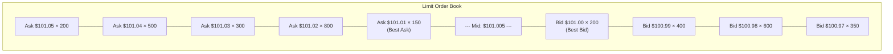
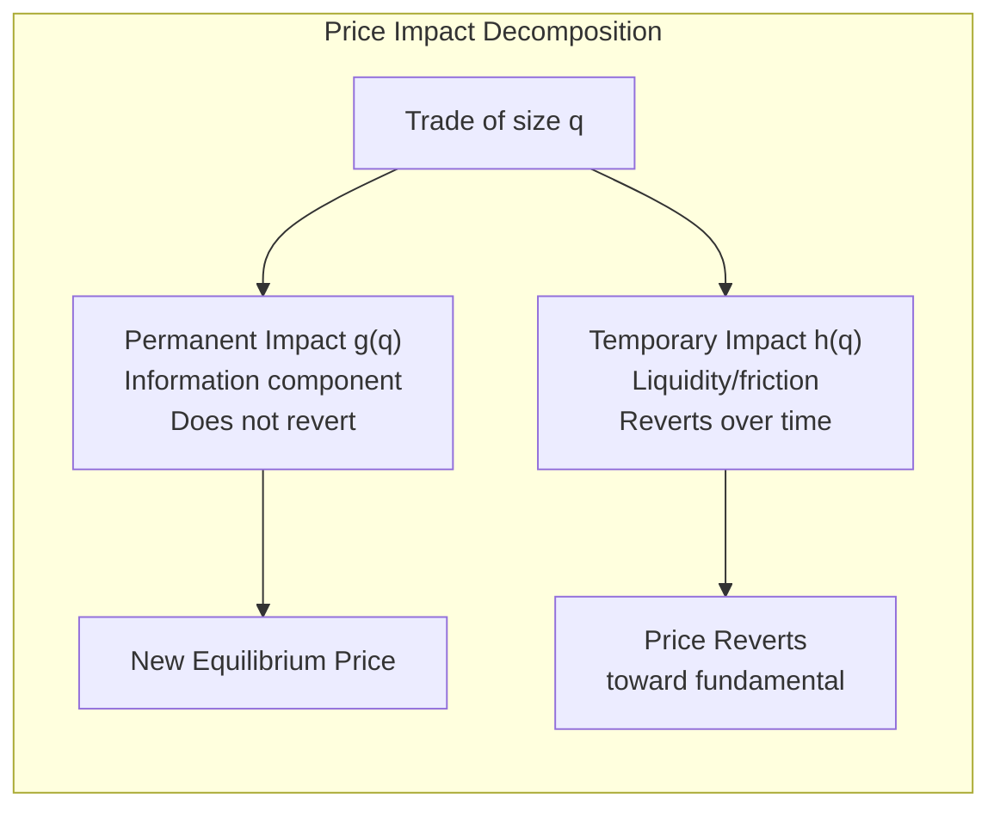
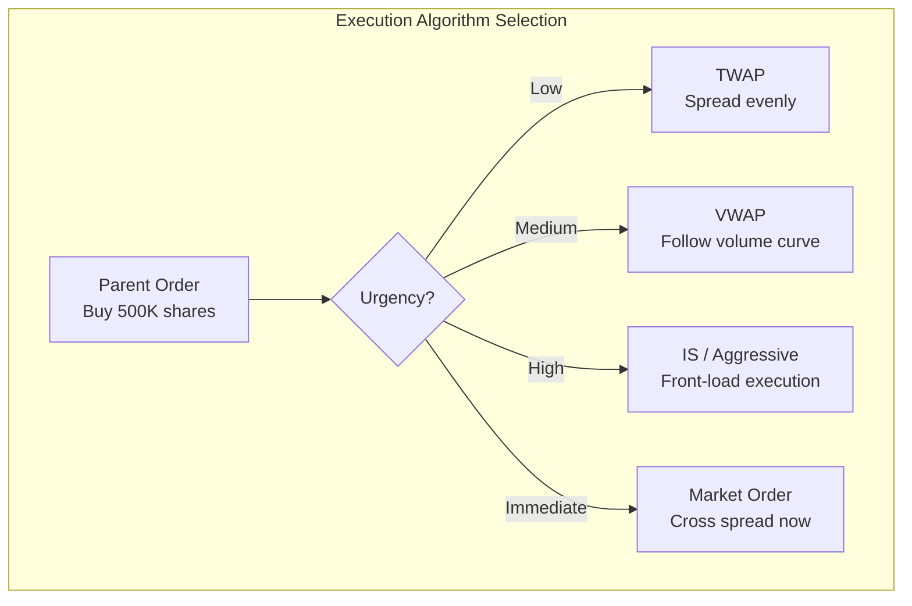

# Market Microstructure

## Part I: Order Book and Market Structure

### Order Types

| Order | Description |
|---|---|
| **Market order** | Execute immediately at best available price; guaranteed fill, uncertain price |
| **Limit order** | Execute at specified price or better; uncertain fill, controlled price |
| **Stop order** | Becomes market order when trigger price reached |
| **Iceberg** | Large order with only small visible portion |
| **IOC** | Immediate-or-Cancel; fill what's available, cancel remainder |
| **FOK** | Fill-or-Kill; fill entirely or cancel entirely |

### The Limit Order Book (LOB)

The bid-ask spread:

$$s = p_a - p_b$$

where $p_a$ = best ask (lowest sell limit), $p_b$ = best bid (highest buy limit).

**Mid-price:** $p_m = (p_a + p_b) / 2$

**Depth:** Total quantity available at each price level. Aggregate depth = total shares within $k$ ticks of mid.

**Microprice (volume-weighted mid):**

$$p_{\mu} = \frac{V_a \cdot p_b + V_b \cdot p_a}{V_a + V_b}$$

where $V_b, V_a$ are quantities at best bid and ask. Microprice leans toward the thinner side.

### Market Quality Measures

| Measure | Formula | Interpretation |
|---|---|---|
| Quoted spread | $p_a - p_b$ | Cost of round-trip at best prices |
| Effective spread | $2|p_{\text{trade}} - p_m|$ | Actual cost (captures price improvement) |
| Realized spread | $2 \epsilon (p_{\text{trade}} - p_{m,t+\Delta})$ | Market maker's profit after price impact |
| Price impact | $\epsilon(p_{m,t+\Delta} - p_m)$ | Information content of trade |

where $\epsilon = +1$ for buyer-initiated, $-1$ for seller-initiated (Lee-Ready algorithm to classify).

## Part II: Market Making

### The Market Maker's Problem

Market makers provide liquidity by quoting both bid and ask. They earn the spread but face:
1. **Inventory risk** — Accumulated positions expose them to adverse price movements
2. **Adverse selection** — Trading against informed traders who know the true value

### Avellaneda-Stoikov Model

Optimal bid and ask offsets for a risk-averse market maker:

$$\delta^{ask} = \frac{1}{\gamma}\ln\left(1 + \frac{\gamma}{\kappa}\right) + \frac{q\gamma\sigma^2(T-t)}{2}$$

$$\delta^{bid} = \frac{1}{\gamma}\ln\left(1 + \frac{\gamma}{\kappa}\right) - \frac{q\gamma\sigma^2(T-t)}{2}$$

where:
- $\gamma$ = risk aversion parameter
- $\kappa$ = order arrival intensity parameter
- $q$ = current inventory (positive = long)
- $\sigma$ = asset volatility
- $T-t$ = time remaining

**Key insight:** The reservation price (midpoint of quotes) shifts away from inventory: long inventory → lower mid → encourage buying from you (selling) and discourage selling to you (buying).

### Amihud Illiquidity Ratio

$$\text{ILLIQ} = \frac{1}{D}\sum_{d=1}^{D}\frac{|R_d|}{\text{Volume}_d}$$

Higher ILLIQ = less liquid. Measures price impact per unit of trading volume. Cross-sectionally, small/illiquid stocks have higher ILLIQ and higher expected returns (illiquidity premium).

## Part III: Price Impact

### Kyle's Lambda

Kyle (1985): informed trader trades optimally against competitive market makers:

$$\Delta p = \lambda \cdot q$$

where $\lambda$ = Kyle's lambda (price impact coefficient), $q$ = signed order flow.

$$\lambda = \frac{\sigma_v}{2\sigma_u}$$

where $\sigma_v$ = std dev of asset value innovation, $\sigma_u$ = std dev of noise trading.

### Permanent vs Temporary Impact

Total impact of a trade:

$$\Delta p = g(q) + h(q)$$

- $g(q)$ = **permanent impact** — reflects information; does not revert
- $h(q)$ = **temporary impact** — reflects liquidity demand; reverts over time

Almgren-Chriss model: $g(q) = \gamma q$ (linear permanent), $h(q) = \eta \cdot \text{sgn}(q) \cdot |v|^{\beta}$ where $v$ = trading rate.

### Square-Root Impact Law

Empirically, permanent impact scales as:

$$\Delta p / p \approx Y \cdot \sigma \cdot \sqrt{Q / V}$$

where $Q$ = total shares traded, $V$ = average daily volume, $Y \approx 1$ (universal constant), $\sigma$ = daily volatility. Remarkably robust across assets, time periods, and markets.

## Part IV: Adverse Selection

### Glosten-Milgrom Model (1985)

Sequential trade model with informed and uninformed (noise) traders.

**Spread due to adverse selection:**

$$s \approx P(\text{informed}) \cdot V$$

where $V$ = value difference between informed buy signal and sell signal.

The market maker sets:
- $p_a = E[\text{value} | \text{buy order}]$
- $p_b = E[\text{value} | \text{sell order}]$

Spread widens when:
- Higher fraction of informed traders
- Greater information asymmetry
- Lower noise trading volume

### PIN (Probability of Informed Trading)

Easley-Kiefer-O'Hara-Paperman (1996):

$$\text{PIN} = \frac{\alpha\mu}{\alpha\mu + 2\epsilon}$$

where $\alpha$ = probability of information event, $\mu$ = informed arrival rate, $\epsilon$ = uninformed arrival rate (per side). Estimated via maximum likelihood on buy/sell order counts.

## Part V: High-Frequency Trading (HFT)

### HFT Strategies

| Strategy | Description |
|---|---|
| **Market making** | Provide liquidity, earn spread, manage inventory at microsecond scale |
| **Latency arbitrage** | Exploit speed advantage to trade on stale quotes across venues |
| **Statistical arbitrage** | Mean-reversion or momentum at ultra-short horizons |
| **Event-driven** | React to news/data releases faster than competitors |

### Infrastructure
- **Co-location:** Servers physically adjacent to exchange matching engine
- **FPGA/ASIC:** Hardware acceleration for order processing
- **Direct market access:** Bypass broker systems for lower latency
- **Microwave/laser links:** Faster than fiber optic between exchanges

### Regulatory Concerns
- Flash crashes (May 6, 2010)
- Phantom liquidity (orders cancelled before execution)
- Unfair speed advantages
- Market fragmentation across venues

## Part VI: Execution Algorithms

### TWAP (Time-Weighted Average Price)

Trade equal quantities at equal time intervals over execution window:

$$q_i = \frac{Q}{N} \quad \text{for } i = 1, \ldots, N$$

Simple benchmark; does not adapt to volume patterns.

### VWAP (Volume-Weighted Average Price)

Trade proportional to expected volume profile:

$$q_i = Q \cdot \frac{v_i^*}{\sum_j v_j^*}$$

where $v_i^*$ = forecasted volume in bucket $i$.

VWAP benchmark: $V_T^* = \frac{\sum p_i v_i}{\sum v_j}$

Goal: match or beat the day's VWAP.

### Implementation Shortfall (IS)

Minimize total execution cost = market impact + timing risk + opportunity cost:

$$\text{IS} = \frac{Q \cdot p_{\text{decision}} - \sum q_i p_i}{Q \cdot p_{\text{decision}}}$$

### Almgren-Chriss Optimal Execution

Minimize: $E[\text{Cost}] + \lambda \cdot \text{Var}[\text{Cost}]$

Optimal trajectory (with linear temporary impact and risk aversion):

$$x_t^* = Q \cdot \frac{\sinh(\kappa(T-t))}{\sinh(\kappa T)}$$

where $\kappa$ depends on risk aversion and impact parameters. More risk-averse → faster execution (front-loaded).

## References

- Harris, L. *Trading and Exchanges: Market Microstructure for Practitioners* (2nd ed.). Oxford University Press.
- O'Hara, M. *Market Microstructure Theory*. Wiley.
- Cartea, Á., Jaimungal, S., & Penalva, J. *Algorithmic and High-Frequency Trading*. Cambridge University Press.
- Kyle, A.S. (1985). "Continuous Auctions and Insider Trading." *Econometrica*, 53(6).
- Glosten, L.R. & Milgrom, P.R. (1985). "Bid, Ask and Transaction Prices." *JFE*, 14(1).
- Almgren, R. & Chriss, N. (2001). "Optimal Execution of Portfolio Transactions." *JRISK*, 3(2).
