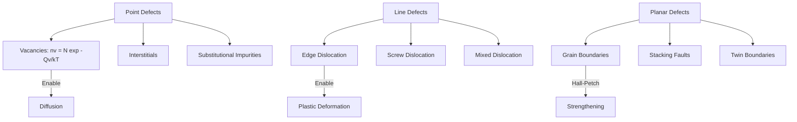
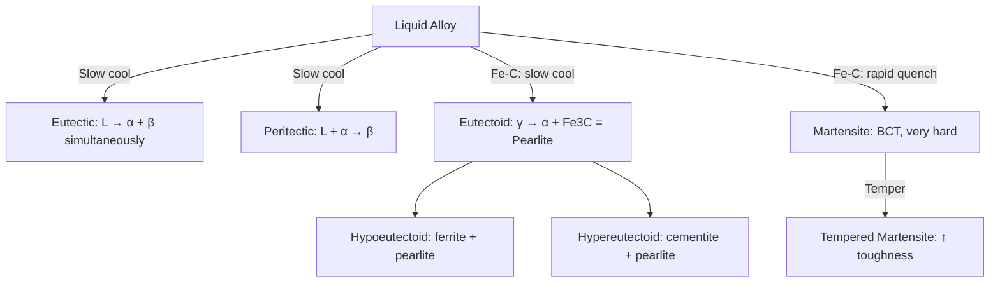
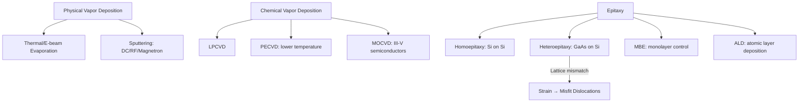

# Materials Science & Engineering

Crystallography, defects, mechanical properties, phase diagrams, polymers, ceramics, composites, nanomaterials, and thin films.

## References

- Callister, W.D. & Rethwisch, D.G. *Materials Science and Engineering*, 10th ed. Wiley, 2018.
- Ashby, M.F. & Jones, D.R.H. *Engineering Materials 1 & 2*, 5th ed. Butterworth-Heinemann, 2019.
- Kittel, C. *Introduction to Solid State Physics*, 8th ed. Wiley, 2004.

---

## Part I — Crystal Structure & Defects

### Week 1: Crystallography

**Crystal systems:** 7 crystal systems (cubic, tetragonal, orthorhombic, hexagonal, trigonal, monoclinic, triclinic) → **14 Bravais lattices** (unique space-filling arrangements).

**Cubic structures:**

| Structure | Atoms/cell | CN | APF | Example |
|-----------|-----------|-----|------|---------|
| SC (Simple Cubic) | 1 | 6 | 0.524 | Po |
| BCC (Body-Centered Cubic) | 2 | 8 | 0.680 | Fe, W, Cr |
| FCC (Face-Centered Cubic) | 4 | 12 | 0.740 | Al, Cu, Au |
| HCP (Hexagonal Close-Packed) | 6 | 12 | 0.740 | Ti, Zn, Mg |

**Miller indices** $(hkl)$: reciprocals of fractional intercepts with crystallographic axes. Family of planes: $\{hkl\}$. Direction: $[uvw]$, family: $\langle uvw \rangle$.

**Interplanar spacing** (cubic):

$$d_{hkl} = \frac{a}{\sqrt{h^2 + k^2 + l^2}}$$

**Bragg's law** for X-ray diffraction:

$$n\lambda = 2d\sin\theta$$

where $n$ = integer order, $\lambda$ = X-ray wavelength, $d$ = interplanar spacing, $\theta$ = diffraction angle.

**Reciprocal lattice & structure factor:** Diffraction intensity depends on structure factor $F_{hkl} = \sum_j f_j \exp[2\pi i(hx_j + ky_j + lz_j)]$. Systematic absences reveal lattice type (e.g., BCC: $h+k+l$ must be even).

### Week 2: Crystallographic Defects

**Point defects:**
- **Vacancies:** Equilibrium concentration $n_v = N \exp(-Q_v / k_BT)$. Crucial for diffusion.
- **Interstitials:** Small atoms (C, N) in interstices of host lattice.
- **Substitutional:** Foreign atom replaces host (Hume-Rothery rules: size ≤15% difference, same crystal structure, similar electronegativity, similar valence).

**Line defects (dislocations):**
- **Edge dislocation:** Extra half-plane of atoms; Burgers vector $\mathbf{b}$ perpendicular to dislocation line.
- **Screw dislocation:** $\mathbf{b}$ parallel to dislocation line.
- **Mixed:** Both components.
- Dislocation density $\rho$ (m/m$^3$ or m$^{-2}$): annealed metal $\sim 10^{10}$, cold-worked $\sim 10^{15}$.

**Planar defects:**
- **Grain boundaries:** Misorientation between adjacent grains. High-angle (>15$°$) vs. low-angle (tilt/twist boundaries from arrays of dislocations).
- **Stacking faults:** Deviation from normal stacking sequence (e.g., ABCABC → ABCABABC in FCC).
- **Twin boundaries:** Mirror symmetry across boundary plane.

---

## Part II — Mechanical Properties & Phase Diagrams

### Week 3: Mechanical Behavior

**Hooke's law** (elastic region):

$$\sigma = E\epsilon$$

where $\sigma$ = stress (Pa), $E$ = Young's modulus, $\epsilon$ = strain (dimensionless).

**Shear:** $\tau = G\gamma$. **Bulk:** $P = -K(\Delta V/V)$.

**Poisson's ratio:** $\nu = -\epsilon_{\text{lateral}}/\epsilon_{\text{axial}}$; typically $0.25$--$0.35$ for metals.

**Relationship:** $E = 2G(1 + \nu) = 3K(1 - 2\nu)$.

**Yield strength:** Onset of permanent (plastic) deformation. Defined by 0.2% offset method.

**Strengthening mechanisms:**
1. **Solid solution:** Solute atoms strain lattice → impede dislocations.
2. **Strain hardening (work hardening):** ↑ dislocation density → dislocation-dislocation interactions.
3. **Grain refinement (Hall-Petch):** $\sigma_y = \sigma_0 + k_y d^{-1/2}$ — smaller grains → more boundaries → higher strength.
4. **Precipitation hardening:** Coherent precipitates (e.g., Al-Cu: GP zones → $\theta'$) block dislocations.

**Hardness:** Resistance to localized plastic deformation. Brinell, Vickers, Rockwell scales. Correlates with tensile strength.

**Fracture:**
- **Ductile:** Extensive plastic deformation, cup-and-cone fracture, microvoid coalescence.
- **Brittle:** Little plastic deformation, cleavage along crystallographic planes. Griffith criterion:

$$\sigma_f = \sqrt{\frac{2E\gamma_s}{\pi a}}$$

where $a$ = crack half-length, $\gamma_s$ = surface energy.

### Week 4: Phase Diagrams

**Gibbs phase rule:** $F = C - P + 2$ ($C$ = components, $P$ = phases, $F$ = degrees of freedom).

**Binary eutectic (e.g., Pb-Sn):**
- Eutectic point: liquid → two solid phases simultaneously.
- Lever rule for phase fractions: $W_\alpha = \frac{C_0 - C_\beta}{C_\alpha - C_\beta}$.

**Binary peritectic:** Liquid + solid$_1$ → solid$_2$ on cooling.

**Iron-carbon diagram:**
- Eutectoid (0.76 wt% C, 727$°$C): $\gamma$-austenite → $\alpha$-ferrite + Fe$_3$C (cementite) = **pearlite**.
- Hypoeutectoid ($< 0.76\%$ C): proeutectoid ferrite + pearlite.
- Hypereutectoid ($> 0.76\%$ C): proeutectoid cementite + pearlite.
- **Martensite:** Rapid quenching traps C in BCT structure → very hard, brittle. Tempered martensite balances strength and toughness.

---

## Part III — Polymers, Ceramics & Composites

### Week 5: Polymers

**Glass transition temperature** ($T_g$): Below $T_g$ → glassy (brittle); above $T_g$ → rubbery/viscous. Depends on chain stiffness, side groups, crosslinking.

**Crystallinity:** Polymers are semi-crystalline (e.g., HDPE ~80%, LDPE ~50%). Higher crystallinity → higher density, strength, $T_m$; lower transparency.

**Viscoelasticity** — time-dependent mechanical response:

$$\sigma(t) = \int_0^t E(t - \tau) \dot{\epsilon}(\tau) \, d\tau$$

**Models:**
- **Maxwell** (spring + dashpot in series): stress relaxation, $\sigma(t) = \sigma_0 e^{-t/\tau}$, $\tau = \eta/E$.
- **Voigt/Kelvin** (spring + dashpot in parallel): creep, $\epsilon(t) = \frac{\sigma_0}{E}(1 - e^{-t/\tau})$.
- **Standard linear solid:** Combines both behaviors.

**Polymer types:** Thermoplastics (recyclable, melt on heating: PE, PP, PET), thermosets (crosslinked, cannot re-melt: epoxy, phenolics), elastomers (lightly crosslinked, large reversible strain: rubber, silicone).

### Week 6: Ceramics & Composites

**Ceramics:** Ionic/covalent bonding → high $T_m$, hardness, chemical stability, brittleness, low $K_{IC}$. Examples: Al$_2$O$_3$, SiC, Si$_3$N$_4$, ZrO$_2$ (toughened by transformation toughening: tetragonal → monoclinic at crack tip).

**Composites** — rule of mixtures (upper bound, iso-strain):

$$E_c = E_f V_f + E_m V_m = E_f V_f + E_m(1 - V_f)$$

Transverse (iso-stress, lower bound):

$$\frac{1}{E_c} = \frac{V_f}{E_f} + \frac{V_m}{E_m}$$

**Fiber-reinforced composites:** Carbon fiber/epoxy (aerospace), glass fiber/polyester (boats), Kevlar/epoxy (armor). Critical fiber length $l_c = \frac{\sigma_f d}{2\tau_c}$ for effective load transfer.

---

## Part IV — Nanomaterials & Thin Films

### Week 7: Nanomaterials

**Quantum confinement:** When particle size approaches de Broglie wavelength, electronic energy levels become discrete. For a quantum dot (particle in a box):

$$E \propto \frac{1}{r^2} \quad \Rightarrow \quad E_n = \frac{n^2 h^2}{8mr^2}$$

Smaller dots → larger band gap → blue-shifted emission. Applications: displays (QLED), bioimaging, solar cells.

**Carbon nanomaterials:**
- **Fullerenes** (C$_{60}$): Spherical cage, $\sim 0.7$ nm diameter.
- **Carbon nanotubes (CNTs):** Rolled graphene sheet. Single-walled (SWCNT) vs. multi-walled (MWCNT). Chirality $(n,m)$ determines metallic ($n=m$) vs. semiconducting. Tensile strength $\sim 100$ GPa, Young's modulus $\sim 1$ TPa.
- **Graphene:** 2D monolayer of sp$^2$ carbon. Carrier mobility $\sim 200,000$ cm$^2$/V·s, thermal conductivity $\sim 5000$ W/m·K.

**Surface-to-volume ratio:** $\propto 1/r$ — nanoparticles are dominated by surface effects (high reactivity, catalysis, melting point depression).

### Week 8: Thin Films & Deposition

**Physical vapor deposition (PVD):**
- **Evaporation:** Thermal, e-beam, or laser ablation. Line-of-sight deposition.
- **Sputtering:** Ion bombardment (Ar$^+$) of target → ejected atoms deposit on substrate. Better step coverage than evaporation. DC (conductive targets), RF (insulators), magnetron (higher rate).

**Chemical vapor deposition (CVD):**
- Gaseous precursors react on/near heated substrate surface.
- LPCVD (low pressure), PECVD (plasma-enhanced, lower $T$), MOCVD (metalorganic, for III-V semiconductors).
- Example: SiH$_4$ → Si + 2H$_2$ (polycrystalline Si deposition).

**Epitaxy:** Crystalline film grown on crystalline substrate with defined orientation relationship.
- **Homoepitaxy:** Same material (Si on Si).
- **Heteroepitaxy:** Different material (GaAs on Si). Lattice mismatch $f = (a_s - a_f)/a_f$ → strain → misfit dislocations if $f > $ critical value.
- **MBE** (molecular beam epitaxy): Ultra-high vacuum, monolayer control, RHEED monitoring. Used for quantum wells, superlattices.

---

## Key Equations Summary

| Concept | Equation |
|---------|----------|
| Bragg's law | $n\lambda = 2d\sin\theta$ |
| Interplanar spacing (cubic) | $d_{hkl} = a/\sqrt{h^2+k^2+l^2}$ |
| Hooke's law | $\sigma = E\epsilon$ |
| Hall-Petch | $\sigma_y = \sigma_0 + k_y d^{-1/2}$ |
| Griffith fracture | $\sigma_f = \sqrt{2E\gamma_s/(\pi a)}$ |
| Vacancy concentration | $n_v = N\exp(-Q_v/k_BT)$ |
| Viscoelastic (Boltzmann) | $\sigma(t) = \int_0^t E(t-\tau)\dot{\epsilon}(\tau)d\tau$ |
| Composite (iso-strain) | $E_c = E_fV_f + E_mV_m$ |
| Quantum dot energy | $E_n = n^2h^2/(8mr^2)$ |
