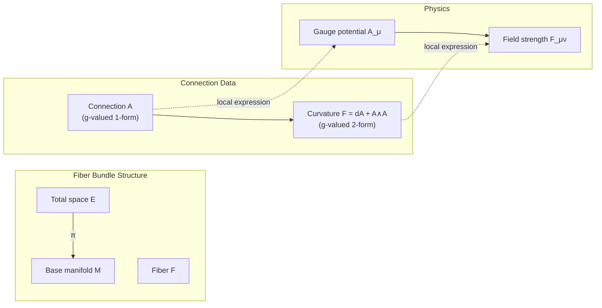
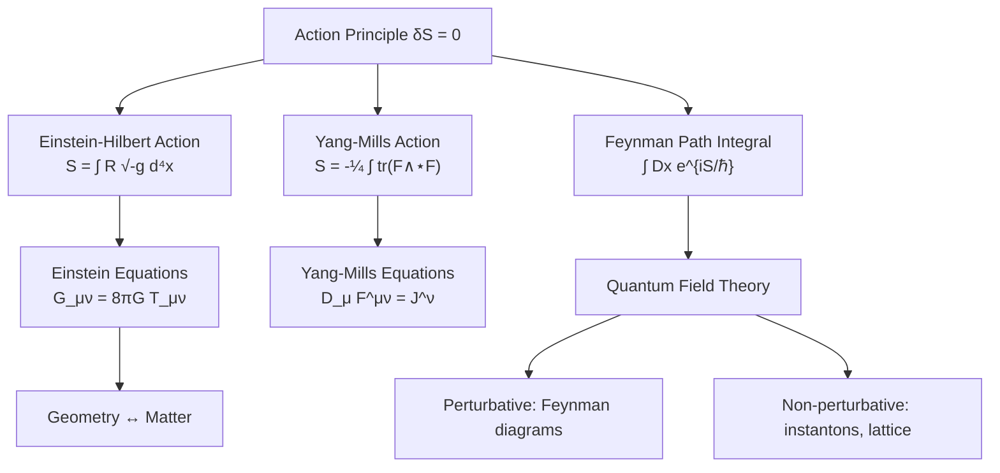

# Mathematical Physics

Rigorous mathematical structures underlying modern theoretical physics: functional analysis and quantum mechanics, differential geometry and gauge theory, variational principles, and general relativity.

---

## Part I: Quantum Mechanics in Hilbert Space

### Week 1: Hilbert Spaces and Operators

Quantum states live in a separable Hilbert space $\mathcal{H}$ (typically $L^2(\mathbb{R}^n)$). The inner product $\langle \psi | \phi \rangle$ gives the probability amplitude.

**Observables** are self-adjoint operators $\hat{A}: \mathcal{D}(\hat{A}) \subset \mathcal{H} \to \mathcal{H}$. The distinction between symmetric and self-adjoint is crucial for unbounded operators:

- **Symmetric:** $\langle \hat{A}\psi, \phi \rangle = \langle \psi, \hat{A}\phi \rangle$ for $\psi, \phi \in \mathcal{D}(\hat{A})$
- **Self-adjoint:** Symmetric and $\mathcal{D}(\hat{A}) = \mathcal{D}(\hat{A}^*)$

The **time-independent Schrodinger equation**:

$$\hat{H}|\psi\rangle = E|\psi\rangle$$

where $\hat{H} = -\frac{\hbar^2}{2m}\nabla^2 + V(\mathbf{x})$ is the Hamiltonian.

#### Spectral Theorem for Unbounded Operators

> **Theorem (Spectral Theorem).** For a self-adjoint operator $\hat{A}$ on $\mathcal{H}$, there exists a unique projection-valued measure $E$ on $\mathbb{R}$ such that:
> $$\hat{A} = \int_{\sigma(\hat{A})} \lambda\, dE(\lambda)$$

The spectrum $\sigma(\hat{A})$ decomposes into:
- **Point spectrum** $\sigma_p$: eigenvalues (bound states)
- **Continuous spectrum** $\sigma_c$: generalized eigenfunctions (scattering states)
- **Residual spectrum** $\sigma_r$: empty for self-adjoint operators

**Stone's theorem:** The one-parameter unitary group $U(t) = e^{-i\hat{H}t/\hbar}$ generates time evolution: $|\psi(t)\rangle = e^{-i\hat{H}t/\hbar}|\psi(0)\rangle$.

### Week 2: Symmetry and Representations

#### Wigner's Theorem

> **Theorem (Wigner).** Every symmetry transformation of a quantum system (bijection on rays preserving transition probabilities $|\langle \psi | \phi \rangle|^2$) is implemented by a unitary or antiunitary operator on $\mathcal{H}$.

Continuous symmetry groups $G$ are represented by unitary representations $U: G \to \mathcal{U}(\mathcal{H})$. By **Stone's theorem**, the generators are self-adjoint operators (observables):
- Translations: generator $\hat{p}$ (momentum), $U(a) = e^{-i\hat{p}a/\hbar}$
- Rotations: generator $\hat{L}$ (angular momentum), $U(R) = e^{-i\hat{L}\cdot\hat{n}\theta/\hbar}$
- Time translation: generator $\hat{H}$ (energy)

**Noether's theorem** (quantum version): If $[\hat{H}, \hat{Q}] = 0$, then $\hat{Q}$ is a conserved quantity.

```mermaid
flowchart TD
    A[Physical Symmetry Group G] --> B[Wigner's Theorem]
    B --> C[Unitary Representation U: G → U(H)]
    C --> D[Stone's Theorem]
    D --> E[Self-Adjoint Generator Â]
    E --> F["[Ĥ, Â] = 0 ?"]
    F -->|Yes| G[Conserved Observable]
    F -->|No| H[Symmetry broken by dynamics]
    G --> I["Spectrum of  → quantum numbers"]
```

---

## Part II: Variational Principles and Classical Mechanics

### Week 3: Calculus of Variations

**Hamilton's principle:** The physical trajectory $q(t)$ extremizes the action:

$$\delta S = \delta \int_{t_1}^{t_2} L(q, \dot{q}, t)\, dt = 0$$

The **Euler-Lagrange equations** follow:

$$\frac{d}{dt}\frac{\partial L}{\partial \dot{q}^i} - \frac{\partial L}{\partial q^i} = 0$$

The Legendre transform $H(q,p) = p_i\dot{q}^i - L(q,\dot{q})$ with $p_i = \frac{\partial L}{\partial \dot{q}^i}$ yields **Hamilton's equations**:

$$\dot{q}^i = \frac{\partial H}{\partial p_i}, \quad \dot{p}_i = -\frac{\partial H}{\partial q^i}$$

**Noether's theorem (Lagrangian version):** If $L$ is invariant under a continuous transformation $q \mapsto q + \epsilon\eta(q)$, then the quantity $J = \frac{\partial L}{\partial \dot{q}^i}\eta^i$ is conserved along solutions.

---

## Part III: Differential Forms and Topology

### Week 4: Differential Forms

A **$k$-form** on an $n$-manifold $M$ is a smooth section of $\bigwedge^k T^*M$:

$$\omega = \sum_{i_1 < \cdots < i_k} \omega_{i_1 \cdots i_k}(x)\, dx^{i_1} \wedge \cdots \wedge dx^{i_k}$$

The **exterior derivative** $d: \Omega^k(M) \to \Omega^{k+1}(M)$ satisfies $d^2 = 0$ and generalizes grad, curl, div.

**Stokes' theorem** (the grand unification):

$$\int_M d\omega = \int_{\partial M} \omega$$

This subsumes the fundamental theorem of calculus, Green's theorem, the classical Stokes theorem, and the divergence theorem.

### Week 5: de Rham Cohomology

The **de Rham cohomology groups**:

$$H^k_{dR}(M) = \frac{\ker(d: \Omega^k \to \Omega^{k+1})}{\operatorname{im}(d: \Omega^{k-1} \to \Omega^k)} = \frac{\text{closed } k\text{-forms}}{\text{exact } k\text{-forms}}$$

$H^k_{dR}(M)$ detects topological features: $\dim H^0 =$ number of connected components, $\dim H^1$ counts independent "holes," and so on. **De Rham's theorem** establishes isomorphism with singular cohomology.

**Poincare lemma:** On a contractible open set, every closed form is exact ($H^k = 0$ for $k \geq 1$).

### Week 6: Fiber Bundles and Connections

A **fiber bundle** $(E, M, \pi, F)$ consists of total space $E$, base $M$, projection $\pi: E \to M$, and fiber $F$, with local trivializations $\pi^{-1}(U) \cong U \times F$.

A **principal $G$-bundle** has fiber $G$ (a Lie group) with right $G$-action. A **connection** $\mathcal{A}$ on a principal bundle is a $\mathfrak{g}$-valued 1-form specifying the horizontal subspace of $TE$.

The **curvature** is the $\mathfrak{g}$-valued 2-form:

$$\mathcal{F} = d\mathcal{A} + \mathcal{A} \wedge \mathcal{A}$$

satisfying the **Bianchi identity** $d_\mathcal{A}\mathcal{F} = 0$.



---

## Part IV: Gauge Theory and Gravity

### Week 7: Gauge Theory

In a local trivialization, the **gauge potential** $A_\mu$ is a $\mathfrak{g}$-valued 1-form and the **field strength tensor**:

$$F_{\mu\nu} = \partial_\mu A_\nu - \partial_\nu A_\mu + [A_\mu, A_\nu]$$

Under a gauge transformation $g: M \to G$:

$$A_\mu \mapsto g A_\mu g^{-1} + g \partial_\mu g^{-1}, \quad F_{\mu\nu} \mapsto g F_{\mu\nu} g^{-1}$$

The **Yang-Mills action**:

$$S_{YM} = -\frac{1}{4}\int \operatorname{tr}(F_{\mu\nu}F^{\mu\nu})\, d^4x$$

The Yang-Mills equations $D_\mu F^{\mu\nu} = J^\nu$ generalize Maxwell's equations (where $G = U(1)$ and $[A_\mu, A_\nu] = 0$).

**Topological content:** Characteristic classes (Chern classes for $U(n)$ bundles, Pontryagin classes for $SO(n)$) classify principal bundles and give rise to topological invariants like the **instanton number**:

$$k = \frac{1}{8\pi^2}\int \operatorname{tr}(F \wedge F) \in \mathbb{Z}$$

### Week 8: Path Integrals

The **Feynman path integral** expresses the quantum propagator:

$$\langle x_f | e^{-iHt/\hbar} | x_i \rangle = \int \mathcal{D}x\, e^{iS[x]/\hbar}$$

where $S[x] = \int_0^t L(x, \dot{x})\, d\tau$ is the classical action and $\mathcal{D}x$ denotes integration over all paths from $x_i$ to $x_f$.

The **stationary phase approximation** ($\hbar \to 0$): the integral is dominated by paths near the classical trajectory $\delta S = 0$, recovering classical mechanics.

For the **Euclidean path integral** (Wick rotation $t \to -i\tau$):

$$Z = \int \mathcal{D}\phi\, e^{-S_E[\phi]/\hbar}$$

This connects to statistical mechanics (partition function) and enables rigorous construction via the Osterwalder-Schrader axioms.

### Week 9: General Relativity

Spacetime is a 4-dimensional Lorentzian manifold $(M, g_{\mu\nu})$ with signature $(-,+,+,+)$.

The **Einstein field equations**:

$$G_{\mu\nu} + \Lambda g_{\mu\nu} = 8\pi G\, T_{\mu\nu}$$

where $G_{\mu\nu} = R_{\mu\nu} - \frac{1}{2}R g_{\mu\nu}$ is the Einstein tensor, $R_{\mu\nu}$ the Ricci tensor, $R = g^{\mu\nu}R_{\mu\nu}$ the scalar curvature, and $T_{\mu\nu}$ the stress-energy tensor.

Derived from the **Einstein-Hilbert action**:

$$S_{EH} = \frac{1}{16\pi G}\int_M (R - 2\Lambda)\sqrt{-g}\, d^4x$$

The **Levi-Civita connection** $\nabla$ is the unique torsion-free metric-compatible connection, with Christoffel symbols:

$$\Gamma^\lambda_{\mu\nu} = \frac{1}{2}g^{\lambda\rho}\left(\partial_\mu g_{\nu\rho} + \partial_\nu g_{\mu\rho} - \partial_\rho g_{\mu\nu}\right)$$

The **Riemann curvature tensor** $R^\rho{}_{\sigma\mu\nu}$ measures the failure of parallel transport to commute and encodes all gravitational tidal effects.



---

## Connections Between Topics

| Mathematical Structure | Physical Realization |
|---|---|
| Hilbert space | Quantum state space |
| Self-adjoint operator | Observable |
| Unitary group | Time evolution, symmetry |
| Principal bundle | Gauge field configuration |
| Connection on bundle | Gauge potential $A_\mu$ |
| Curvature 2-form | Field strength $F_{\mu\nu}$ |
| Riemannian manifold | Spacetime (with Lorentz signature) |
| Levi-Civita connection | Gravity (Christoffel symbols) |
| Characteristic class | Topological charge (instantons) |

---

## References

1. Nakahara, M. *Geometry, Topology and Physics*. 2nd ed., CRC Press, 2003.
2. Reed, M. & Simon, B. *Methods of Modern Mathematical Physics*, Vols. I--IV. Academic Press, 1972--1979.
3. Wald, R. M. *General Relativity*. University of Chicago Press, 1984.
4. Arnold, V. I. *Mathematical Methods of Classical Mechanics*. 2nd ed., Springer, 1989.
5. Frankel, T. *The Geometry of Physics*. 3rd ed., Cambridge University Press, 2011.
6. Folland, G. B. *Quantum Field Theory: A Tourist Guide for Mathematicians*. AMS, 2008.
