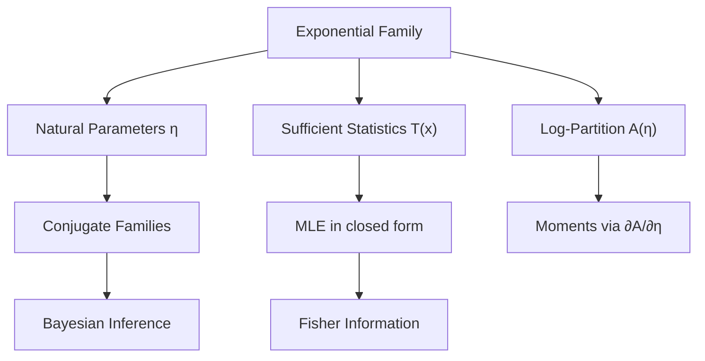
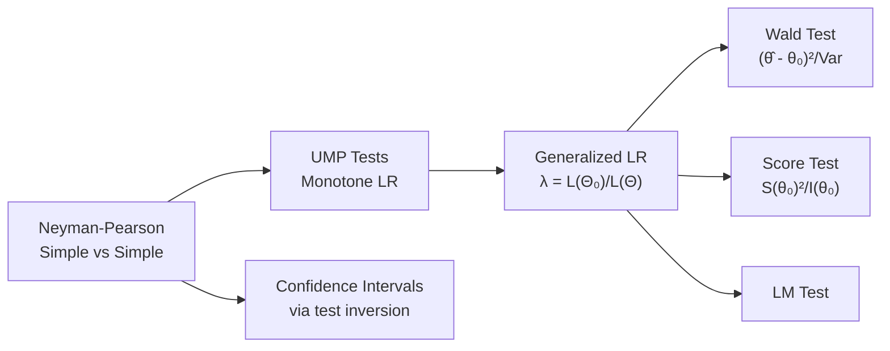

# Mathematical Statistics

> Theory of statistical inference: estimation, testing, and asymptotics.

**Primary References:**
- Casella, G. & Berger, R. *Statistical Inference* (2nd ed., Cengage, 2002)
- Lehmann, E. & Romano, J. *Testing Statistical Hypotheses* (3rd ed., Springer, 2005)
- Keener, R. *Theoretical Statistics* (Springer, 2010)

---

## Part I — Foundations of Estimation

### Week 1: Sufficiency and Exponential Families

A statistic $T(X)$ is **sufficient** for $\theta$ if $P(X | T(X), \theta) = P(X | T(X))$.

**Fisher-Neyman Factorization:** $T$ is sufficient iff:

$$f(x|\theta) = g(T(x), \theta) \cdot h(x)$$

**Minimal sufficiency:** $T$ is minimal sufficient if it is a function of every other sufficient statistic.

**Exponential family:** A distribution belongs to the $k$-parameter exponential family if:

$$f(x|\boldsymbol{\eta}) = h(x) \exp\left(\sum_{i=1}^k \eta_i T_i(x) - A(\boldsymbol{\eta})\right)$$

where $\boldsymbol{\eta}$ are **natural parameters**, $T_i$ are **sufficient statistics**, and $A(\boldsymbol{\eta})$ is the **log-partition function**. Moments follow from derivatives of $A$:

$$E[T_i] = \frac{\partial A}{\partial \eta_i}, \qquad \text{Cov}(T_i, T_j) = \frac{\partial^2 A}{\partial \eta_i \partial \eta_j}$$

### Week 2: Point Estimation

**Maximum Likelihood Estimation:** Given data $x_1, \ldots, x_n$:

$$\hat{\theta}_{MLE} = \arg\max_\theta L(\theta) = \arg\max_\theta \prod_{i=1}^n f(x_i | \theta)$$

Equivalently, maximize the log-likelihood $\ell(\theta) = \sum_{i=1}^n \ln f(x_i|\theta)$.

**Method of Moments:** Set sample moments equal to population moments:

$$\frac{1}{n}\sum_{i=1}^n X_i^k = E[X^k(\theta)] \quad \text{for } k = 1, \ldots, p$$

**Bias and MSE:**

$$\text{Bias}(\hat{\theta}) = E[\hat{\theta}] - \theta, \qquad \text{MSE}(\hat{\theta}) = \text{Var}(\hat{\theta}) + \text{Bias}^2(\hat{\theta})$$

### Week 3: Fisher Information and Efficiency

The **score function:** $S(\theta) = \frac{\partial}{\partial \theta} \ln f(X|\theta)$, with $E[S(\theta)] = 0$.

**Fisher information:**

$$I(\theta) = \text{Var}(S(\theta)) = E\left[\left(\frac{\partial \ln f}{\partial \theta}\right)^2\right] = -E\left[\frac{\partial^2 \ln f}{\partial \theta^2}\right]$$

For $n$ i.i.d. observations: $I_n(\theta) = n I_1(\theta)$.

**Cramér-Rao Lower Bound:** For any unbiased estimator $\hat{\theta}$:

$$\text{Var}(\hat{\theta}) \ge \frac{1}{I_n(\theta)}$$

An estimator achieving this bound is **efficient**. In exponential families, the sufficient statistic achieves it.

**Rao-Blackwell Theorem:** If $\hat{\theta}$ is unbiased and $T$ is sufficient, then $\tilde{\theta} = E[\hat{\theta}|T]$ has $\text{MSE}(\tilde{\theta}) \le \text{MSE}(\hat{\theta})$.

---

## Part II — Hypothesis Testing

### Week 4: Neyman-Pearson Framework

Test $H_0: \theta \in \Theta_0$ vs $H_1: \theta \in \Theta_1$.

**Type I error:** $\alpha = P(\text{reject } H_0 | H_0)$. **Type II error:** $\beta = P(\text{fail to reject } H_0 | H_1)$.

**Power function:** $\pi(\theta) = P(\text{reject } H_0 | \theta)$.

**Neyman-Pearson Lemma:** For simple $H_0: \theta = \theta_0$ vs $H_1: \theta = \theta_1$, the most powerful level-$\alpha$ test rejects when:

$$\Lambda(x) = \frac{L(\theta_1)}{L(\theta_0)} > k_\alpha$$

### Week 5: Uniformly Most Powerful Tests

A test is **UMP** at level $\alpha$ if it has the greatest power among all level-$\alpha$ tests for all $\theta \in \Theta_1$.

**Monotone Likelihood Ratio (MLR):** Family $\{f(x|\theta)\}$ has MLR in $T(x)$ if $\frac{f(x|\theta_2)}{f(x|\theta_1)}$ is non-decreasing in $T(x)$ for $\theta_2 > \theta_1$.

For MLR families, the UMP test for $H_0: \theta \le \theta_0$ vs $H_1: \theta > \theta_0$ rejects for large $T$.

**Generalized Likelihood Ratio Test (GLRT):**

$$\lambda(x) = \frac{\sup_{\theta \in \Theta_0} L(\theta|x)}{\sup_{\theta \in \Theta} L(\theta|x)}$$

Under $H_0$ and regularity conditions: $-2 \ln \lambda(X) \xrightarrow{d} \chi^2_\nu$ where $\nu = \dim(\Theta) - \dim(\Theta_0)$.

### Week 6: Confidence Intervals

A **$(1-\alpha)$ confidence interval** $C(X)$ satisfies $P(\theta \in C(X)) \ge 1 - \alpha$ for all $\theta$.

**Pivotal method:** Find $Q(X, \theta)$ with distribution free of $\theta$, then invert.

For normal data with known variance: $\bar{X} \pm z_{\alpha/2} \frac{\sigma}{\sqrt{n}}$.

For normal data with unknown variance: $\bar{X} \pm t_{\alpha/2, n-1} \frac{S}{\sqrt{n}}$.

---

## Part III — Asymptotic Theory

### Week 7: Consistency and Asymptotic Normality

**Consistency:** $\hat{\theta}_n \xrightarrow{P} \theta$ as $n \to \infty$.

The MLE is consistent under regularity conditions.

**Asymptotic normality of MLE:**

$$\sqrt{n}(\hat{\theta}_{MLE} - \theta_0) \xrightarrow{d} N\left(0, \frac{1}{I_1(\theta_0)}\right)$$

So $\hat{\theta}_{MLE}$ is **asymptotically efficient** — it achieves the Cramér-Rao bound in the limit.

### Week 8: Delta Method and Variance Stabilization

**Delta method:** If $\sqrt{n}(X_n - \mu) \xrightarrow{d} N(0, \sigma^2)$ and $g$ is differentiable at $\mu$ with $g'(\mu) \ne 0$:

$$\sqrt{n}(g(X_n) - g(\mu)) \xrightarrow{d} N(0, \sigma^2 [g'(\mu)]^2)$$

**Multivariate delta method:** If $\sqrt{n}(\mathbf{X}_n - \boldsymbol{\mu}) \xrightarrow{d} N(\mathbf{0}, \boldsymbol{\Sigma})$:

$$\sqrt{n}(g(\mathbf{X}_n) - g(\boldsymbol{\mu})) \xrightarrow{d} N\left(0, \nabla g(\boldsymbol{\mu})^T \boldsymbol{\Sigma} \nabla g(\boldsymbol{\mu})\right)$$

**Variance-stabilizing transform:** Choose $g$ so that $[g'(\mu)]^2 \sigma^2(\mu) = c$.

Example: For Poisson ($\text{Var} = \mu$), use $g(x) = \sqrt{x}$; for Binomial, use $g(p) = \arcsin(\sqrt{p})$.

### Week 9: Large-Sample Tests

The three asymptotically equivalent tests at level $\alpha$:

**Wald test:**

$$W = \frac{(\hat{\theta} - \theta_0)^2}{\widehat{\text{Var}}(\hat{\theta})} \xrightarrow{d} \chi^2_1$$

**Score (Rao) test:**

$$S = \frac{[S(\theta_0)]^2}{I_n(\theta_0)} \xrightarrow{d} \chi^2_1$$

**Likelihood ratio test:**

$$\Lambda = -2[\ell(\theta_0) - \ell(\hat{\theta})] \xrightarrow{d} \chi^2_1$$

Under contiguous alternatives $\theta_n = \theta_0 + h/\sqrt{n}$, these tests have **asymptotic relative efficiency (ARE)** = 1 relative to each other.

---

## Key Concepts Summary

| Concept | Key Result |
|---------|------------|
| Sufficiency | Factorization theorem; data reduction without information loss |
| Completeness | $E_\theta[g(T)] = 0 \; \forall \theta \Rightarrow g = 0$ a.e. |
| UMVUE | Rao-Blackwell + completeness $\Rightarrow$ unique UMVUE |
| MLE asymptotics | Consistent, asymptotically normal, asymptotically efficient |
| Cramér-Rao | Variance lower bound for unbiased estimators |
| Neyman-Pearson | Optimal simple-vs-simple test via likelihood ratio |
