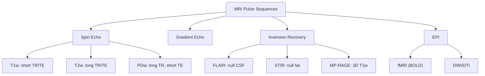
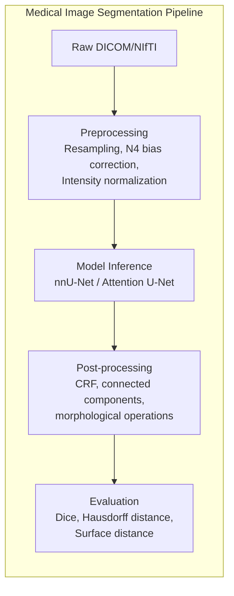
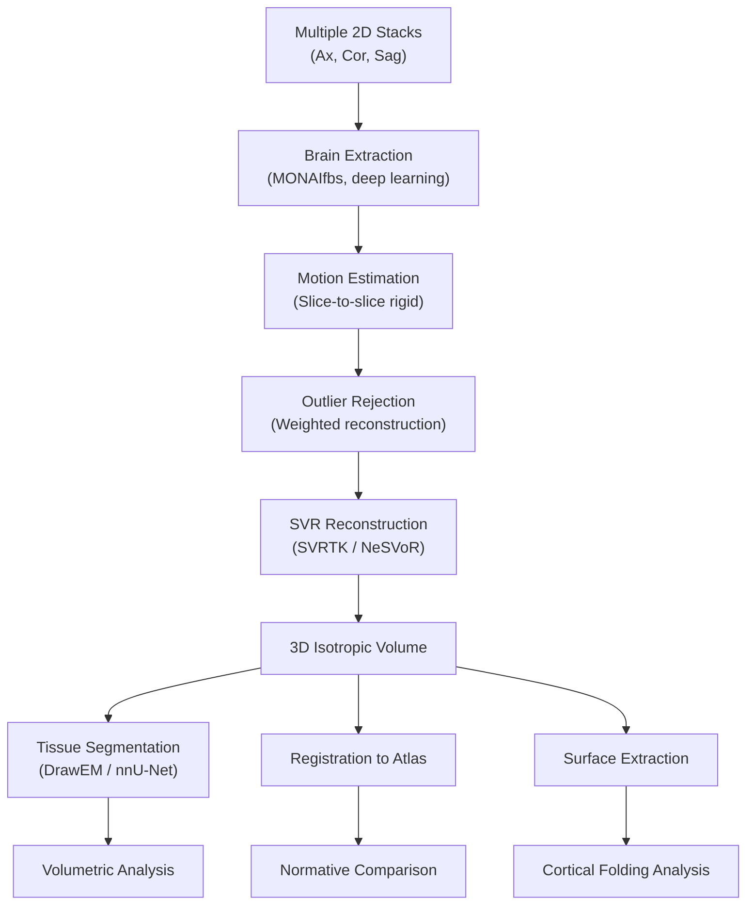

# Medical Imaging — MRI Focus

> MRI physics, reconstruction, and computational neuroimaging with emphasis on fetal brain MRI.

## References

- Haacke, E. M. et al. *Magnetic Resonance Imaging: Physical Principles and Sequence Design*, 2nd ed. Wiley, 2014.
- Prince, J. L. & Links, J. M. *Medical Imaging Signals and Systems*, 2nd ed. Pearson, 2014.
- Bernstein, M. A. et al. *Handbook of MRI Pulse Sequences*. Elsevier, 2004.
- Fischl, B. "FreeSurfer." NeuroImage 62(2): 774-781, 2012.
- Isensee, F. et al. "nnU-Net: a self-configuring method for deep learning-based biomedical image segmentation." Nature Methods, 2021.
- Avants, B. B. et al. "A reproducible evaluation of ANTs similarity metric performance in brain image registration." NeuroImage, 2011.
- Xu, J. et al. "NeSVoR: Implicit Neural Representation for Slice-to-Volume Reconstruction in MRI." IEEE TMI, 2023.

---

# Part I — MRI Physics

## Week 1: Nuclear Magnetic Resonance

### Spin Physics

Protons ($^1$H) possess intrinsic angular momentum (spin). In an external magnetic field $B_0$, spins precess at the **Larmor frequency**:

$$\omega_0 = \gamma B_0$$

where $\gamma = 42.58 \text{ MHz/T}$ for hydrogen. At 3T: $\omega_0 \approx 127.74$ MHz.

### Bloch Equations

The macroscopic magnetization $\mathbf{M} = (M_x, M_y, M_z)$ evolves as:

$$\frac{d\mathbf{M}}{dt} = \gamma \mathbf{M} \times \mathbf{B} - \frac{M_x \hat{x} + M_y \hat{y}}{T_2} - \frac{(M_z - M_0)\hat{z}}{T_1}$$

- $T_1$ (spin-lattice relaxation): recovery of $M_z$ toward equilibrium $M_0$
- $T_2$ (spin-spin relaxation): decay of transverse magnetization $M_{xy}$
- $T_2^*$: effective transverse relaxation including field inhomogeneities ($\frac{1}{T_2^*} = \frac{1}{T_2} + \frac{1}{T_2'}$)

### Signal Equations

After a 90-degree RF pulse:

$$M_{xy}(t) = M_0 \, e^{-t/T_2}, \quad M_z(t) = M_0(1 - e^{-t/T_1})$$

The received signal (FID — Free Induction Decay):

$$s(t) \propto M_0 \, e^{-t/T_2^*} \, e^{-i\omega_0 t}$$

### Tissue Contrast

| Tissue | $T_1$ (ms) at 3T | $T_2$ (ms) |
|--------|-------------------|-------------|
| White Matter | ~830 | ~80 |
| Gray Matter | ~1330 | ~110 |
| CSF | ~4000 | ~2000 |
| Fat | ~370 | ~130 |

## Week 2: Pulse Sequences

### Spin Echo (SE)

90° — TE/2 — 180° — TE/2 — echo. Refocuses $T_2'$ dephasing.

$$S_{\text{SE}} \propto M_0 \, (1 - e^{-TR/T_1}) \, e^{-TE/T_2}$$

- $T_1$-weighted: short TR, short TE
- $T_2$-weighted: long TR, long TE
- PD-weighted: long TR, short TE

### Gradient Echo (GRE)

Uses gradient reversal instead of 180° pulse. Faster but $T_2^*$ decay:

$$S_{\text{GRE}} \propto M_0 \, \frac{\sin\alpha (1 - e^{-TR/T_1})}{1 - \cos\alpha \, e^{-TR/T_1}} \, e^{-TE/T_2^*}$$

where $\alpha$ is the flip angle. Ernst angle: $\alpha_E = \cos^{-1}(e^{-TR/T_1})$.

### FLAIR (Fluid-Attenuated Inversion Recovery)

Inversion pulse with TI chosen to null CSF signal:

$$TI_{\text{null}} = T_{1,\text{CSF}} \cdot \ln 2 \approx 2800 \text{ ms at 3T}$$

Critical for detecting periventricular lesions (e.g., MS, stroke).

---

# Part II — Image Reconstruction

## Week 3: k-Space and Fourier Imaging

### Spatial Encoding

Frequency-encoding and phase-encoding gradients create a mapping between spatial position and signal frequency/phase:

$$s(k_x, k_y) = \int \int m(x, y) \, e^{-i2\pi(k_x x + k_y y)} \, dx \, dy$$

This is the 2D Fourier transform of the image $m(x, y)$. Reconstruction via inverse FT:

$$m(x, y) = \int \int s(k_x, k_y) \, e^{+i2\pi(k_x x + k_y y)} \, dk_x \, dk_y$$

### k-Space Properties

- **Center**: low spatial frequencies (contrast, bulk signal)
- **Periphery**: high spatial frequencies (edges, fine detail)
- **FOV** = $1/\Delta k$, **Resolution** = $1/k_{\max}$

### Parallel Imaging

**GRAPPA**: fill missing k-space lines using calibration data and coil sensitivity kernels.

**SENSE**: unfold aliased images using coil sensitivity maps. Acceleration factor $R$:

$$\text{SNR}_{\text{SENSE}} = \frac{\text{SNR}_{\text{full}}}{g \sqrt{R}}$$

where $g \geq 1$ is the geometry factor.

### Compressed Sensing

Recover images from undersampled k-space by exploiting sparsity:

$$\min_m \|F_u m - y\|_2^2 + \lambda \|\Psi m\|_1$$

where $F_u$ is the undersampled Fourier operator and $\Psi$ is a sparsifying transform (wavelets, total variation).

---

# Part III — Deep Learning for Medical Imaging

## Week 4: Segmentation

### U-Net for Medical Imaging

The original U-Net (Ronneberger et al., 2015) was designed for biomedical segmentation with limited training data:
- Encoder-decoder with skip connections
- Data augmentation (elastic deformations) crucial for small datasets
- Overlap-tile strategy for seamless segmentation of large images

### Loss Functions

**Cross-entropy**: $\mathcal{L}_{\text{CE}} = -\sum_c w_c \, y_c \log \hat{y}_c$

**Dice loss**: $\mathcal{L}_{\text{Dice}} = 1 - \frac{2\sum_i p_i g_i + \epsilon}{\sum_i p_i + \sum_i g_i + \epsilon}$

**Combined**: $\mathcal{L} = \mathcal{L}_{\text{CE}} + \mathcal{L}_{\text{Dice}}$ — common in practice.

**Boundary loss** (Kervadec et al., 2019): for highly imbalanced classes, use distance maps.

### nnU-Net (Isensee et al., 2021)

Self-configuring framework that automatically determines:
- Preprocessing (resampling, normalization, cropping)
- Network architecture (2D, 3D, cascade)
- Training scheme (patch size, batch size, augmentation)
- Post-processing (connected components, ensembling)

State-of-the-art on most medical segmentation benchmarks without manual tuning.

### Attention Gates (Oktay et al., 2018)

Learned spatial attention applied to skip connections:

$$\alpha_i = \sigma_2(w^T(\sigma_1(W_x x_i + W_g g + b)) + b')$$

where $x_i$ is the skip feature, $g$ is the gating signal from the decoder. Suppresses irrelevant regions.

---

# Part IV — Registration

## Week 5: Image Registration

### Problem Formulation

Find a spatial transformation $T: \mathbb{R}^3 \rightarrow \mathbb{R}^3$ that aligns a moving image $M$ to a fixed image $F$:

$$\hat{T} = \arg\min_T \mathcal{D}(F, M \circ T) + \lambda \mathcal{R}(T)$$

where $\mathcal{D}$ is a dissimilarity metric and $\mathcal{R}$ is a regularizer.

### Transformation Models

| Type | DOF | Parameters |
|------|-----|-----------|
| Rigid | 6 | 3 rotations + 3 translations |
| Affine | 12 | Rigid + scaling + shearing |
| B-spline (FFD) | ~1000s | Control point displacements |
| Diffeomorphic | $\infty$ | Smooth, invertible, topology-preserving |

### Similarity Metrics

- **SSD**: $\mathcal{D}_{\text{SSD}} = \sum_x (F(x) - M(T(x)))^2$ — same modality
- **NCC**: Normalized cross-correlation — intensity-scale invariant
- **Mutual Information**: $\text{MI}(F, M) = H(F) + H(M) - H(F, M)$ — multimodal

### ANTs/SyN (Symmetric Normalization)

Diffeomorphic registration via symmetric optimization:

$$\hat{\phi}_1, \hat{\phi}_2 = \arg\min_{\phi_1, \phi_2} \int_0^{0.5} \|v_1(x, t)\|^2 dt + \int_{0.5}^{1} \|v_2(x, t)\|^2 dt + \mathcal{D}(F \circ \phi_1^{-1}, M \circ \phi_2^{-1})$$

Consistently ranked top in brain registration benchmarks. Implemented in ANTsPy/ANTsR.

### Deep Learning Registration

**VoxelMorph** (Balakrishnan et al., 2019): U-Net predicts displacement field in a single forward pass. Train unsupervised with image similarity + smoothness loss.

$$\mathcal{L} = \mathcal{D}(F, M \circ \phi) + \lambda \sum_x \|\nabla u(x)\|^2$$

---

# Part V — Fetal Brain MRI

## Week 6: Fetal Neuroimaging

### Challenges

Fetal brain MRI is uniquely difficult due to:
- **Unpredictable fetal motion**: no sedation; movement between and during slices
- **Small brain size**: 20-38 weeks GA, brain volume ~10-400 mL
- **Surrounding maternal tissue**: field inhomogeneities, signal interference
- **Limited scan time**: clinical constraint, typically single-shot fast spin echo (SSFSE/HASTE)

### Acquisition

Standard protocol: acquire multiple stacks of 2D slices in orthogonal orientations (axial, coronal, sagittal) relative to fetal brain. Each stack acquired quickly (~1 slice per second) but inter-slice motion is significant.

### Slice-to-Volume Reconstruction (SVR)

Reconstruct a 3D isotropic volume from multiple motion-corrupted 2D stacks.

Classical pipeline:
1. **Brain extraction**: mask fetal brain from surrounding tissue
2. **Slice-to-slice motion estimation**: rigid registration of each slice
3. **Outlier rejection**: remove heavily corrupted slices
4. **Super-resolution reconstruction**: combine all slices into a high-resolution 3D volume

$$\hat{x} = \arg\min_x \sum_k \sum_i w_{ki} \|A_{ki} x - y_{ki}\|^2 + \lambda R(x)$$

where $A_{ki}$ encodes the slice acquisition model (motion + PSF + sampling) for slice $i$ of stack $k$, $w_{ki}$ are slice weights, and $R$ is a regularizer.

### Modern SVR Tools

**SVRTK** (Kuklisova-Murgasova et al.): classical iterative SVR with robust statistics.

**NeSVoR** (Xu et al., 2023): implicit neural representation using a coordinate-based MLP:

$$f_\theta: (x, y, z) \mapsto \text{intensity}$$

Learns a continuous 3D representation that explains the observed 2D slices. Handles arbitrary motion, no explicit motion estimation needed. State-of-the-art reconstruction quality.

### Downstream Analysis

After SVR reconstruction:
- **Tissue segmentation**: cortical plate, white matter, ventricles, cerebellum, brainstem (DrawEM, dHCP pipeline)
- **Atlas construction**: spatiotemporal atlases (e.g., CRL fetal brain atlas, Gholipour et al.)
- **Cortical surface extraction**: adapted for the fetal brain's smooth/lissencephalic anatomy
- **Volumetric analysis**: brain growth trajectories, regional volumes vs. gestational age
- **Harmonization**: account for scanner/site differences in multi-site studies (ComBat, RAVEL)

### Registration in Fetal Imaging

**Challenges**: large anatomical variability across gestational ages, incomplete myelination changes contrast.

**Approaches**:
- Age-specific atlases as intermediate targets
- Diffeomorphic registration (ANTs SyN) with MI metric for inter-age alignment
- Deep learning approaches: trained on fetal data with age-conditional architectures

### Cortical Surface Analysis

The fetal cortex is largely lissencephalic (smooth) before ~26 weeks GA, with primary sulci emerging 24-28 weeks and secondary/tertiary sulci after 30 weeks.

Metrics:
- **Sulcal depth**: distance from hull surface
- **Curvature**: mean curvature $H = \frac{\kappa_1 + \kappa_2}{2}$ and Gaussian curvature $K = \kappa_1 \kappa_2$
- **Gyrification index**: ratio of cortical surface area to convex hull area
- **Cortical thickness**: typically measured on reconstructed surfaces

Tools: FreeSurfer (adult/neonatal), dHCP pipeline, custom fetal pipelines.

---

## Summary Checklist

- [ ] Derive signal intensity for spin echo from Bloch equations
- [ ] Explain k-space and its relationship to image space via Fourier transform
- [ ] Compare U-Net, nnU-Net, and attention U-Net for medical segmentation
- [ ] Describe the diffeomorphic registration framework (ANTs SyN)
- [ ] Outline the fetal brain SVR pipeline from acquisition to reconstruction
- [ ] Explain NeSVoR's implicit neural representation approach
- [ ] List key challenges unique to fetal neuroimaging
