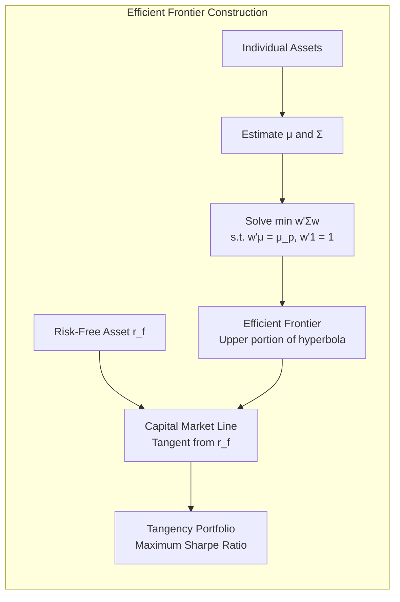
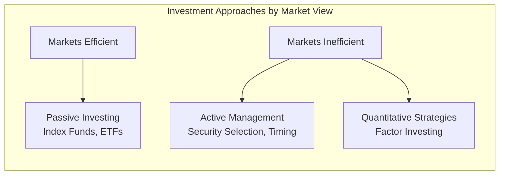

# Modern Portfolio Theory

## Part I: Mean-Variance Optimization

### Portfolio Return and Risk

For a portfolio of $n$ assets with weight vector $\mathbf{w}$:

$$\mu_p = \mathbf{w}^T \boldsymbol{\mu} = \sum_{i=1}^{n} w_i \mu_i$$

$$\sigma_p^2 = \mathbf{w}^T \Sigma \mathbf{w} = \sum_{i=1}^{n}\sum_{j=1}^{n} w_i w_j \sigma_{ij}$$

For two assets: $\sigma_p^2 = w_1^2\sigma_1^2 + w_2^2\sigma_2^2 + 2w_1 w_2 \rho_{12}\sigma_1\sigma_2$

### The Optimization Problem

$$\min_{\mathbf{w}} \; \mathbf{w}^T \Sigma \mathbf{w}$$

subject to:

$$\mathbf{w}^T \boldsymbol{\mu} = \mu_p, \quad \mathbf{w}^T \mathbf{1} = 1$$

Lagrangian solution yields the **efficient frontier** — the set of portfolios with maximum return for each level of risk.

### Key Properties

- **Minimum Variance Portfolio (MVP):** $\mathbf{w}^* = \frac{\Sigma^{-1}\mathbf{1}}{\mathbf{1}^T\Sigma^{-1}\mathbf{1}}$
- **Two-Fund Separation Theorem:** Any efficient portfolio is a linear combination of any two efficient portfolios
- **Diversification benefit:** Portfolio risk $<$ weighted average of individual risks (when $\rho < 1$)
- As $n \to \infty$ with equal weights: $\sigma_p^2 \to \bar{\sigma}_{ij}$ (only systematic risk remains)



## Part II: The Sharpe Ratio and Capital Market Line

### Sharpe Ratio

$$SR = \frac{\mu_p - r_f}{\sigma_p}$$

The **tangency portfolio** maximizes the Sharpe ratio:

$$\mathbf{w}_{\text{tan}} = \frac{\Sigma^{-1}(\boldsymbol{\mu} - r_f \mathbf{1})}{\mathbf{1}^T \Sigma^{-1}(\boldsymbol{\mu} - r_f \mathbf{1})}$$

### Capital Market Line (CML)

With a risk-free asset, all efficient portfolios lie on the CML:

$$E[R_p] = r_f + \frac{E[R_m] - r_f}{\sigma_m} \cdot \sigma_p$$

Every investor holds a combination of the risk-free asset and the tangency (market) portfolio. Risk preference only determines the allocation between the two.

## Part III: Capital Asset Pricing Model (CAPM)

### The CAPM Equation

$$E[R_i] = r_f + \beta_i (E[R_m] - r_f)$$

where:

$$\beta_i = \frac{\text{Cov}(R_i, R_m)}{\text{Var}(R_m)} = \frac{\sigma_{im}}{\sigma_m^2}$$

### Security Market Line (SML)

Plots expected return vs beta (not total risk). All correctly priced assets lie on the SML.

- $\alpha_i > 0$: undervalued (above SML)
- $\alpha_i < 0$: overvalued (below SML)
- $\alpha_i = 0$: fairly priced (on SML)

Jensen's alpha: $\alpha_i = R_i - [r_f + \beta_i(R_m - r_f)]$

### CML vs SML

| Feature | CML | SML |
|---|---|---|
| X-axis | Total risk ($\sigma$) | Systematic risk ($\beta$) |
| Applies to | Efficient portfolios only | All assets and portfolios |
| Slope | Market Sharpe ratio | Market risk premium |

### CAPM Assumptions
1. Mean-variance optimizing investors
2. Homogeneous expectations
3. Risk-free borrowing and lending at $r_f$
4. No taxes, transaction costs, or restrictions
5. All assets are infinitely divisible and marketable
6. Single-period model

```mermaid
graph TD
    subgraph "CAPM: Risk Decomposition"
        TR[Total Risk σ²_i] --> SR2["Systematic Risk<br/>β²_i · σ²_m"]
        TR --> UR["Unsystematic Risk<br/>σ²_ε (idiosyncratic)"]
        SR2 --> PRICED[Priced by Market<br/>Compensated via E[R]]
        UR --> UNPRICED[Not Priced<br/>Diversifiable away]
    end
```

## Part IV: CAPM Extensions and Tests

### Black's Zero-Beta CAPM

No risk-free asset; replace $r_f$ with return on zero-beta portfolio $R_z$:

$$E[R_i] = E[R_z] + \beta_i(E[R_m] - E[R_z])$$

### Empirical Challenges
- **Low-beta anomaly:** Low-beta stocks earn higher risk-adjusted returns than predicted
- **Size effect:** Small caps outperform (Banz, 1981)
- **Value effect:** High B/M stocks outperform (Fama-French, 1992)
- **Momentum:** Past winners continue to outperform (Jegadeesh-Titman, 1993)
- **Roll's Critique:** True market portfolio is unobservable; tests are joint hypotheses

### Performance Measures

| Measure | Formula | Interpretation |
|---|---|---|
| Sharpe Ratio | $(R_p - r_f)/\sigma_p$ | Return per unit of total risk |
| Treynor Ratio | $(R_p - r_f)/\beta_p$ | Return per unit of systematic risk |
| Jensen's Alpha | $R_p - [r_f + \beta_p(R_m - r_f)]$ | Excess return after risk adjustment |
| Information Ratio | $\alpha_p / \sigma(\epsilon_p)$ | Alpha per unit of tracking error |
| Sortino Ratio | $(R_p - r_f)/\sigma_{\text{downside}}$ | Like Sharpe but only downside deviation |

## Part V: Arbitrage Pricing Theory (APT)

### Multi-Factor Model

$$E[R_i] = r_f + \sum_{k=1}^{K} \beta_{ik} \lambda_k$$

where $\beta_{ik}$ = sensitivity to factor $k$, $\lambda_k$ = risk premium for factor $k$.

### APT vs CAPM

| Feature | CAPM | APT |
|---|---|---|
| Factors | Single (market) | Multiple (unspecified) |
| Derivation | Equilibrium | No-arbitrage |
| Assumptions | Stronger (utility, homogeneous expectations) | Weaker (no arbitrage, factor structure) |
| Testability | Joint hypothesis problem | Factors must be identified |

### Common APT Factors (Chen-Roll-Ross, 1986)
- Industrial production growth
- Changes in expected inflation
- Unexpected inflation
- Credit spread changes
- Term structure changes

## Part VI: Efficient Market Hypothesis (EMH)

### Three Forms

| Form | Information Set | Implication |
|---|---|---|
| **Weak** | Past prices and volume | Technical analysis cannot earn abnormal returns |
| **Semi-Strong** | All publicly available information | Fundamental analysis cannot earn abnormal returns |
| **Strong** | All information (public + private) | Even insiders cannot earn abnormal returns |

### Evidence

- **Supporting:** Event studies show rapid price adjustment; most active managers underperform index
- **Against:** Anomalies (size, value, momentum), excess volatility, bubbles, behavioral biases
- **Joint hypothesis problem:** Testing EMH requires an asset pricing model; rejection could mean wrong model

### Practical Implications
- Passive investing (index funds) is rational under semi-strong EMH
- If markets are not perfectly efficient, active management can add value but net of fees is the question
- Grossman-Stiglitz paradox: perfectly efficient markets are impossible (no incentive to gather information)



## References

- Markowitz, H.M. (1952). "Portfolio Selection." *Journal of Finance*, 7(1), 77-91.
- Bodie, Z., Kane, A., & Marcus, A.J. *Investments* (12th ed.). McGraw-Hill.
- Elton, E.J., Gruber, M.J., Brown, S.J., & Goetzmann, W.N. *Modern Portfolio Theory and Investment Analysis* (10th ed.). Wiley.
- Sharpe, W.F. (1964). "Capital Asset Prices." *Journal of Finance*, 19(3), 425-442.
- Ross, S.A. (1976). "The Arbitrage Theory of Capital Asset Pricing." *JET*, 13(3), 341-360.
- Fama, E.F. (1970). "Efficient Capital Markets: A Review." *Journal of Finance*, 25(2), 383-417.
