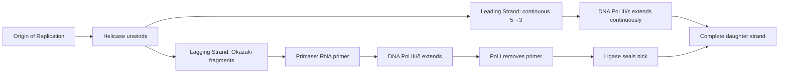
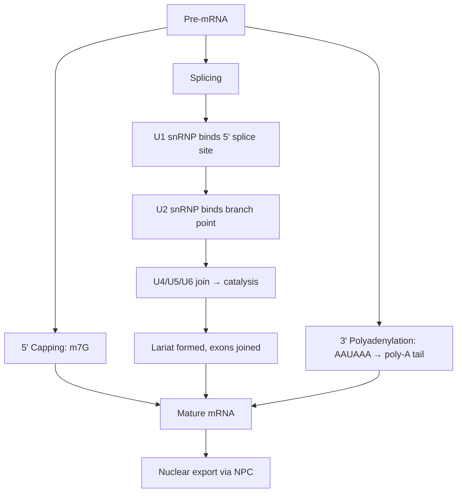
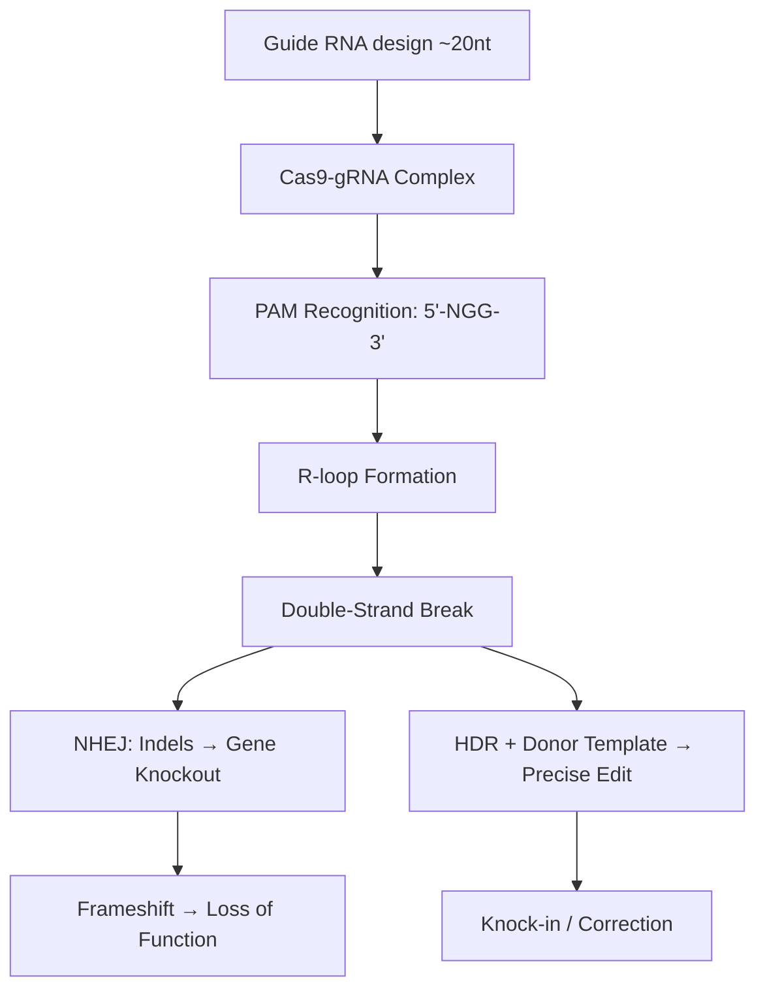

# Molecular Biology

Comprehensive notes on DNA structure, replication, transcription, translation, gene regulation, epigenetics, and genome editing.

## References

- Watson, J.D. et al. *Molecular Biology of the Gene*, 7th ed. Pearson, 2014.
- Lewin, B. *Genes XII*. Jones & Bartlett, 2017.
- Alberts, B. et al. *Molecular Biology of the Cell*, 7th ed. W.W. Norton, 2022.

---

## Part I — DNA & Replication

### Week 1: DNA Structure

**Watson-Crick model (1953):** Right-handed double helix, antiparallel strands (5'→3' / 3'→5'). Base pairing: A=T (2 H-bonds), G≡C (3 H-bonds).

- **B-form DNA:** 10.5 bp/turn, 3.4 nm pitch, 2 nm diameter (predominant in vivo).
- **A-form:** 11 bp/turn, wider, shorter — RNA-DNA hybrids.
- **Z-form:** Left-handed, 12 bp/turn — alternating purine-pyrimidine sequences.

**Chargaff's rules:** $[A] = [T]$ and $[G] = [C]$; thus $(A+G) = (T+C)$.

Melting temperature depends on GC content:

$$T_m \approx 69.3 + 0.41 \times (\%GC) \quad \text{(in standard salt)}$$

### Week 2: DNA Replication

**Semi-conservative** (Meselson-Stahl, 1958). Bidirectional from origins of replication (oriC in *E. coli*, multiple origins in eukaryotes).

Key enzymes:
- **Helicase** — unwinds dsDNA
- **SSB / RPA** — stabilizes ssDNA
- **Primase** — synthesizes RNA primers
- **DNA Pol III** (prokaryotes) / **DNA Pol δ/ε** (eukaryotes) — main replicative polymerases
- **DNA Pol I** — removes RNA primers, fills gaps (prokaryotes)
- **Ligase** — seals nicks

**Leading strand:** continuous synthesis in 5'→3' direction.
**Lagging strand:** discontinuous — Okazaki fragments ($\sim 1000$--$2000$ nt in prokaryotes, $\sim 100$--$200$ nt in eukaryotes).

**Fidelity:** Base selection ($10^{-5}$) × proofreading 3'→5' exonuclease ($10^{-2}$) × mismatch repair ($10^{-2}$) yields overall error rate:

$$\text{Error rate} \sim 10^{-9} \text{ per bp per replication}$$

**Telomere replication:** Telomerase (reverse transcriptase + RNA template) extends 3' overhang — TTAGGG repeats in humans. Without telomerase, progressive shortening (Hayflick limit).

---

## Part II — Transcription & RNA Processing

### Week 3: Transcription

**Prokaryotic transcription:**
- RNA polymerase holoenzyme ($\alpha_2\beta\beta'\sigma$) recognizes promoter at –10 (TATAAT, Pribnow box) and –35 regions.
- $\sigma$ factor dissociates after initiation; core enzyme elongates.
- Termination: Rho-independent (hairpin + polyU) or Rho-dependent.

**Eukaryotic transcription:**
- **RNA Pol I** — rRNA (28S, 18S, 5.8S)
- **RNA Pol II** — mRNA, snRNA, miRNA
- **RNA Pol III** — tRNA, 5S rRNA

Promoter elements for Pol II:
- **TATA box** (~–30): bound by TBP (TATA-binding protein) within TFIID.
- **Inr** (initiator): overlaps +1.
- **Enhancers/silencers:** can be thousands of bp away; looping via Mediator complex.

**Pre-initiation complex (PIC):** TFIID → TFIIA → TFIIB → Pol II/TFIIF → TFIIE → TFIIH (helicase + CTD kinase).

### Week 4: RNA Processing

**5' capping:** 7-methylguanosine cap added co-transcriptionally (protects from exonucleases, aids ribosome recruitment).

**Splicing:** Introns removed by spliceosome (U1, U2, U4, U5, U6 snRNPs).
- Branch point A attacks 5' splice site → lariat intermediate.
- 3' OH of exon 1 attacks 3' splice site → exons joined.
- **Alternative splicing:** ~95% of human multi-exon genes; Drosophila *Dscam* can produce >38,000 isoforms.

**3' polyadenylation:** AAUAAA signal → cleavage → poly(A) polymerase adds ~200 A residues.

---

## Part III — Translation

### Week 5: Protein Synthesis

**Ribosome structure:**
- Prokaryotic: 70S (30S + 50S). 30S: 16S rRNA + 21 proteins. 50S: 23S + 5S rRNA + 31 proteins.
- Eukaryotic: 80S (40S + 60S).

**tRNA aminoacylation:** Aminoacyl-tRNA synthetases charge tRNAs with cognate amino acids (20 synthetases, one per amino acid). Two-step: amino acid + ATP → aminoacyl-AMP → aminoacyl-tRNA.

**Genetic code:** 64 codons, 61 sense + 3 stop (UAA, UAG, UGA). Start: AUG (Met). **Wobble** at 3rd codon position allows inosine in tRNA anticodon to pair with U, C, or A.

**Translation phases:**
1. **Initiation:** mRNA + small subunit + initiator tRNA (fMet-tRNA$_f$ in prokaryotes) → start codon recognition → large subunit joins.
2. **Elongation:** aminoacyl-tRNA enters A site (EF-Tu/eEF1A + GTP) → peptide bond (peptidyl transferase, ribozyme activity of 23S/28S rRNA) → translocation (EF-G/eEF2 + GTP).
3. **Termination:** Stop codon in A site → release factors (RF1/RF2 in prokaryotes, eRF1 in eukaryotes) → peptide release → ribosome recycling.

**Elongation rate:** $\sim 15$--$20$ amino acids/sec (prokaryotes), $\sim 6$ amino acids/sec (eukaryotes).

---

## Part IV — Gene Regulation

### Week 6: Prokaryotic Regulation

**lac operon** (Jacob & Monod, 1961):
- **Negative regulation:** LacI repressor binds operator, blocks transcription. Allolactose (inducer) binds LacI → conformational change → derepression.
- **Positive regulation:** Low glucose → high cAMP → CAP-cAMP binds upstream → enhances Pol binding.
- **Dual control:** maximal expression requires lactose present AND glucose absent.

**Attenuation** (trp operon): Leader peptide with Trp codons; ribosome stalling when Trp is scarce allows antiterminator hairpin → read-through.

### Week 7: Eukaryotic Regulation & Epigenetics

**Transcription factors:** Activators (e.g., p53, NF-$\kappa$B) and repressors bind enhancers/silencers. DNA-binding domains: zinc finger, helix-turn-helix, leucine zipper, bHLH.

**Chromatin remodeling:** Nucleosome = 147 bp DNA wrapped around histone octamer (H2A, H2B, H3, H4)$_2$.
- **Euchromatin:** open, transcriptionally active.
- **Heterochromatin:** compact, silent.

**Histone modifications (the "histone code"):**

| Mark | Effect | Writers | Erasers |
|------|--------|---------|---------|
| H3K4me3 | Activation (promoters) | MLL/SET1 | KDM5 |
| H3K27me3 | Repression | PRC2 (EZH2) | KDM6/UTX |
| H3K9me3 | Heterochromatin | SUV39H1 | KDM4 |
| H3K27ac | Active enhancers | p300/CBP | HDACs |

**DNA methylation:** CpG dinucleotides methylated by DNMTs (DNMT1 maintenance, DNMT3a/b de novo). Methylated promoters → recruit MeCP2 → histone deacetylation → silencing. Important in X-inactivation, imprinting, and cancer (hypermethylation of tumor suppressors).

---

## Part V — Genome Editing

### Week 8: CRISPR-Cas9

**Components:**
- **Cas9:** endonuclease (from *S. pyogenes*) with RuvC and HNH nuclease domains.
- **Guide RNA (gRNA):** ~20 nt spacer complementary to target + scaffold (tracrRNA).
- **PAM sequence:** 5'-NGG-3' immediately downstream of target on non-target strand — required for Cas9 binding.

**Mechanism:**
1. gRNA-Cas9 complex scans DNA for PAM.
2. Local melting and R-loop formation; gRNA base-pairs with target strand.
3. HNH cleaves target strand; RuvC cleaves non-target strand → **double-strand break (DSB)** 3 bp upstream of PAM.

**DSB repair:**
- **NHEJ** (non-homologous end joining): error-prone, insertions/deletions → gene knockout.
- **HDR** (homology-directed repair): with donor template → precise edits (knock-in, correction). Efficiency typically $< 30\%$.

**Variants:** dCas9 (dead, no cleavage — CRISPRi/CRISPRa), base editors (CBE, ABE), prime editing (reverse transcriptase fusion).

---

## Key Numerical Benchmarks

| Parameter | Value |
|-----------|-------|
| Human genome size | $\sim 3.2 \times 10^9$ bp |
| Protein-coding genes | $\sim 20,000$ |
| Replication error rate | $\sim 10^{-9}$ per bp |
| Transcription error rate | $\sim 10^{-5}$ per nt |
| Translation error rate | $\sim 10^{-4}$ per codon |
| Nucleosome repeat length | $\sim 200$ bp |
