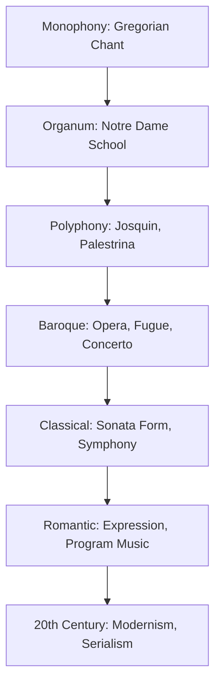
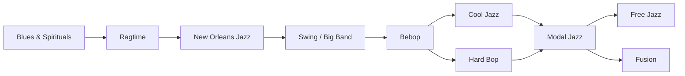
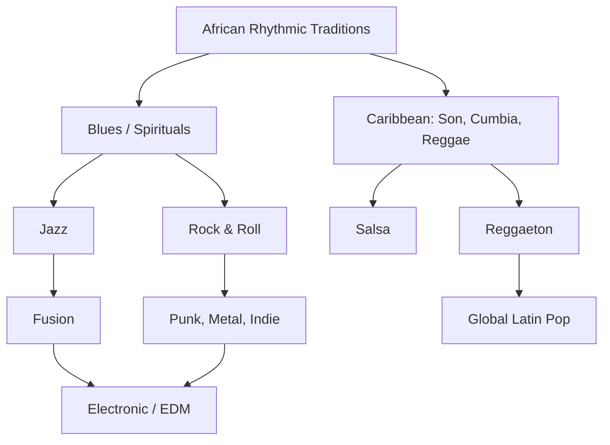

# Music History — Medieval to Modern

## Part I — Western Art Music: Origins to Classical

### Week 1: Medieval (500-1400)

**Plainchant (Gregorian Chant)**: monophonic, unmetered, Latin liturgical text. Modal system (8 church modes, not major/minor). Pope Gregory I credited (legendarily) with codification.

**Organum**: the birth of polyphony. Parallel organum (4ths/5ths), then free organum. The **Notre Dame school** (12th-13th c.):
- **Leonin**: composed the *Magnus Liber Organi*; sustained-note organum
- **Perotin**: expanded to three and four voices (*Viderunt Omnes*); rhythmic modes

**Secular music**: troubadours (southern France, Occitan), trouveres (northern France), Minnesanger (Germany). Courtly love poetry set to monophonic melody.

### Week 2: Renaissance (1400-1600)

**Josquin des Prez** (c. 1450-1521): "the master of the notes" (Luther). Imitative counterpoint — each voice enters with the same melody at staggered intervals. Motets and masses of extraordinary expressive range.

**Palestrina** (c. 1525-1594): the model of Catholic counterpoint. *Missa Papae Marcelli* reportedly saved polyphony from the Council of Trent's censure. Smooth voice leading, consonance, text clarity.

**Madrigal**: secular vocal music, often Italian. Word painting (*madrigalisms*): ascending melody on "heaven," chromaticism on "pain." Monteverdi's late madrigals bridge Renaissance and Baroque.

### Week 3: Baroque (1600-1750)

**Birth of opera**: Monteverdi's *L'Orfeo* (1607) — recitative (speech-song) and aria (lyrical expression). Drama conveyed through music.

**J.S. Bach** (1685-1750): the supreme contrapuntist. *The Well-Tempered Clavier* (48 preludes and fugues in all 24 keys), the *Mass in B minor*, the *St. Matthew Passion*. The fugue as intellectual and expressive architecture.

**Vivaldi**: *The Four Seasons* — program music avant la lettre; the concerto as vehicle for virtuosity and narrative.

**Handel**: oratorio (*Messiah*), opera, instrumental music. Grandeur, theatrical sense.

**Basso continuo**: the Baroque rhythm section — harpsichord/organ + cello/bassoon realizing a figured bass. Defines the Baroque texture.

### Week 4: Classical (1750-1820)

**Sonata form**: the governing structure of the Classical era.
- Exposition (two contrasting themes, two keys) - Development (fragmentation, modulation) - Recapitulation (both themes in home key)

**Haydn** (1732-1809): "Father of the String Quartet" and the symphony. 104 symphonies, 68 quartets. Wit, surprise (*Surprise Symphony*), formal invention.

**Mozart** (1756-1791): opera (*Don Giovanni*, *The Marriage of Figaro*, *The Magic Flute*), piano concertos, symphonies. Grace, drama, and an unerring sense of proportion.

**Beethoven** (1770-1827): bridges Classical and Romantic. The *Eroica* (Symphony No. 3) expands the symphony's scope; the Ninth introduces voices. Late quartets push toward modernism. Deafness as biographical legend and artistic catalyst.

---

## Part II — Romantic to Modern

### Week 5: Romantic Era (1820-1900)

**Chopin**: the piano as private confessional. Nocturnes, etudes, preludes, polonaises. Polish nationalism sublimated into lyric form.

**Schumann**: literary Romantic — music criticism, poetic titles (*Carnaval*, *Kreisleriana*). Clara Schumann as performer and composer in her own right.

**Wagner** (1813-1883): **Gesamtkunstwerk** ("total work of art") — the music drama unifying music, text, staging, design. **Leitmotif**: recurring musical themes associated with characters, objects, or ideas (*The Ring Cycle*). Tristan chord ($F$-$B$-$D\sharp$-$G\sharp$) as the dissolution of tonal certainty.

**Brahms**: the Classical Romantic — symphonic rigor, chamber music, *Ein deutsches Requiem*. The Brahms-Wagner debate: absolute music vs. program music.

**Program music**: instrumental music with a narrative or descriptive intent. Berlioz (*Symphonie fantastique*: the *idee fixe*), Liszt (symphonic poems), Strauss (*Also sprach Zarathustra*).

### Week 6: Twentieth-Century Art Music

**Debussy** (1862-1918): Impressionism — whole-tone scales, parallel chords, fluid rhythm. *Prelude a l'apres-midi d'un faune* (1894) signals the end of Romantic harmony.

**Stravinsky** (1882-1971): *The Rite of Spring* (1913) — polyrhythm, dissonance, primitivism. Riot at the premiere. Later: neoclassicism (*Pulcinella*), then serialism (*Agon*).

**Schoenberg** (1874-1951): atonality, then the **twelve-tone method** (serialism). Each composition uses a *tone row* — an ordered arrangement of all 12 chromatic pitches. No note repeats until all 12 have sounded.

**Bartok**: folk music + modernist technique. *Music for Strings, Percussion and Celesta*, the string quartets. The golden ratio as structural principle.

**Cage** (1912-1992): **aleatory (chance) music**. *4'33"* — the performer sits in silence; the "music" is ambient sound. Radical redefinition of what counts as music.

**Minimalism** (1960s-): repetition, gradual process, diatonic harmony.
- Steve Reich: phasing (*It's Gonna Rain*), interlocking patterns (*Music for 18 Musicians*)
- Philip Glass: arpeggiated patterns, additive process (*Einstein on the Beach*)
- Terry Riley: *In C* (1964) — 53 short patterns, performed by any number of players

---

## Part III — Jazz

### Week 7: Blues to Bebop

**The Blues** (late 19th c.): 12-bar form, blue notes ($\flat 3$, $\flat 5$, $\flat 7$), call-and-response, AAB lyric form. Robert Johnson, Bessie Smith, W.C. Handy.

**Ragtime** (1890s-1910s): syncopated piano music. Scott Joplin ("Maple Leaf Rag"). A bridge between European form and African-American rhythm.

**New Orleans Jazz** (1910s-1920s): collective improvisation. Louis Armstrong — the first great jazz soloist; transforms ensemble music into a soloist's art. King Oliver, Jelly Roll Morton.

**Swing (1930s-1940s)**: big band era. Duke Ellington (composer-bandleader, *Take the A Train*), Count Basie, Benny Goodman. Dance music with sophisticated arrangement.

**Bebop (1940s)**: revolt against swing's commercialism. Small combos, fast tempos, complex harmony.
- **Charlie Parker** (alto sax): virtuosic improvisation, "Confirmation," "Ko-Ko"
- **Dizzy Gillespie** (trumpet): Afro-Cuban jazz fusion, "A Night in Tunisia"
- **Thelonious Monk**: angular melodies, dissonance, rhythmic displacement

### Week 8: Cool to Fusion

**Cool Jazz (1950s)**: relaxed tempos, lighter tone. Miles Davis (*Birth of the Cool*), Dave Brubeck (*Time Out* — odd meters), West Coast school.

**Modal Jazz**: improvisation based on scales (modes) rather than chord changes. Miles Davis, *Kind of Blue* (1959) — the best-selling jazz album ever. "So What": D Dorian for 16 bars, Eb Dorian for 8, D Dorian for 8.

**Free Jazz**: abandon fixed harmony, melody, rhythm. Ornette Coleman (*Free Jazz*, 1961), John Coltrane (*Ascension*), Albert Ayler. Liberation or chaos — the debate continues.

**Fusion (1970s)**: jazz + rock/funk. Miles Davis (*Bitches Brew*), Herbie Hancock (*Head Hunters*), Weather Report, Return to Forever. Electric instruments, groove, extended improvisation.

---

## Part IV — Popular Music

### Week 9: Rock and Its Descendants

**Blues-rock**: electric blues amplified. Muddy Waters, Howlin' Wolf $\to$ British Invasion (Rolling Stones, Yardbirds, Animals).

**British Invasion (1960s)**: The Beatles transform pop from singles to albums (*Sgt. Pepper's*, 1967). The Who, The Kinks.

**Psychedelic**: Hendrix, Pink Floyd, Grateful Dead. Studio experimentation, extended improvisation, altered states.

**Progressive Rock (1970s)**: classical/jazz ambitions. Yes, Genesis, King Crimson. Complex meters, concept albums, virtuosity.

**Punk (1976-)**: three chords, DIY ethos, anti-virtuosity. Ramones, Sex Pistols, Clash. A reaction against prog excess.

**Post-punk / New Wave**: Joy Division, Talking Heads, Depeche Mode. Synthesizers, angular guitars, art-school aesthetics.

**Grunge / Alternative (1990s)**: Nirvana, Pearl Jam, Soundgarden. Punk energy + metal weight + Gen-X alienation.

**Indie**: umbrella term for non-major-label aesthetics. Sonic Youth, Pavement, Radiohead (who transcended all categories).

### Week 10: Electronic Music

**Musique concrete** (1948): Pierre Schaeffer — recorded sounds as raw material, manipulated via tape.

**Synthesizer pioneers**: Stockhausen (*Gesang der Junglinge*), Wendy Carlos (*Switched-On Bach*).

**Kraftwerk** (1970s): electronic pop, man-machine aesthetic. *Autobahn*, *Trans-Europe Express*. Direct ancestors of synth-pop, hip-hop, techno.

**House** (Chicago, 1980s): four-on-the-floor kick, synthesized bass, 120-130 BPM. Frankie Knuckles, Larry Heard.

**Techno** (Detroit, 1980s): darker, more industrial. Juan Atkins, Derrick May, Kevin Saunderson.

**Ambient**: Brian Eno (*Music for Airports*). Music as environment, not narrative.

---

## Part V — Latin and Global Music

### Week 11: Latin American Musical Traditions

**Son cubano**: the root of salsa. Clave rhythm as organizing pulse — the 3-2 or 2-3 son clave. Tres guitar, bongos, maracas. Buena Vista Social Club.

**Bossa nova** (Brazil, late 1950s): samba + cool jazz. Joao Gilberto, Antonio Carlos Jobim (*The Girl from Ipanema*). Intimate vocal delivery, syncopated guitar.

**Tango** (Argentina/Uruguay): bandoneon, dramatic pauses, call-and-response between melody and rhythm. Astor Piazzolla: nuevo tango — concert tango fusing classical, jazz, and traditional elements.

**Cumbia** (Colombia): accordion-driven, 2/4 or 4/4, strong offbeat. Spread across Latin America with regional variations (Mexican cumbia, Argentine cumbia villera, Peruvian chicha).

**Salsa** (New York, 1960s-70s): Cuban son + Puerto Rican bomba/plena + jazz. Fania Records, Celia Cruz, Willie Colon, Hector Lavoe.

**Reggaeton** (Puerto Rico, 1990s-2000s): Jamaican dancehall + Latin hip-hop + electronic production. The dembow riddim as rhythmic backbone. Daddy Yankee, Bad Bunny, global dominance in the 2010s-20s.

### Week 12: Synthesis — Music as Cultural Mirror

Every genre emerges from **cross-cultural contact**, **technological change**, and **social upheaval**. The phonograph, radio, electric guitar, synthesizer, sampler, DAW, and streaming platform each reshaped what music could be and who could make it.

---

## References

- Grout, Donald Jay, and Claude V. Palisca. *A History of Western Music*. 10th ed. Norton, 2019.
- Taruskin, Richard. *The Oxford History of Western Music*. 5 vols. Oxford UP, 2005.
- Gioia, Ted. *The History of Jazz*. 3rd ed. Oxford UP, 2021.
- Gioia, Ted. *Music: A Subversive History*. Basic Books, 2019.
- Ross, Alex. *The Rest Is Noise: Listening to the Twentieth Century*. Farrar, Straus and Giroux, 2007.
- Sublette, Ned. *Cuba and Its Music: From the First Drums to the Mambo*. Chicago Review Press, 2004.
- Morales, Ed. *The Latin Beat*. Da Capo, 2003.
