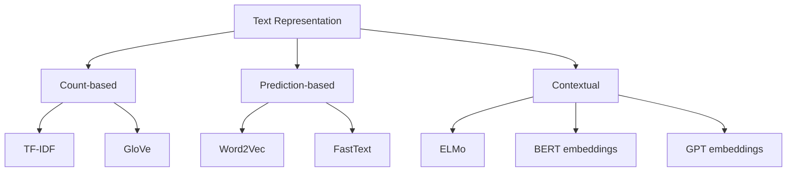
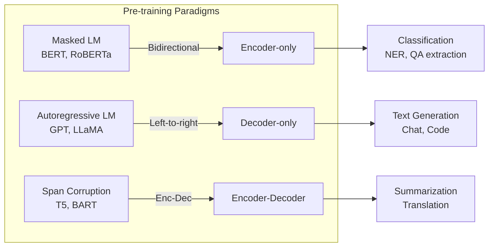
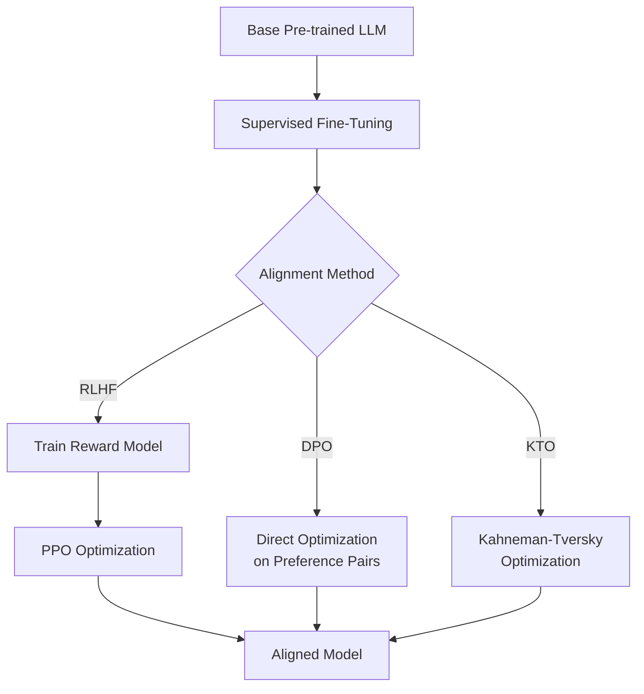

# Natural Language Processing

> From tokenization and embeddings to large language models and alignment.

## References

- Jurafsky, D. & Martin, J. H. *Speech and Language Processing*, 3rd ed. (draft). 2024.
- Goldberg, Y. *Neural Network Methods for Natural Language Processing*. Morgan & Claypool, 2017.
- Vaswani, A. et al. "Attention Is All You Need." NeurIPS, 2017.
- Devlin, J. et al. "BERT: Pre-training of Deep Bidirectional Transformers." NAACL, 2019.
- Radford, A. et al. "Language Models are Unsupervised Multitask Learners." OpenAI, 2019.
- Ouyang, L. et al. "Training Language Models to Follow Instructions with Human Feedback." NeurIPS, 2022.
- Rafailov, R. et al. "Direct Preference Optimization." NeurIPS, 2023.

---

# Part I — Text Representation

## Week 1: Tokenization

### Subword Tokenization

Modern NLP avoids word-level vocabularies (too large, OOV problem) and character-level (too long sequences).

**Byte Pair Encoding (BPE)** (Sennrich et al., 2016):
1. Start with character-level vocabulary
2. Count all adjacent pairs
3. Merge the most frequent pair into a new token
4. Repeat for $V$ merges

**WordPiece** (used in BERT): similar to BPE but merges based on likelihood increase:

$$\text{score}(a, b) = \frac{\text{freq}(ab)}{\text{freq}(a) \cdot \text{freq}(b)}$$

**SentencePiece** (Kudo & Richardson, 2018): language-agnostic, treats input as raw byte stream, uses unigram LM or BPE.

**Byte-level BPE** (used in GPT-2+): operates on UTF-8 bytes, vocabulary starts at 256.

## Week 2: Word Embeddings

### Word2Vec

**Skip-gram** objective — predict context from center word:

$$\max \sum_{t=1}^T \sum_{-c \leq j \leq c, j \neq 0} \log P(w_{t+j} | w_t)$$

$$P(w_o | w_c) = \frac{\exp(v_{w_o}'^T v_{w_c})}{\sum_{w=1}^W \exp(v_w'^T v_{w_c})}$$

**Negative sampling** approximation:

$$\log \sigma(v_{w_o}'^T v_{w_c}) + \sum_{i=1}^k E_{w_i \sim P_n(w)}[\log \sigma(-v_{w_i}'^T v_{w_c})]$$

### GloVe (Global Vectors)

Factorize the log co-occurrence matrix:

$$J = \sum_{i,j=1}^V f(X_{ij})(w_i^T \tilde{w}_j + b_i + \tilde{b}_j - \log X_{ij})^2$$

where $f$ is a weighting function that caps frequent co-occurrences.

### Properties

Embeddings capture analogies: $v_{\text{king}} - v_{\text{man}} + v_{\text{woman}} \approx v_{\text{queen}}$

Limitations: static (one vector per word), no polysemy handling.

---

# Part II — Sequence Models

## Week 3: Seq2Seq and Attention

### Encoder-Decoder

The encoder maps input $(x_1, \ldots, x_n)$ to hidden states; the decoder generates output $(y_1, \ldots, y_m)$ autoregressively conditioned on the encoder output and previous tokens.

### Bahdanau Attention (2015)

Instead of compressing all information into a fixed context vector, attend to all encoder states:

$$\alpha_{ij} = \frac{\exp(e_{ij})}{\sum_{k=1}^n \exp(e_{ik})}, \quad e_{ij} = a(s_{i-1}, h_j)$$

$$c_i = \sum_{j=1}^n \alpha_{ij} h_j$$

where $a$ is an alignment model (small neural network), $s_{i-1}$ is the decoder state, $h_j$ are encoder states.

### Luong Attention Variants

- **Dot**: $e_{ij} = s_i^T h_j$
- **General**: $e_{ij} = s_i^T W_a h_j$
- **Concat**: $e_{ij} = v_a^T \tanh(W_a[s_i; h_j])$

---

# Part III — Pre-trained Language Models

## Week 4: BERT and GPT

### BERT (Bidirectional Encoder Representations from Transformers)

Pre-training objectives:

**Masked Language Modeling (MLM)**: randomly mask 15% of tokens, predict them:

$$\mathcal{L}_{\text{MLM}} = -E\left[\sum_{i \in \mathcal{M}} \log P(x_i | x_{\setminus \mathcal{M}})\right]$$

**Next Sentence Prediction (NSP)**: binary classification — is sentence B the actual next sentence after A?

Fine-tuning: add task-specific head on `[CLS]` token for classification, or use token representations for sequence labeling.

### GPT (Generative Pre-trained Transformer)

Autoregressive language modeling:

$$\mathcal{L}_{\text{LM}} = -\sum_{i=1}^n \log P(x_i | x_1, \ldots, x_{i-1})$$

Uses causal (left-to-right) attention mask. Scaling laws (Kaplan et al., 2020):

$$L(N) \propto N^{-\alpha_N}, \quad L(D) \propto D^{-\alpha_D}, \quad L(C) \propto C^{-\alpha_C}$$

### Language Model Evaluation

**Perplexity**:

$$PP = \exp\left(-\frac{1}{N}\sum_{i=1}^N \log p(w_i | w_1, \ldots, w_{i-1})\right)$$

Lower perplexity = better model. Equivalent to the exponential of cross-entropy loss.

## Week 5: Modern LLM Techniques

### In-Context Learning

Few-shot prompting: provide examples in the prompt without gradient updates. Performance scales with model size (Brown et al., 2020).

### Chain-of-Thought

Elicit step-by-step reasoning: "Let's think step by step" or provide worked examples. Emergent in models above ~100B parameters (Wei et al., 2022).

### Retrieval-Augmented Generation (RAG)

Combine retriever (dense passage retrieval) with generator:

$$P(y|x) = \sum_{z \in \text{top-}k} P(z|x) \cdot P(y|x, z)$$

---

# Part IV — Alignment

## Week 6: RLHF and DPO

### RLHF Pipeline (Ouyang et al., 2022)

1. **Supervised Fine-Tuning (SFT)**: fine-tune on high-quality demonstrations
2. **Reward Model (RM)**: train on human preference pairs $(y_w \succ y_l | x)$:

$$\mathcal{L}_{\text{RM}} = -E\left[\log \sigma(r_\theta(x, y_w) - r_\theta(x, y_l))\right]$$

3. **RL optimization** (PPO): maximize reward while staying close to SFT policy:

$$\max_\pi E_{x \sim D, y \sim \pi}[r_\theta(x, y)] - \beta \text{KL}[\pi \| \pi_{\text{ref}}]$$

### Direct Preference Optimization (DPO)

Bypass the reward model by reparameterizing. The optimal policy under the RLHF objective satisfies:

$$r(x, y) = \beta \log \frac{\pi^*(y|x)}{\pi_{\text{ref}}(y|x)} + \beta \log Z(x)$$

Substituting into the Bradley-Terry preference model:

$$\mathcal{L}_{\text{DPO}} = -E\left[\log \sigma\left(\beta \log \frac{\pi_\theta(y_w|x)}{\pi_{\text{ref}}(y_w|x)} - \beta \log \frac{\pi_\theta(y_l|x)}{\pi_{\text{ref}}(y_l|x)}\right)\right]$$

### Instruction Tuning

Fine-tune on diverse instruction-response pairs. Key datasets: FLAN, Natural Instructions, OpenAssistant, ShareGPT.

---

## Summary Checklist

- [ ] Implement BPE tokenizer from scratch
- [ ] Train Word2Vec with negative sampling
- [ ] Code Bahdanau attention mechanism
- [ ] Fine-tune BERT for text classification
- [ ] Calculate perplexity for a language model
- [ ] Understand the DPO loss derivation from RLHF
- [ ] Compare few-shot vs. fine-tuned performance
