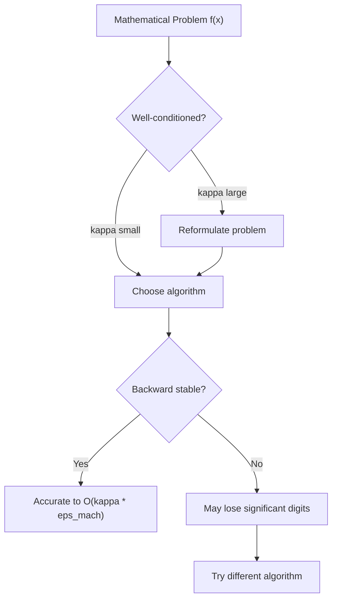
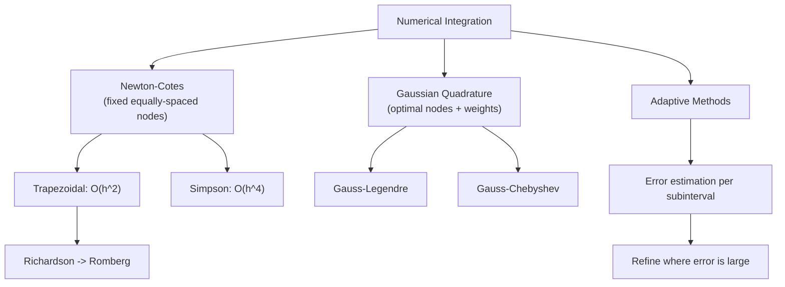
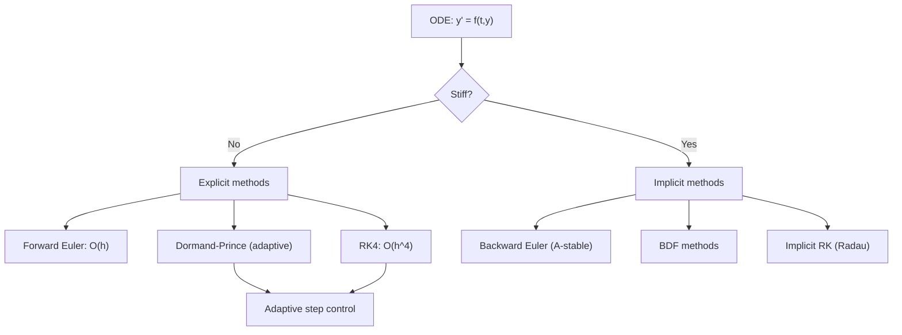

# Numerical Analysis

> The art and science of computing approximate solutions to mathematical problems with controlled error.

Related: [[harmonic-analysis]] | [[stochastic-processes]] | [[time-series]]

---

## Part I: Floating Point Arithmetic and Error Analysis (Weeks 1-2)

### 1.1 IEEE 754 Floating Point

A floating point number is represented as:

$$fl(x) = \pm (1.b_1 b_2 \cdots b_{p-1})_2 \times 2^e$$

| Format | Precision $p$ | Exponent bits | $\epsilon_{\text{mach}}$ |
|---|---|---|---|
| Single (32-bit) | 24 | 8 | $2^{-24} \approx 5.96 \times 10^{-8}$ |
| Double (64-bit) | 53 | 11 | $2^{-53} \approx 1.11 \times 10^{-16}$ |

**Machine epsilon** $\epsilon_{\text{mach}}$: the smallest $\epsilon > 0$ such that $fl(1 + \epsilon) > 1$.

For any real $x$ in the representable range:

$$fl(x) = x(1 + \delta), \quad |\delta| \leq \epsilon_{\text{mach}}$$

### 1.2 Error Propagation and Conditioning

**Absolute error:** $|x - \hat{x}|$. **Relative error:** $|x - \hat{x}|/|x|$.

The **condition number** of a problem $f$ at input $x$:

$$\kappa = \frac{|x f'(x)|}{|f(x)|}$$

measures sensitivity of the output to perturbations in input.

For a matrix $A$, the condition number for solving $Ax = b$:

$$\kappa(A) = \|A\| \cdot \|A^{-1}\|$$

**Catastrophic cancellation:** subtracting nearly equal numbers amplifies relative error. Example: computing $\sqrt{x+1} - \sqrt{x}$ for large $x$ should use rationalization.

### 1.3 Stability

An algorithm is **backward stable** if for every input $x$, it produces an exact result for a slightly perturbed input: $\hat{f}(x) = f(x + \delta x)$ with $|\delta x|/|x| = O(\epsilon_{\text{mach}})$.

An algorithm is **forward stable** if $|\hat{f}(x) - f(x)|/|f(x)| = O(\kappa \cdot \epsilon_{\text{mach}})$.

**Backward stability + good conditioning = accurate results.**

---

## Part II: Interpolation and Approximation (Weeks 3-5)

### 2.1 Polynomial Interpolation

Given $n+1$ data points $(x_0, y_0), \ldots, (x_n, y_n)$, there exists a unique polynomial $p_n(x)$ of degree $\leq n$ passing through all points.

**Lagrange form:**

$$p_n(x) = \sum_{k=0}^{n} y_k \prod_{\substack{j=0 \\ j \neq k}}^{n} \frac{x - x_j}{x_k - x_j}$$

**Newton form** (more efficient for adding points):

$$p_n(x) = \sum_{k=0}^{n} [y_0, \ldots, y_k] \prod_{j=0}^{k-1}(x - x_j)$$

where $[y_0, \ldots, y_k]$ are **divided differences**.

**Interpolation error:** For $f \in C^{n+1}[a,b]$:

$$f(x) - p_n(x) = \frac{f^{(n+1)}(\xi)}{(n+1)!}\prod_{j=0}^{n}(x - x_j)$$

**Runge's phenomenon:** High-degree interpolation on equally spaced points can diverge. Solution: use **Chebyshev nodes** $x_k = \cos\left(\frac{2k+1}{2(n+1)}\pi\right)$, which minimize $\max |\prod(x - x_j)|$.

### 2.2 Cubic Spline Interpolation

Piecewise cubic polynomials $S_i(x)$ on $[x_i, x_{i+1}]$:

$$S_i(x) = a_i + b_i(x - x_i) + c_i(x - x_i)^2 + d_i(x - x_i)^3$$

Conditions ($4n$ unknowns, $4n$ equations):
- Interpolation: $S_i(x_i) = y_i$, $S_i(x_{i+1}) = y_{i+1}$
- Continuity of $S'$ and $S''$ at interior knots
- Boundary conditions: natural ($S'' = 0$ at endpoints) or clamped ($S' = f'$ at endpoints)

The resulting tridiagonal system is solved in $O(n)$ time.

### 2.3 Best Approximation

**Weierstrass theorem:** Every continuous function on $[a,b]$ can be uniformly approximated by polynomials.

**Best $L^\infty$ approximation:** The minimax polynomial $p^*$ satisfies the **Chebyshev equioscillation theorem:** $f - p^*$ equioscillates at least $n+2$ times.

**Best $L^2$ approximation:** Project onto orthogonal polynomials (Legendre, Chebyshev, Hermite).

---

## Part III: Numerical Differentiation and Integration (Weeks 6-8)

### 3.1 Finite Differences

**Forward difference:** $f'(x) \approx \frac{f(x+h) - f(x)}{h}$, error $O(h)$

**Central difference:** $f'(x) \approx \frac{f(x+h) - f(x-h)}{2h}$, error $O(h^2)$

**Second derivative:** $f''(x) \approx \frac{f(x+h) - 2f(x) + f(x-h)}{h^2}$, error $O(h^2)$

**Richardson extrapolation:** Combine estimates at different $h$ to cancel leading error terms. If $D(h) = f'(x) + c_1 h^2 + O(h^4)$, then:

$$\frac{4D(h/2) - D(h)}{3} = f'(x) + O(h^4)$$

### 3.2 Numerical Quadrature

**Newton-Cotes formulas** (equally spaced nodes):

**Trapezoidal rule:**

$$\int_a^b f(x)\,dx \approx \frac{h}{2}\sum_{k=0}^{n-1}[f(x_k) + f(x_{k+1})], \quad \text{error } O(h^2)$$

**Simpson's rule** ($n$ even):

$$\int_a^b f(x)\,dx \approx \frac{h}{3}\sum_{k=0}^{n/2-1}[f(x_{2k}) + 4f(x_{2k+1}) + f(x_{2k+2})], \quad \text{error } O(h^4)$$

### 3.3 Gaussian Quadrature

Choose both nodes and weights optimally:

$$\int_a^b w(x) f(x)\,dx \approx \sum_{k=1}^{n} w_k f(x_k)$$

Exact for polynomials of degree $\leq 2n - 1$ (vs. degree $n$ for Newton-Cotes with $n$ points).

| Weight $w(x)$ | Interval | Polynomials |
|---|---|---|
| $1$ | $[-1,1]$ | Legendre |
| $(1-x^2)^{-1/2}$ | $[-1,1]$ | Chebyshev |
| $e^{-x}$ | $[0,\infty)$ | Laguerre |
| $e^{-x^2}$ | $(-\infty,\infty)$ | Hermite |

---

## Part IV: Root Finding and Nonlinear Equations (Weeks 9-10)

### 4.1 Bisection Method

For continuous $f$ with $f(a)f(b) < 0$, repeatedly halve the interval. After $n$ steps:

$$|x_n - x^*| \leq \frac{b-a}{2^n}$$

**Linear convergence** (one bit of accuracy per step). Robust but slow.

### 4.2 Newton's Method

$$x_{n+1} = x_n - \frac{f(x_n)}{f'(x_n)}$$

**Quadratic convergence** near a simple root: $|x_{n+1} - x^*| \leq C|x_n - x^*|^2$.

Requires: $f'(x^*) \neq 0$, good initial guess, $f \in C^2$.

**Newton's method for systems:** $F: \mathbb{R}^n \to \mathbb{R}^n$:

$$x_{n+1} = x_n - J_F(x_n)^{-1}F(x_n)$$

where $J_F$ is the Jacobian. In practice, solve $J_F \Delta x = -F(x_n)$ for $\Delta x$.

### 4.3 Other Methods

- **Secant method:** $x_{n+1} = x_n - f(x_n)\frac{x_n - x_{n-1}}{f(x_n) - f(x_{n-1})}$, superlinear convergence (order $\phi \approx 1.618$).
- **Fixed-point iteration:** $x_{n+1} = g(x_n)$; converges if $|g'(x^*)| < 1$.
- **Brent's method:** Combines bisection, secant, and inverse quadratic interpolation (guaranteed convergence + superlinear speed).

---

## Part V: Ordinary Differential Equations (Weeks 11-13)

### 5.1 Initial Value Problems

Given $y' = f(t, y)$, $y(t_0) = y_0$, approximate $y(t_n)$ at discrete times $t_n = t_0 + nh$.

**Euler's method** (order 1):

$$y_{n+1} = y_n + h f(t_n, y_n)$$

**Implicit (backward) Euler** (order 1, A-stable):

$$y_{n+1} = y_n + h f(t_{n+1}, y_{n+1})$$

### 5.2 Runge-Kutta Methods

The classical **RK4** method (order 4):

$$y_{n+1} = y_n + \frac{h}{6}(k_1 + 2k_2 + 2k_3 + k_4)$$

where:

$$k_1 = f(t_n, y_n)$$
$$k_2 = f\left(t_n + \frac{h}{2}, y_n + \frac{h}{2}k_1\right)$$
$$k_3 = f\left(t_n + \frac{h}{2}, y_n + \frac{h}{2}k_2\right)$$
$$k_4 = f(t_n + h, y_n + hk_3)$$

**Local truncation error:** $O(h^5)$ per step, **global error** $O(h^4)$.

### 5.3 Stiffness and Stability

A problem is **stiff** if some components decay much faster than others (e.g., $y' = -1000y + 999e^{-t}$).

The **stability region** of a method: the set of $z = h\lambda$ (where $y' = \lambda y$) for which the method does not grow.

- **Euler:** stability disk $|1 + z| \leq 1$
- **Backward Euler:** $|1/(1-z)| \leq 1$ (entire left half-plane: **A-stable**)
- **RK4:** larger stability region but still bounded

**A-stability:** The stability region contains the entire left half-plane $\{z : \text{Re}(z) \leq 0\}$. No explicit method with a finite number of stages is A-stable (Dahlquist barrier for linear multistep methods).

For stiff problems, use implicit methods (backward Euler, implicit RK, BDF).

### 5.4 Adaptive Step Size

**Embedded RK pairs** (e.g., Dormand-Prince RK4(5)): compute two approximations of different orders; use the difference as an error estimate:

$$\text{err} = |y_{n+1}^{(5)} - y_{n+1}^{(4)}|$$

Adjust step size: $h_{\text{new}} = h \cdot \min\left(S, \max\left(0.1, S\left(\frac{\text{tol}}{\text{err}}\right)^{1/5}\right)\right)$ with safety factor $S \approx 0.9$.

---

## Part VI: Iterative Methods for Linear Systems (Weeks 14-15)

### 6.1 Classical Iterative Methods

Decompose $A = D - L - U$ (diagonal, strict lower, strict upper triangular).

**Jacobi iteration:**

$$x^{(k+1)} = D^{-1}(L + U)x^{(k)} + D^{-1}b$$

**Gauss-Seidel iteration:**

$$x^{(k+1)} = (D - L)^{-1}Ux^{(k)} + (D-L)^{-1}b$$

Convergence: $\rho(T) < 1$ where $T$ is the iteration matrix and $\rho$ is the spectral radius. Guaranteed for strictly diagonally dominant or symmetric positive definite matrices.

**SOR** (Successive Over-Relaxation): $x^{(k+1)} = (1-\omega)x^{(k)} + \omega x_{\text{GS}}^{(k+1)}$ with optimal $\omega \in (1, 2)$.

### 6.2 Conjugate Gradient Method

For SPD matrix $A$, solving $Ax = b$ is equivalent to minimizing $\phi(x) = \frac{1}{2}x^TAx - b^Tx$.

The CG algorithm generates conjugate directions $\{p_k\}$ ($p_i^T A p_j = 0$ for $i \neq j$) and converges in at most $n$ steps (exact arithmetic).

**Convergence bound:**

$$\|x_k - x^*\|_A \leq 2\left(\frac{\sqrt{\kappa(A)} - 1}{\sqrt{\kappa(A)} + 1}\right)^k \|x_0 - x^*\|_A$$

**Preconditioning:** Replace $Ax = b$ with $M^{-1}Ax = M^{-1}b$ where $M \approx A$ but $M^{-1}$ is cheap to apply. This reduces the effective condition number.

### 6.3 Introduction to Finite Element Methods

For the BVP $-u''(x) = f(x)$ on $[0,1]$ with $u(0) = u(1) = 0$:

1. **Weak formulation:** Find $u \in H_0^1$ such that $\int_0^1 u'v'\,dx = \int_0^1 fv\,dx$ for all $v \in H_0^1$
2. **Discretization:** Restrict to finite-dimensional subspace $V_h$ (piecewise linear hat functions)
3. **Assembly:** Results in a sparse SPD system $Ku = F$ (stiffness matrix)
4. **Solve:** Use CG or direct sparse solvers

Error estimate: $\|u - u_h\|_{H^1} \leq Ch\|f\|_{L^2}$ (optimal for piecewise linear elements).

---

## References

1. Burden, R. L. & Faires, J. D. *Numerical Analysis*. 10th ed., Cengage Learning, 2015.
2. Trefethen, L. N. & Bau, D. *Numerical Linear Algebra*. SIAM, 1997.
3. Suli, E. & Mayers, D. F. *An Introduction to Numerical Analysis*. Cambridge University Press, 2003.
4. Trefethen, L. N. *Approximation Theory and Approximation Practice*. SIAM, 2013.
5. Hairer, E., Norsett, S. P. & Wanner, G. *Solving Ordinary Differential Equations I*. 2nd ed., Springer, 1993.
6. Hairer, E. & Wanner, G. *Solving Ordinary Differential Equations II: Stiff and Differential-Algebraic Problems*. 2nd ed., Springer, 1996.
7. Golub, G. H. & Van Loan, C. F. *Matrix Computations*. 4th ed., Johns Hopkins University Press, 2013.
