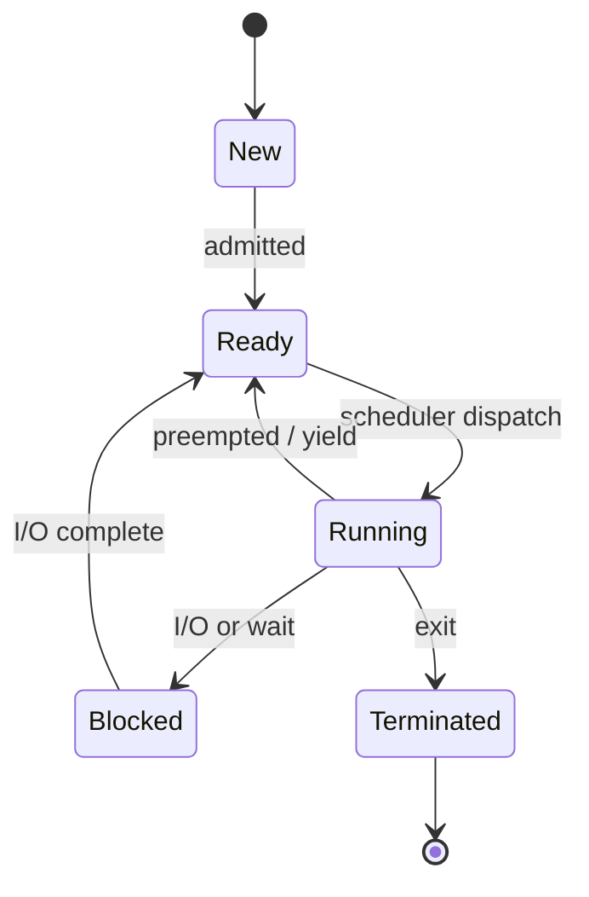
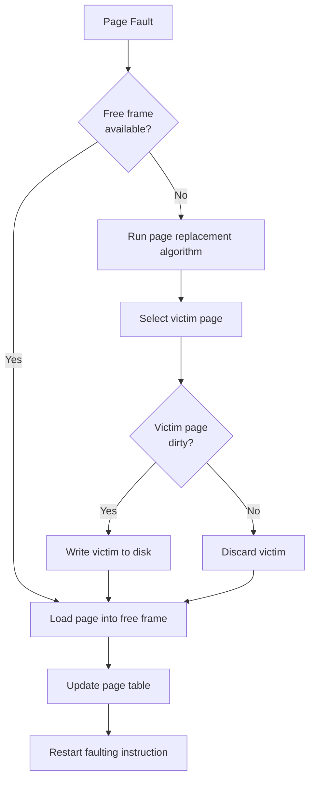
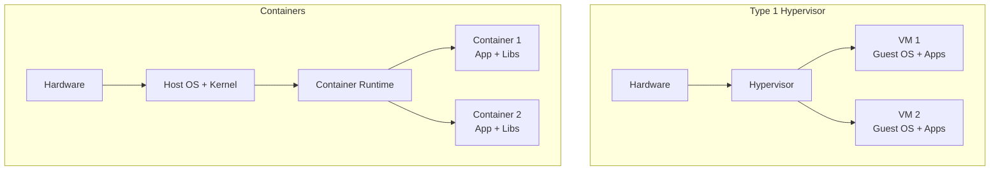

# Operating Systems

## References

- Arpaci-Dusseau, R.H. & Arpaci-Dusseau, A.C. *Operating Systems: Three Easy Pieces* (Arpaci-Dusseau Books, 2018) — OSTEP
- Tanenbaum, A.S. & Bos, H. *Modern Operating Systems*, 4th ed. (Pearson, 2015)
- Silberschatz, A., Galvin, P.B., & Gagne, G. *Operating System Concepts*, 10th ed. (Wiley, 2018)
- Love, R. *Linux Kernel Development*, 3rd ed. (Addison-Wesley, 2010)
- McKusick, M.K. et al. *The Design and Implementation of the FreeBSD Operating System*, 2nd ed. (Addison-Wesley, 2015)

---

## Part I — Virtualization: CPU

### Week 1: Processes and Scheduling

A **process** is a running program — its state includes: address space, registers (PC, stack pointer), open files, PID.

**Process states**: New, Ready, Running, Blocked, Terminated.

**Scheduling metrics**:
- **Turnaround time**: $T_{turnaround} = T_{completion} - T_{arrival}$
- **Response time**: $T_{response} = T_{first\_run} - T_{arrival}$
- **Throughput**: Jobs completed per unit time

### Week 2: Scheduling Algorithms

**FIFO** (First In, First Out): Simple, but convoy effect — short jobs stuck behind long ones. Average turnaround can be arbitrarily bad.

**SJF** (Shortest Job First): Optimal for average turnaround (non-preemptive). Problem: requires knowing job length; starvation of long jobs.

**STCF** (Shortest Time-to-Completion First): Preemptive SJF — switches to newly arrived shorter job. Optimal for turnaround but terrible for response time.

**Round Robin**: Each job runs for a time quantum $q$, then preempted. Response time: $T_{response} \le (n-1) \cdot q$. Trade-off: small $q$ = good response but high context-switch overhead; large $q$ = approaches FIFO.

**MLFQ** (Multi-Level Feedback Queue):
- Multiple priority queues; higher priority runs first
- New jobs start at highest priority
- If job uses entire time slice: priority reduced (CPU-bound)
- If job yields before slice: stays at same level (I/O-bound)
- Periodic **priority boost**: move all jobs to top queue (prevents starvation)
- Anti-gaming: track total CPU time at each level

**CFS** (Completely Fair Scheduler — Linux):
- Tracks **virtual runtime** $\text{vruntime}$ for each process
- Always runs process with smallest vruntime
- Uses red-black tree for $O(\log n)$ selection
- Time slice proportional to weight: $\text{slice}_i = \frac{w_i}{\sum_j w_j} \cdot \text{period}$
- Nice values $[-20, 19]$ map to weights via: $w = \frac{1024}{5^{nice/4}}$ (approximately)

$$\text{vruntime} += \frac{\text{actual\_runtime} \times w_0}{w_i}$$

where $w_0$ is the weight of nice=0 and $w_i$ is the process's weight.

---

## Part II — Virtualization: Memory

### Week 3: Virtual Memory and Paging

**Address space**: Each process sees a contiguous private address space: code, heap (grows up), stack (grows down).

**Paging**: Divide virtual and physical memory into fixed-size **pages** (typically 4KB). **Page table** maps virtual page numbers (VPN) to physical frame numbers (PFN).

Address translation for page size $2^p$:
- Virtual address = VPN ($n-p$ bits) + offset ($p$ bits)
- VPN indexes into page table to get PFN
- Physical address = PFN + offset

$$\text{PA} = \text{PageTable}[\text{VPN}] \cdot 2^p + \text{offset}$$

**Multi-level page tables**: Avoid allocating full table. For 64-bit addresses with 4KB pages and 8-byte PTEs: single-level table = $2^{52}$ entries = 32 PB. Instead, use 4-level (x86-64): PML4 $\to$ PDPT $\to$ PD $\to$ PT.

**TLB** (Translation Lookaside Buffer): Hardware cache of recent VPN $\to$ PFN translations. TLB hit: 1 cycle. TLB miss: page table walk (potentially 4 memory accesses on x86-64).

Effective memory access time:

$$T_{eff} = h \cdot (T_{TLB} + T_{mem}) + (1-h) \cdot (T_{TLB} + k \cdot T_{mem} + T_{mem})$$

where $h$ = TLB hit rate, $k$ = page table levels.

### Week 4: Page Replacement

When physical memory is full and a page fault occurs, the OS must evict a page.

**OPT** (Belady's Optimal): Evict the page that will be used furthest in the future. Not implementable but serves as benchmark.

**LRU** (Least Recently Used): Evict page not used for the longest time. Approximates OPT under locality. Expensive to implement exactly (requires tracking access order).

**Clock algorithm** (LRU approximation): Pages arranged in circular buffer. Each page has a **use bit** (set on access). On eviction: scan clockwise, clear use bits; evict first page with use bit = 0.

**Thrashing**: When working set exceeds physical memory, constant page faults. System spends more time paging than executing. Solution: working set model — estimate pages needed and admit only processes that fit.

$$\text{Working Set } W(t, \Delta) = \text{pages referenced in } [t - \Delta, t]$$

---

## Part III — Concurrency

### Week 5: Locks and Synchronization

**Critical section** problem: Code that accesses shared resources must satisfy:
1. **Mutual exclusion**: At most one thread in the critical section
2. **Progress**: If no thread is in CS, a waiting thread must be able to enter
3. **Bounded waiting**: A thread cannot wait forever

**Mutex** (mutual exclusion lock): `lock()` acquires; `unlock()` releases. Implementations:
- **Test-and-set** (atomic): `int TAS(int *old_ptr, int new) { int old = *old_ptr; *old_ptr = new; return old; }`
- **Compare-and-swap**: `CAS(addr, expected, new)` — set `*addr = new` only if `*addr == expected`
- **Ticket locks**: Fetch-and-add for fairness — `ticket = FAA(&next_ticket, 1); while (now_serving != ticket);`

**Semaphore**: Generalized lock with integer count. `sem_wait()`: decrement (block if 0). `sem_post()`: increment (wake one waiter). Binary semaphore = mutex. Counting semaphore = bounded resource pool.

**Condition variables**: `wait(cv, lock)` releases lock and sleeps. `signal(cv)` wakes one waiter. `broadcast(cv)` wakes all. Always use with `while` loop (spurious wakeups).

### Week 6: Deadlock

Four necessary conditions (Coffman et al., 1971):
1. **Mutual exclusion**: Resource held exclusively
2. **Hold and wait**: Hold one resource, wait for another
3. **No preemption**: Resources not forcibly taken
4. **Circular wait**: $P_1 \to P_2 \to \cdots \to P_n \to P_1$

**Prevention** strategies:
- Break circular wait: impose total ordering on locks, always acquire in order
- Break hold-and-wait: acquire all locks atomically (or release all if can't get one — trylock)
- Allow preemption: force release (not always possible)

**Detection**: Build resource allocation graph; detect cycles. For single-instance resources: cycle = deadlock. For multi-instance: use banker's algorithm.

**Banker's algorithm**: Maintain `Available[m]`, `Max[n][m]`, `Allocation[n][m]`, `Need[n][m]` where $\text{Need}[i] = \text{Max}[i] - \text{Allocation}[i]$. System is safe if there exists an ordering of processes where each can finish with available + allocated resources.

---

## Part IV — Persistence

### Week 7: File Systems

**Inode-based FS** (ext2/3/4):
- **Inode**: Fixed-size structure containing metadata (size, permissions, timestamps) and block pointers
- Direct pointers (12): point to data blocks
- Single indirect: points to block of pointers
- Double indirect: block of blocks of pointers
- Triple indirect: block of blocks of blocks of pointers

Max file size with 4KB blocks and 4-byte pointers ($k = 1024$ pointers per block):

$$\text{Max} = (12 + k + k^2 + k^3) \times 4\text{KB} \approx 4\text{TB}$$

**Journaling** (ext3/4, XFS): Write changes to a journal before applying to FS. On crash, replay journal. Modes:
- **Data journaling**: Journal both metadata and data (safest, slowest)
- **Ordered journaling**: Journal metadata, but write data to final location first (default ext4)
- **Writeback**: Journal metadata only, data can be stale after crash

**Copy-on-Write** (ZFS, Btrfs): Never overwrite in place. Write new data to new location, then atomically update pointer. Benefits: crash consistency without journal, easy snapshots.

### Week 8: I/O and Virtualization

**I/O interaction methods**:
- **Programmed I/O**: CPU polls device status register (busy-waiting)
- **Interrupt-driven**: Device signals completion via interrupt; CPU handles in ISR
- **DMA** (Direct Memory Access): Device reads/writes memory directly; interrupts only on completion

**Virtualization**:
- **Type 1 hypervisor** (bare metal): Xen, VMware ESXi. Runs directly on hardware.
- **Type 2 hypervisor** (hosted): VirtualBox, VMware Workstation. Runs on host OS.
- **Containers** (OS-level): Docker, LXC. Share host kernel; use namespaces (PID, network, mount, user) and cgroups (resource limits). Much lighter than VMs.

**Namespaces** provide isolation: each container sees its own PID 1, its own network stack, its own filesystem mounts. **Cgroups** limit resources: CPU shares, memory limits, I/O bandwidth.

---

## Key Formulas Summary

| Concept | Formula |
|---------|---------|
| CFS virtual runtime | $\text{vruntime} += \text{actual} \times w_0 / w_i$ |
| Address translation | $\text{PA} = \text{PT}[\text{VPN}] \cdot 2^p + \text{offset}$ |
| Effective access time | $T = h(T_{TLB}+T_{mem}) + (1-h)(T_{TLB}+k \cdot T_{mem}+T_{mem})$ |
| Max file size (ext4) | $(12 + k + k^2 + k^3) \times \text{block\_size}$ |
| Working set | $W(t,\Delta) = \text{pages in } [t-\Delta, t]$ |
