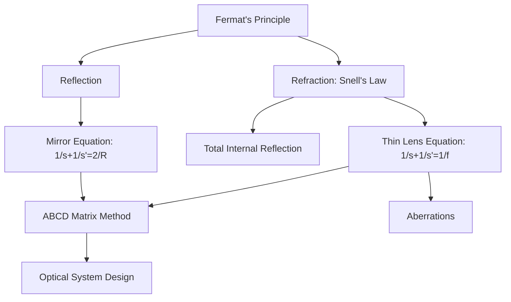
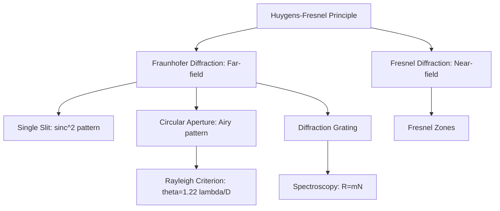
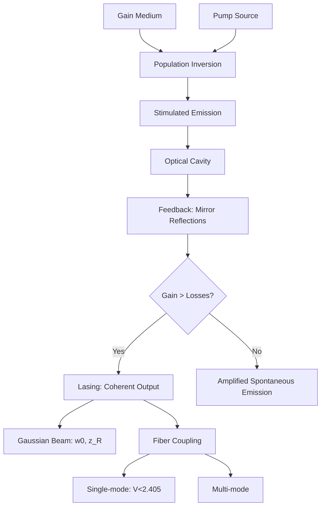

# Optics

## References

- Hecht, E. *Optics*, 5th ed. (Pearson, 2017)
- Born, M. & Wolf, E. *Principles of Optics*, 7th ed. (Cambridge, 1999)
- Saleh, B.E.A. & Teich, M.C. *Fundamentals of Photonics*, 3rd ed. (Wiley, 2019)

---

## Part I: Geometric Optics (Weeks 1-3)

### Fermat's Principle

Light travels the path of stationary optical path length:

$$\delta \int n(\mathbf{r})\,ds = 0$$

This yields the laws of reflection and refraction.

### Snell's Law

At an interface between media with refractive indices $n_1$ and $n_2$:

$$n_1\sin\theta_1 = n_2\sin\theta_2$$

Total internal reflection occurs when $\theta_1 > \theta_c = \arcsin(n_2/n_1)$ for $n_1 > n_2$.

### Mirrors

Spherical mirror with radius of curvature $R$, focal length $f = R/2$:

$$\frac{1}{s} + \frac{1}{s'} = \frac{1}{f} = \frac{2}{R}$$

Magnification: $M = -s'/s$

Sign convention: positive for concave mirrors (real focus), negative for convex.

### Thin Lenses

Lensmaker's equation:

$$\frac{1}{f} = (n-1)\left(\frac{1}{R_1} - \frac{1}{R_2}\right)$$

Thin lens equation: $\frac{1}{s} + \frac{1}{s'} = \frac{1}{f}$

Lateral magnification: $M = -s'/s$. Compound systems: matrix (ray transfer) methods.

### Ray Transfer Matrix (ABCD Matrices)

A ray is described by $(y, \theta)$. Propagation through optical elements:

$$\begin{pmatrix}y_2\\\theta_2\end{pmatrix} = \begin{pmatrix}A&B\\C&D\end{pmatrix}\begin{pmatrix}y_1\\\theta_1\end{pmatrix}$$

| Element | Matrix |
|---------|--------|
| Free space (length $d$) | $\begin{pmatrix}1&d\\0&1\end{pmatrix}$ |
| Thin lens (focal length $f$) | $\begin{pmatrix}1&0\\-1/f&1\end{pmatrix}$ |
| Flat interface ($n_1 \to n_2$) | $\begin{pmatrix}1&0\\0&n_1/n_2\end{pmatrix}$ |
| Mirror (radius $R$) | $\begin{pmatrix}1&0\\-2/R&1\end{pmatrix}$ |

### Aberrations

Seidel aberrations: spherical, coma, astigmatism, field curvature, distortion. Chromatic aberration from $n(\lambda)$ dispersion.

---

## Part II: Wave Optics — Interference (Weeks 4-6)

### Electromagnetic Waves

Light as an EM wave: $\mathbf{E} = E_0\cos(\mathbf{k}\cdot\mathbf{r} - \omega t + \phi)\,\hat{\mathbf{e}}$

Intensity: $I = \frac{1}{2}c\epsilon_0 E_0^2 \propto |E_0|^2$

### Superposition and Interference

Two coherent waves with intensities $I_1$, $I_2$ and phase difference $\delta$:

$$I = I_1 + I_2 + 2\sqrt{I_1 I_2}\cos\delta$$

Constructive: $\delta = 2m\pi$. Destructive: $\delta = (2m+1)\pi$.

### Young's Double-Slit Experiment

Slit separation $d$, screen distance $L$:

$$d\sin\theta = m\lambda \quad (\text{bright fringes})$$

Fringe spacing: $\Delta y = \lambda L/d$

### Thin-Film Interference

For a film of thickness $t$ and index $n_f$: $2n_f t\cos\theta_r = (m + 1/2)\lambda$ (constructive, with one reflection from higher-$n$ interface). Phase shift of $\pi$ upon reflection from a denser medium.

### Michelson Interferometer

Path difference $\Delta = 2(d_1 - d_2)$. Bright fringes when $\Delta = m\lambda$. Applications: precise length measurement, spectroscopy (Fourier transform), gravitational wave detection (LIGO).

### Fabry-Perot Interferometer

Multiple-beam interference. Transmission peaks (Airy function):

$$\mathcal{T} = \frac{1}{1 + F\sin^2(\delta/2)}, \qquad F = \frac{4R}{(1-R)^2}$$

Finesse: $\mathcal{F} = \pi\sqrt{F}/2$. Free spectral range: $\Delta\nu_{\text{FSR}} = c/(2nd)$.

---

## Part III: Diffraction (Weeks 7-9)

### Huygens-Fresnel Principle

Every point on a wavefront acts as a source of secondary spherical wavelets. The field at point $P$:

$$E(P) \propto \int_{\text{aperture}} \frac{E_0}{r}e^{ikr}\,dA$$

### Fraunhofer Diffraction (Far-Field)

Valid when $z \gg a^2/\lambda$ (Fresnel number $N_F = a^2/(\lambda z) \ll 1$).

**Single slit** (width $a$):

$$I(\theta) = I_0\left(\frac{\sin\beta}{\beta}\right)^2, \qquad \beta = \frac{\pi a\sin\theta}{\lambda}$$

First minimum at $\sin\theta = \lambda/a$.

**Circular aperture** (diameter $D$) — Airy pattern:

$$I(\theta) = I_0\left(\frac{2J_1(u)}{u}\right)^2, \qquad u = \frac{\pi D\sin\theta}{\lambda}$$

Rayleigh criterion (angular resolution): $\theta_R = 1.22\lambda/D$

**Diffraction grating** ($N$ slits, spacing $d$):

$$I(\theta) = I_0\left(\frac{\sin\beta}{\beta}\right)^2\left(\frac{\sin(N\gamma)}{\sin\gamma}\right)^2, \qquad \gamma = \frac{\pi d\sin\theta}{\lambda}$$

Principal maxima at $d\sin\theta = m\lambda$. Resolving power: $R = mN$.

### Fresnel Diffraction (Near-Field)

Fresnel zones, zone plates, Cornu spiral. Transitions to Fraunhofer regime as distance increases.

---

## Part IV: Polarization (Weeks 10-11)

### Polarization States

Linear: $\mathbf{E} = E_0\cos(\omega t - kz)\,\hat{\mathbf{x}}$

Circular: $\mathbf{E} = E_0[\cos(\omega t - kz)\,\hat{\mathbf{x}} \pm \sin(\omega t - kz)\,\hat{\mathbf{y}}]$

Elliptical: general case.

### Jones Calculus

Polarization state as a complex 2-vector (for fully polarized light):

$$\mathbf{J} = \begin{pmatrix}E_x\\E_y\end{pmatrix}$$

Jones matrices for optical elements:

| Element | Jones Matrix |
|---------|-------------|
| Linear polarizer ($x$) | $\begin{pmatrix}1&0\\0&0\end{pmatrix}$ |
| Quarter-wave plate (fast axis $x$) | $\begin{pmatrix}1&0\\0&e^{i\pi/2}\end{pmatrix}$ |
| Half-wave plate (fast axis $x$) | $\begin{pmatrix}1&0\\0&-1\end{pmatrix}$ |

### Stokes Parameters and Mueller Calculus

For partially polarized light, use Stokes vector $\mathbf{S} = (S_0, S_1, S_2, S_3)^T$ and Mueller matrices ($4\times 4$).

Degree of polarization: $\mathcal{P} = \sqrt{S_1^2 + S_2^2 + S_3^2}/S_0$

### Polarization Phenomena

Malus's law: $I = I_0\cos^2\theta$ (polarizer at angle $\theta$).

Brewster's angle: $\tan\theta_B = n_2/n_1$ (reflected light is fully polarized).

Birefringence: different refractive indices for ordinary and extraordinary rays ($\Delta n = n_e - n_o$). Applications: wave plates, compensators.

---

## Part V: Coherence, Lasers, and Fiber Optics (Weeks 12-14)

### Coherence

Temporal coherence: coherence time $\tau_c \sim 1/\Delta\nu$, coherence length $l_c = c\tau_c$.

Spatial coherence: Van Cittert-Zernike theorem relates the mutual coherence function to the source intensity distribution (Fourier transform relationship).

### Lasers

Essential components: gain medium, pump, optical resonator (cavity).

**Population inversion**: $N_2 > N_1$ (non-equilibrium). Requires 3-level or 4-level system.

**Stimulated emission**: Einstein B coefficient. Rate $R_{\text{stim}} = B_{21}\rho(\nu)N_2$.

Einstein relations: $A_{21}/B_{21} = 8\pi h\nu^3/c^3$, $B_{12}g_1 = B_{21}g_2$.

**Threshold condition**: gain $\geq$ losses. For a cavity of length $L$ with mirrors $R_1, R_2$:

$$g_{\text{th}} = \alpha + \frac{1}{2L}\ln\frac{1}{R_1 R_2}$$

**Laser types**: He-Ne (632.8 nm), Nd:YAG (1064 nm), CO$_2$ (10.6 $\mu$m), semiconductor diode, fiber lasers, Ti:sapphire (tunable).

**Gaussian beam**: $w(z) = w_0\sqrt{1+(z/z_R)^2}$, Rayleigh range $z_R = \pi w_0^2/\lambda$, beam divergence $\theta \approx \lambda/(\pi w_0)$.

### Fiber Optics

Total internal reflection in a cylindrical dielectric waveguide. Numerical aperture:

$$\text{NA} = \sin\theta_{\max} = \sqrt{n_{\text{core}}^2 - n_{\text{clad}}^2}$$

**Modes**: step-index fiber supports $V^2/2$ modes where $V = (2\pi a/\lambda)\text{NA}$. Single-mode fiber: $V < 2.405$.

**Attenuation**: Rayleigh scattering ($\propto \lambda^{-4}$), absorption. Minimum loss in silica at $\sim 1.55$ $\mu$m ($\sim 0.2$ dB/km).

**Dispersion**: material dispersion, waveguide dispersion, modal dispersion. Group velocity dispersion: $D = -(\lambda/c)(d^2n/d\lambda^2)$.

---

## Key Problem Types

1. **Geometric optics** — image formation (mirrors, lenses), ABCD matrices, aberrations
2. **Interference** — Young's experiment, thin films, Fabry-Perot, Michelson
3. **Diffraction** — single/multiple slit patterns, Airy disk, resolving power
4. **Polarization** — Jones/Mueller calculus, Brewster angle, wave plates
5. **Lasers** — rate equations, threshold gain, mode structure, Gaussian beams
6. **Fiber optics** — NA, mode analysis, dispersion, attenuation budgets
