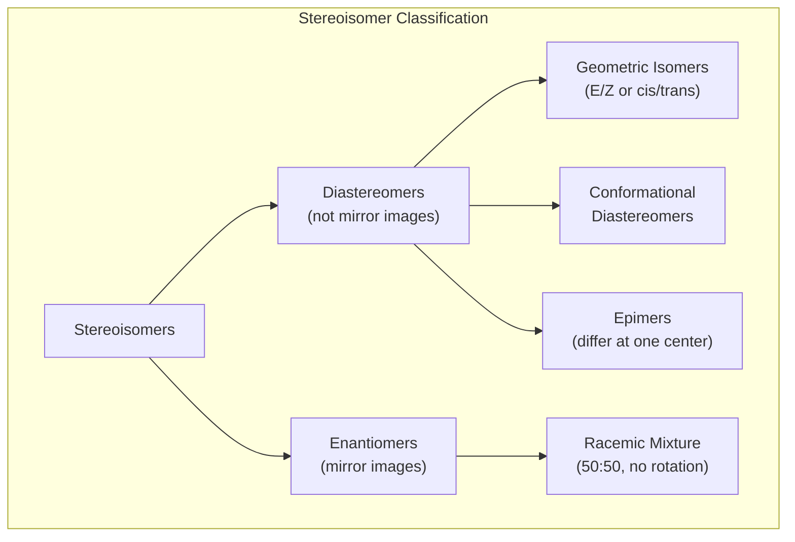
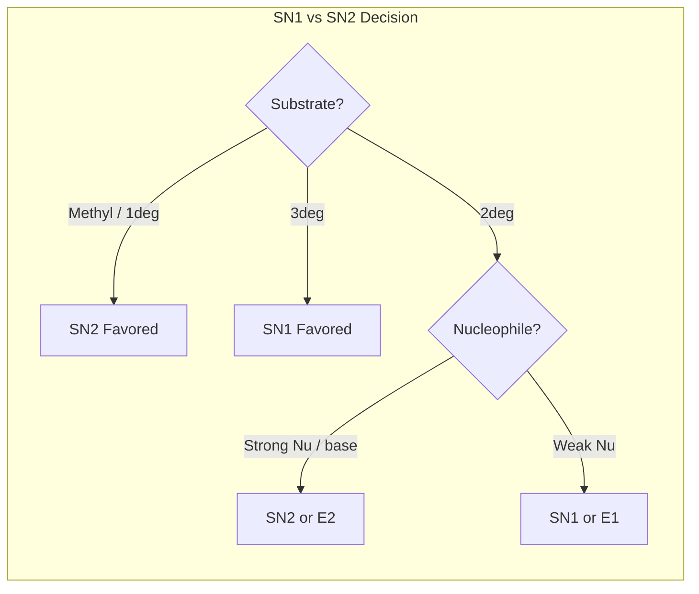

# Organic Chemistry

> Comprehensive notes covering functional groups, stereochemistry, reaction mechanisms (substitution, elimination, addition, aromatic), retrosynthesis, and spectroscopy.

**Primary Texts:**
- Clayden, J., Greeves, N., Warren, S. *Organic Chemistry*, 2nd ed. Oxford University Press, 2012.
- Wade, L.G. *Organic Chemistry*, 9th ed. Pearson, 2017.
- McMurry, J. *Organic Chemistry*, 9th ed. Cengage, 2016.

---

## Part I — Functional Groups and Nomenclature

### Week 1: Carbon Frameworks and Functional Groups

| Functional Group | General Formula | Example | Suffix/Prefix |
|---|---|---|---|
| Alkane | $\text{C}_n\text{H}_{2n+2}$ | Methane | -ane |
| Alkene | $\text{C}_n\text{H}_{2n}$ | Ethene | -ene |
| Alkyne | $\text{C}_n\text{H}_{2n-2}$ | Ethyne | -yne |
| Alcohol | R-OH | Ethanol | -ol |
| Aldehyde | R-CHO | Ethanal | -al |
| Ketone | R-CO-R' | Propanone | -one |
| Carboxylic acid | R-COOH | Ethanoic acid | -oic acid |
| Ester | R-COOR' | Methyl ethanoate | -oate |
| Amine | R-NH$_2$ | Methylamine | -amine |
| Amide | R-CONHR' | Ethanamide | -amide |

**IUPAC nomenclature:** Find the longest carbon chain, number to give substituents the lowest locants, name substituents alphabetically as prefixes.

### Week 2: Conformational Analysis

**Newman projections** describe rotational isomers along C-C bonds.
- **Anti** conformation: substituents 180 deg apart (lowest energy)
- **Gauche** conformation: substituents 60 deg apart
- **Eclipsed:** highest energy (torsional strain)

**Cyclohexane:** chair conformations interconvert via ring flip. Axial vs. equatorial positions; large substituents prefer equatorial (1,3-diaxial strain).

---

## Part II — Stereochemistry

### Week 3: Chirality and Optical Activity

A **chiral center** (stereocenter) is a carbon bonded to four different groups.

**Cahn-Ingold-Prelog (CIP) priority rules:**
1. Higher atomic number = higher priority
2. At first point of difference along the chain
3. Double/triple bonds treated as duplicated/triplicated atoms

**R/S assignment:** Orient lowest priority group away from viewer. If remaining priorities decrease clockwise: R (rectus). Counterclockwise: S (sinister).

**Optical activity:** chiral compounds rotate plane-polarized light. Specific rotation:

$$[\alpha] = \frac{\alpha_{\text{obs}}}{l \cdot c}$$

where $\alpha_{\text{obs}}$ is observed rotation (degrees), $l$ is path length (dm), $c$ is concentration (g/mL).

**Enantiomers:** non-superimposable mirror images. Same physical properties except optical rotation.
**Diastereomers:** stereoisomers that are not mirror images. Different physical properties.
**Meso compounds:** contain stereocenters but have an internal mirror plane (optically inactive).

### Week 4: E/Z Isomerism

For alkenes with restricted rotation:
- **Z (zusammen):** higher-priority groups on same side
- **E (entgegen):** higher-priority groups on opposite side

---

## Part III — Substitution Reactions

### Week 5: SN2 Mechanism

**Bimolecular nucleophilic substitution.** One-step concerted mechanism.

$$\text{Rate} = k[\text{RX}][\text{Nu}^-]$$

Key features:
- **Walden inversion** (backside attack): stereochemistry inverts at the carbon
- Favored by: strong nucleophile, primary/methyl substrate, polar aprotic solvent
- Steric hindrance slows SN2: $\text{CH}_3\text{X} > 1° > 2° \gg 3°$ (reactivity)

### Week 6: SN1 Mechanism

**Unimolecular nucleophilic substitution.** Two-step: ionization then nucleophilic capture.

$$\text{Rate} = k[\text{RX}]$$

Key features:
- Rate-determining step: formation of carbocation
- Carbocation stability: $3° > 2° > 1° > \text{methyl}$
- **Racemization** at stereocenter (planar carbocation attacked from both faces)
- Favored by: weak nucleophile, tertiary substrate, polar protic solvent

---

## Part IV — Elimination Reactions

### Week 7: E1 and E2 Mechanisms

**E2 (bimolecular elimination):**
- Concerted: base abstracts $\beta$-H as leaving group departs
- Anti-periplanar geometry required
- Strong base, high temperature favors elimination over substitution
- **Zaitsev rule:** more substituted alkene is the major product (thermodynamic control)

**E1 (unimolecular elimination):**
- Two-step via carbocation intermediate
- Same substrates as SN1 (tertiary)
- Zaitsev product usually predominates
- Hofmann rule applies when bulky base is used (less substituted alkene)

**Competition summary:**
- Strong nucleophile/base + primary: SN2
- Strong base + secondary/tertiary: E2
- Weak nucleophile + tertiary: SN1/E1
- Heat favors elimination; low temperature favors substitution

---

## Part V — Electrophilic Aromatic Substitution (EAS)

### Week 8: Benzene Reactivity

General mechanism: electrophile attacks the $\pi$ system, forming an arenium ion (sigma complex), then proton loss restores aromaticity.

**Common EAS reactions:**

| Reaction | Electrophile | Reagents |
|---|---|---|
| Halogenation | $\text{X}^+$ | $\text{X}_2$ / $\text{FeX}_3$ |
| Nitration | $\text{NO}_2^+$ | $\text{HNO}_3$ / $\text{H}_2\text{SO}_4$ |
| Sulfonation | $\text{SO}_3$ | Fuming $\text{H}_2\text{SO}_4$ |
| Friedel-Crafts alkylation | $\text{R}^+$ | $\text{RCl}$ / $\text{AlCl}_3$ |
| Friedel-Crafts acylation | $\text{RCO}^+$ | $\text{RCOCl}$ / $\text{AlCl}_3$ |

**Directing effects:**
- **Activating, ortho/para directors:** -OH, -OR, -NH$_2$, -NHCOR, alkyl groups (electron-donating)
- **Deactivating, meta directors:** -NO$_2$, -CN, -COOH, -SO$_3$H, -COR (electron-withdrawing)
- **Deactivating, ortho/para directors:** halogens (lone pair donation but inductive withdrawal)

### Week 9: Nucleophilic Addition to Carbonyls

Aldehydes and ketones undergo nucleophilic addition:

1. **Grignard reaction:** $\text{RMgBr} + \text{R'CHO} \rightarrow \text{R-CH(OH)-R'}$
2. **Hydride reduction:** $\text{NaBH}_4$ or $\text{LiAlH}_4$ reduce $\text{C=O}$ to alcohol
3. **Cyanohydrin formation:** $\text{HCN}$ addition
4. **Wittig reaction:** phosphorus ylide converts $\text{C=O}$ to $\text{C=C}$
5. **Aldol condensation:** enolate attacks another carbonyl

Reactivity: aldehydes > ketones (steric and electronic effects).

---

## Part VI — Retrosynthesis

### Week 10: Disconnection Approach

**Retrosynthesis** works backward from target to available starting materials.

**Key concepts:**
- **Synthon:** idealized fragment (e.g., $\text{R}^-$ nucleophile, $\text{R}^+$ electrophile)
- **Reagent equivalent:** real reagent that provides the synthon
- **Transform:** reverse of a reaction; shown with double-lined retro arrow ($\Rightarrow$)
- **Functional group interconversion (FGI):** change one group to another to enable disconnection

**Strategic bonds to disconnect:**
1. Bonds adjacent to heteroatoms
2. Bonds between functional group and carbon chain
3. 1,2-, 1,3-, 1,4-, 1,5-difunctional relationships suggest specific reactions (aldol, Claisen, Michael, etc.)

---

## Part VII — Spectroscopy

### Week 11: NMR Spectroscopy

**$^1$H NMR:** each chemically distinct hydrogen gives a signal.

- **Chemical shift ($\delta$):** position on the spectrum (ppm relative to TMS at 0 ppm)
  - Alkyl: 0.5-2.0 ppm
  - Adjacent to electronegative group: 2.0-4.5 ppm
  - Aldehyde: 9-10 ppm
  - Aromatic: 6.5-8.5 ppm
  - Carboxylic acid: 10-12 ppm

- **Coupling constant ($J$):** splitting pattern reveals neighboring H atoms
  - $n+1$ rule: peak splits into $n+1$ lines
  - Typical $^3J_{HH}$ values: 6-8 Hz (free rotation), 10-17 Hz (alkene)

- **Integration:** area under peak proportional to number of H atoms

**$^{13}$C NMR:** each unique carbon gives one signal. DEPT distinguishes CH$_3$, CH$_2$, CH, and quaternary C.

### Week 12: IR and Mass Spectrometry

**IR spectroscopy** identifies functional groups by characteristic absorptions:

| Functional Group | Wavenumber (cm$^{-1}$) |
|---|---|
| O-H (alcohol) | 3200-3600 (broad) |
| N-H | 3300-3500 |
| C-H | 2850-3000 |
| C=O | 1680-1750 |
| C=C | 1600-1680 |
| C-O | 1000-1300 |

**Mass spectrometry:** measures mass-to-charge ratio ($m/z$).
- **Molecular ion (M$^+$):** gives molecular weight
- **Base peak:** most abundant fragment (100% relative intensity)
- **Fragmentation patterns:** $\alpha$-cleavage, McLafferty rearrangement
- **Isotope patterns:** $^{35}$Cl/$^{37}$Cl (3:1), $^{79}$Br/$^{81}$Br (1:1)
- **Nitrogen rule:** odd molecular mass suggests odd number of nitrogen atoms

---

## Summary and Review Checklist

- [ ] Functional group identification and IUPAC nomenclature
- [ ] R/S and E/Z stereochemical assignments
- [ ] SN1 vs SN2 vs E1 vs E2 decision framework
- [ ] EAS directing effects and reactivity
- [ ] Carbonyl addition reactions and Grignard synthesis
- [ ] Retrosynthetic disconnection strategies
- [ ] NMR interpretation: chemical shift, coupling, integration
- [ ] IR functional group identification
- [ ] Mass spec fragmentation analysis
