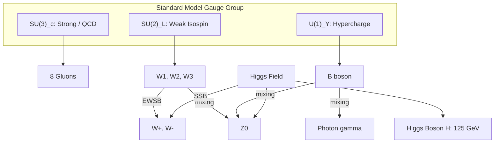
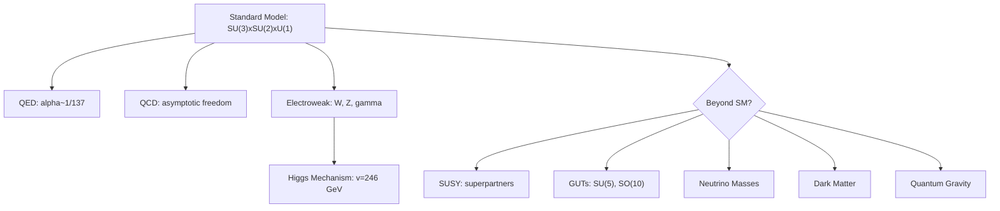

# Particle Physics

## References

- Griffiths, D.J. *Introduction to Elementary Particles*, 2nd ed. (Wiley-VCH, 2008)
- Peskin, M.E. & Schroeder, D.V. *An Introduction to Quantum Field Theory* (CRC Press, 2018)
- Schwartz, M.D. *Quantum Field Theory and the Standard Model* (Cambridge, 2014)

---

## Part I: Foundations and Symmetries (Weeks 1-3)

### Natural Units

In particle physics: $\hbar = c = 1$. Energy, momentum, and mass all in GeV. Length and time in GeV$^{-1}$. Fine structure constant $\alpha = e^2/(4\pi) \approx 1/137$.

### Relativistic Kinematics

Four-momentum: $p^\mu = (E, \mathbf{p})$, with $p^\mu p_\mu = m^2$ (mass-shell condition).

Mandelstam variables for $2 \to 2$ scattering:

$$s = (p_1+p_2)^2, \qquad t = (p_1-p_3)^2, \qquad u = (p_1-p_4)^2$$

with $s + t + u = \sum m_i^2$.

### Symmetries and Conservation Laws

Noether's theorem: every continuous symmetry yields a conserved current $\partial_\mu j^\mu = 0$.

| Symmetry | Conservation Law |
|----------|-----------------|
| Time translation | Energy |
| Space translation | Momentum |
| Rotation | Angular momentum |
| $U(1)_{\text{EM}}$ gauge | Electric charge |
| $SU(3)_c$ gauge | Color charge |
| $CPT$ | Combined $C$, $P$, $T$ (exact) |

Discrete symmetries: $C$ (charge conjugation), $P$ (parity), $T$ (time reversal). CP is violated in the weak sector.

### The Standard Model Particle Content

**Fermions** (spin 1/2):
- Quarks: $(u,d)$, $(c,s)$, $(t,b)$ — each in 3 colors, charges $+2/3$ and $-1/3$
- Leptons: $(e,\nu_e)$, $(\mu,\nu_\mu)$, $(\tau,\nu_\tau)$ — charges $-1$ and $0$

**Gauge bosons** (spin 1): $\gamma$, $W^\pm$, $Z^0$, $g$ (8 gluons)

**Scalar** (spin 0): Higgs boson $H$ ($m_H \approx 125$ GeV)

---

## Part II: Quantum Electrodynamics (Weeks 4-6)

### QED Lagrangian

$$\mathcal{L}_{\text{QED}} = \bar{\psi}(i\gamma^\mu D_\mu - m)\psi - \frac{1}{4}F_{\mu\nu}F^{\mu\nu}$$

where $D_\mu = \partial_\mu + ieA_\mu$ is the covariant derivative. Local $U(1)$ gauge invariance: $\psi \to e^{i\alpha(x)}\psi$, $A_\mu \to A_\mu - \frac{1}{e}\partial_\mu\alpha$.

### Feynman Rules for QED

- **Vertex**: $-ie\gamma^\mu$ (coupling constant $e$, with $\alpha = e^2/(4\pi) \approx 1/137$)
- **Photon propagator**: $\frac{-ig_{\mu\nu}}{q^2 + i\epsilon}$ (Feynman gauge)
- **Fermion propagator**: $\frac{i(\gamma^\mu p_\mu + m)}{p^2 - m^2 + i\epsilon}$
- External lines: $u(p), \bar{u}(p)$ (particles), $v(p), \bar{v}(p)$ (antiparticles), $\epsilon^\mu$ (photons)

### Cross Section Calculations

$e^+e^- \to \mu^+\mu^-$ at tree level (unpolarized, $s \gg m_\mu^2$):

$$\frac{d\sigma}{d\Omega} = \frac{\alpha^2}{4s}(1 + \cos^2\theta), \qquad \sigma_{\text{total}} = \frac{4\pi\alpha^2}{3s}$$

### Radiative Corrections

Loop diagrams produce UV divergences. Regularization (dimensional: $d = 4-\epsilon$) + renormalization absorb infinities into physical parameters. Running coupling:

$$\alpha(q^2) = \frac{\alpha(0)}{1 - \frac{\alpha(0)}{3\pi}\ln(q^2/m_e^2)}$$

$\alpha$ increases at higher energies (screening). At $M_Z \approx 91$ GeV: $\alpha(M_Z) \approx 1/128$.

Anomalous magnetic moment: $a_e = (g-2)/2 = \alpha/(2\pi) + O(\alpha^2)$ (Schwinger, 1948).

---

## Part III: QCD and the Strong Interaction (Weeks 7-9)

### QCD Lagrangian

$$\mathcal{L}_{\text{QCD}} = \sum_f \bar{q}_f(i\gamma^\mu D_\mu - m_f)q_f - \frac{1}{4}G^a_{\mu\nu}G^{a\mu\nu}$$

$SU(3)_c$ gauge symmetry with 8 gluons $A^a_\mu$. Gluons carry color charge and self-interact (unlike photons in QED).

Field strength tensor: $G^a_{\mu\nu} = \partial_\mu A^a_\nu - \partial_\nu A^a_\mu + g_s f^{abc}A^b_\mu A^c_\nu$

### Asymptotic Freedom

The QCD beta function (one-loop):

$$\beta(g_s) = -\frac{g_s^3}{16\pi^2}\left(11 - \frac{2}{3}n_f\right)$$

For $n_f \leq 16$ (in reality $n_f = 6$): $\beta < 0$, so $\alpha_s$ decreases at high energies. This is asymptotic freedom (Gross, Wilczek, Politzer 2004 Nobel).

At low energies $\alpha_s \sim O(1)$: confinement. Quarks and gluons are never observed as free particles.

### Hadron Spectroscopy

Mesons: $q\bar{q}$ (e.g., $\pi^+ = u\bar{d}$, $K^+ = u\bar{s}$, $J/\psi = c\bar{c}$)

Baryons: $qqq$ (e.g., $p = uud$, $n = udd$, $\Delta^{++} = uuu$, $\Lambda = uds$)

Deep inelastic scattering probes parton distribution functions $f(x,Q^2)$, with DGLAP evolution.

---

## Part IV: Electroweak Theory and Beyond (Weeks 10-14)

### Electroweak Unification

$SU(2)_L \times U(1)_Y$ gauge symmetry with coupling constants $g$ and $g'$. Left-handed fermions form doublets; right-handed fermions are singlets.

Weak interaction: parity-maximally violating ($V-A$ structure). Only left-handed fermions couple to $W^\pm$.

### Higgs Mechanism

The Higgs doublet $\phi = \begin{pmatrix}\phi^+\\\phi^0\end{pmatrix}$ with potential $V(\phi) = -\mu^2\phi^\dagger\phi + \lambda(\phi^\dagger\phi)^2$.

Spontaneous symmetry breaking: $\langle\phi\rangle = \begin{pmatrix}0\\v/\sqrt{2}\end{pmatrix}$ with $v = \mu/\sqrt{\lambda} \approx 246$ GeV.

Gauge boson masses: $m_W = gv/2 \approx 80.4$ GeV, $m_Z = m_W/\cos\theta_W \approx 91.2$ GeV.

Weinberg angle: $\sin^2\theta_W \approx 0.231$.

Fermion masses arise from Yukawa couplings: $m_f = y_f v/\sqrt{2}$.

### The Full Standard Model Lagrangian

$$\mathcal{L}_{\text{SM}} = \mathcal{L}_{\text{gauge}} + \mathcal{L}_{\text{fermion}} + \mathcal{L}_{\text{Higgs}} + \mathcal{L}_{\text{Yukawa}}$$

This is the most precisely tested theory in physics: QED predictions match experiment to $\sim 10^{-12}$.

### CKM Matrix and CP Violation

Quark mixing: $\begin{pmatrix}d'\\s'\\b'\end{pmatrix} = V_{\text{CKM}}\begin{pmatrix}d\\s\\b\end{pmatrix}$

CP violation arises from the single complex phase in $V_{\text{CKM}}$ (Kobayashi-Maskawa). Observed in $K$ and $B$ meson systems.

### Beyond the Standard Model

Open questions: neutrino masses, dark matter, matter-antimatter asymmetry, hierarchy problem, gravity.

**Supersymmetry (SUSY)**: every SM particle has a superpartner differing by spin 1/2. Stabilizes the Higgs mass, enables gauge coupling unification, provides dark matter candidates.

**Grand Unified Theories (GUTs)**: embed $SU(3)\times SU(2)\times U(1)$ in a larger group ($SU(5)$, $SO(10)$, $E_6$). Predict proton decay.

---

## Key Problem Types

1. **Kinematics** — threshold energies, invariant mass, decay rates
2. **Feynman diagrams** — draw all diagrams at given order, identify vertices
3. **Cross sections** — tree-level QED calculations, $e^+e^-$ annihilation, Compton scattering
4. **Symmetry arguments** — selection rules, conservation laws, allowed/forbidden processes
5. **Higgs mechanism** — symmetry breaking, mass generation, Goldstone bosons
6. **Running couplings** — RG equations, coupling unification
