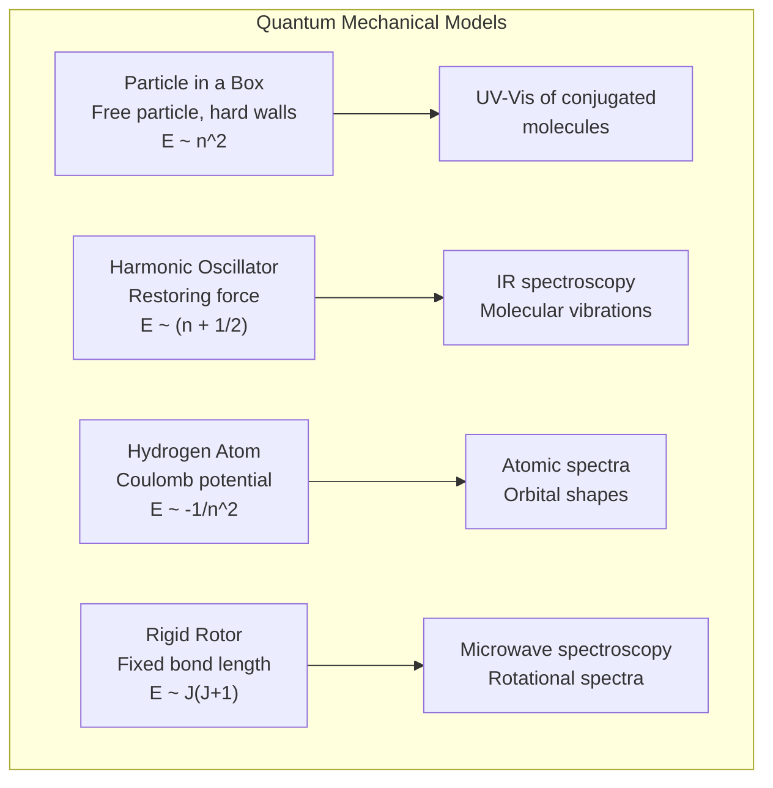
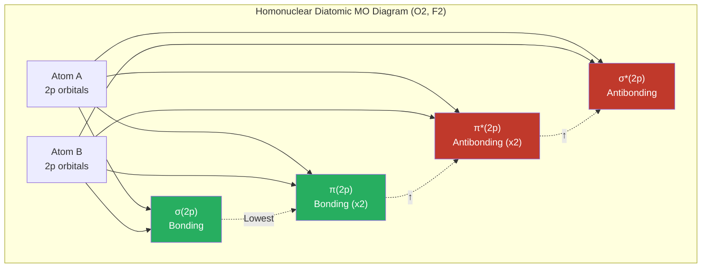
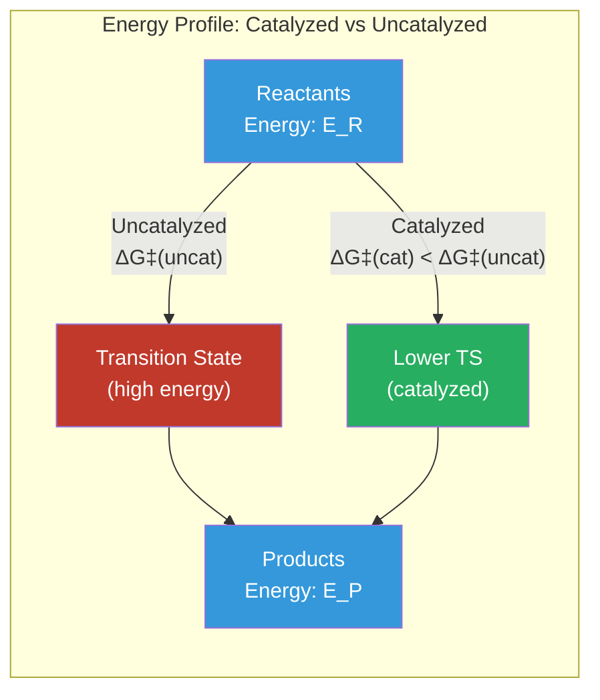

# Physical Chemistry

> Comprehensive notes covering quantum chemistry (particle in a box, harmonic oscillator, hydrogen atom), molecular orbital theory, statistical thermodynamics, and chemical kinetics.

**Primary Texts:**
- Atkins, P. & de Paula, J. *Atkins' Physical Chemistry*, 11th ed. Oxford University Press, 2018.
- McQuarrie, D.A. *Physical Chemistry: A Molecular Approach*. University Science Books, 1997.
- Engel, T. & Reid, P. *Physical Chemistry*, 4th ed. Pearson, 2019.

---

## Part I — Foundations of Quantum Mechanics

### Week 1: Wave-Particle Duality and the Schrodinger Equation

**de Broglie wavelength:**

$$\lambda = \frac{h}{p} = \frac{h}{mv}$$

**Time-independent Schrodinger equation:**

$$\hat{H}\psi = E\psi$$

where the Hamiltonian operator:

$$\hat{H} = -\frac{\hbar^2}{2m}\nabla^2 + V(x)$$

**Born interpretation:** $|\psi(x)|^2 dx$ gives the probability of finding the particle between $x$ and $x + dx$.

**Normalization:**

$$\int_{-\infty}^{\infty} |\psi(x)|^2 \, dx = 1$$

### Week 2: Particle in a Box

For a particle confined to a one-dimensional box of length $L$ with infinite potential walls:

**Wavefunctions:**

$$\psi_n(x) = \sqrt{\frac{2}{L}} \sin\left(\frac{n\pi x}{L}\right) \qquad n = 1, 2, 3, \ldots$$

**Energy levels:**

$$E_n = \frac{n^2 h^2}{8mL^2}$$

Key properties:
- Zero-point energy: $E_1 = h^2/(8mL^2) > 0$ (particle is never at rest)
- Energy spacing increases with $n$: $\Delta E_{n \to n+1} = (2n+1)\frac{h^2}{8mL^2}$
- Number of nodes = $n - 1$
- Applicable to conjugated $\pi$ systems (electrons delocalized over molecular length)

### Week 3: Quantum Harmonic Oscillator

Models molecular vibrations. Potential: $V(x) = \frac{1}{2}kx^2$

**Energy levels:**

$$E_n = \left(n + \frac{1}{2}\right)\hbar\omega \qquad n = 0, 1, 2, \ldots$$

where $\omega = \sqrt{k/m}$ is the angular frequency and $\hbar = h/(2\pi)$.

Key properties:
- Zero-point energy: $E_0 = \frac{1}{2}\hbar\omega$
- Equally spaced energy levels: $\Delta E = \hbar\omega$
- Selection rule for IR: $\Delta n = \pm 1$
- Wavefunctions involve Hermite polynomials multiplied by Gaussian $e^{-\alpha x^2/2}$

### Week 4: The Hydrogen Atom

**Energy levels:**

$$E_n = -\frac{m_e e^4}{8\epsilon_0^2 h^2} \cdot \frac{1}{n^2} = -\frac{13.6 \text{ eV}}{n^2}$$

**Wavefunctions** $\psi_{n,l,m_l}(r,\theta,\phi) = R_{n,l}(r) \cdot Y_l^{m_l}(\theta,\phi)$

where $R_{n,l}(r)$ is the radial function and $Y_l^{m_l}$ are spherical harmonics.

**Orbital angular momentum magnitude:** $L = \hbar\sqrt{l(l+1)}$

**z-component:** $L_z = m_l \hbar$

**Degeneracy** of level $n$: $n^2$ (ignoring spin), $2n^2$ (with spin).

---

## Part II — Molecular Orbital Theory

### Week 5: LCAO-MO Theory

**Linear Combination of Atomic Orbitals (LCAO):**

$$\psi_{MO} = c_A \phi_A + c_B \phi_B$$

- **Bonding MO** ($c_A = c_B$): constructive overlap, energy below atomic orbitals
- **Antibonding MO** ($c_A = -c_B$): destructive overlap, node between nuclei, energy above atomic orbitals

**Secular determinant** for H$_2^+$:

$$\begin{vmatrix} H_{AA} - ES_{AA} & H_{AB} - ES_{AB} \\ H_{AB} - ES_{AB} & H_{BB} - ES_{BB} \end{vmatrix} = 0$$

where $H_{AB}$ is the resonance integral, $S_{AB}$ is the overlap integral.

**Bond order:**

$$\text{BO} = \frac{1}{2}(n_b - n_a)$$

- O$_2$: BO = 2, paramagnetic (two unpaired electrons in $\pi^*$)
- N$_2$: BO = 3, diamagnetic
- He$_2$: BO = 0, does not exist

---

## Part III — Statistical Thermodynamics

### Week 6: The Boltzmann Distribution and Partition Functions

**Boltzmann distribution:** probability of occupying state $i$ with energy $\epsilon_i$:

$$p_i = \frac{g_i e^{-\epsilon_i / k_B T}}{q}$$

where $g_i$ is the degeneracy and $q$ is the **molecular partition function**:

$$q = \sum_i g_i e^{-\epsilon_i / k_B T}$$

For $N$ independent, indistinguishable particles, the **canonical partition function**:

$$Q = \frac{q^N}{N!}$$

### Week 7: Partition Functions and Thermodynamic Properties

The partition function connects to all thermodynamic quantities:

**Helmholtz free energy:**

$$A = -k_B T \ln Q$$

**Internal energy:**

$$U = k_B T^2 \left(\frac{\partial \ln Q}{\partial T}\right)_V$$

**Entropy:**

$$S = k_B \ln Q + k_B T \left(\frac{\partial \ln Q}{\partial T}\right)_V = \frac{U - A}{T}$$

**Pressure:**

$$p = k_B T \left(\frac{\partial \ln Q}{\partial V}\right)_T$$

**Factorization of partition function** (separable degrees of freedom):

$$q = q_{\text{trans}} \cdot q_{\text{rot}} \cdot q_{\text{vib}} \cdot q_{\text{elec}}$$

| Mode | Partition Function | High-T Limit |
|---|---|---|
| Translation | $q_{\text{trans}} = \left(\frac{2\pi m k_B T}{h^2}\right)^{3/2} V$ | Classical |
| Rotation (linear) | $q_{\text{rot}} = \frac{T}{\sigma \Theta_{\text{rot}}}$ | $T \gg \Theta_{\text{rot}}$ |
| Vibration | $q_{\text{vib}} = \frac{1}{1 - e^{-\Theta_{\text{vib}}/T}}$ | $\frac{T}{\Theta_{\text{vib}}}$ |
| Electronic | $q_{\text{elec}} = g_0$ (usually) | Ground state |

where $\Theta_{\text{rot}} = \hbar^2/(2Ik_B)$ and $\Theta_{\text{vib}} = \hbar\omega/k_B$.

---

## Part IV — Chemical Kinetics

### Week 8: Rate Laws and Reaction Orders

**Rate law** for $aA + bB \rightarrow \text{products}$:

$$\text{Rate} = k[A]^m[B]^n$$

where $m$ and $n$ are experimentally determined (not necessarily stoichiometric coefficients).

**Integrated rate laws:**

| Order | Rate Law | Integrated Form | Half-life |
|---|---|---|---|
| 0 | $-d[A]/dt = k$ | $[A] = [A]_0 - kt$ | $t_{1/2} = [A]_0/(2k)$ |
| 1 | $-d[A]/dt = k[A]$ | $\ln[A] = \ln[A]_0 - kt$ | $t_{1/2} = \ln 2 / k$ |
| 2 | $-d[A]/dt = k[A]^2$ | $1/[A] = 1/[A]_0 + kt$ | $t_{1/2} = 1/(k[A]_0)$ |

### Week 9: Temperature Dependence and the Arrhenius Equation

**Arrhenius equation:**

$$k = A e^{-E_a / RT}$$

where $A$ is the pre-exponential (frequency) factor and $E_a$ is the activation energy.

**Linearized form:**

$$\ln k = \ln A - \frac{E_a}{R} \cdot \frac{1}{T}$$

Plot $\ln k$ vs. $1/T$: slope $= -E_a/R$, intercept $= \ln A$.

**Two-temperature form:**

$$\ln\frac{k_2}{k_1} = \frac{E_a}{R}\left(\frac{1}{T_1} - \frac{1}{T_2}\right)$$

### Week 10: Transition State Theory (Eyring Theory)

**Eyring equation:**

$$k = \frac{k_B T}{h} e^{-\Delta G^\ddagger / RT}$$

Separating enthalpy and entropy of activation:

$$k = \frac{k_B T}{h} e^{\Delta S^\ddagger / R} e^{-\Delta H^\ddagger / RT}$$

**Comparison with Arrhenius:**
- $E_a \approx \Delta H^\ddagger + RT$ (for unimolecular reactions in solution)
- $A$ contains the entropy of activation $\Delta S^\ddagger$

### Week 11: Catalysis

**Catalyst** provides an alternative reaction pathway with lower $\Delta G^\ddagger$.

**Homogeneous catalysis:** catalyst in same phase as reactants.
- Acid/base catalysis
- Enzyme kinetics: Michaelis-Menten

$$v = \frac{V_{\max}[S]}{K_M + [S]}$$

**Heterogeneous catalysis:** catalyst in different phase.
- Adsorption $\rightarrow$ reaction on surface $\rightarrow$ desorption
- Langmuir isotherm: $\theta = \frac{K p}{1 + K p}$

---

## Part V — Applications and Connections

### Week 12: Spectroscopic Applications

**Rotational spectroscopy:** rigid rotor model, $E_J = BJ(J+1)\hbar^2$, selection rule $\Delta J = \pm 1$.

**Vibrational spectroscopy:** harmonic oscillator model, selection rule $\Delta n = \pm 1$. Anharmonicity leads to overtones.

**Electronic spectroscopy:** Franck-Condon principle (vertical transitions), Beer-Lambert law $A = \epsilon b c$.

**Connection between statistical mechanics and equilibrium:**

$$K = e^{-\Delta G^\circ / RT} = \frac{Q_{\text{products}}}{Q_{\text{reactants}}} e^{-\Delta E_0 / k_B T}$$

---

## Summary and Review Checklist

- [ ] Schrodinger equation and physical meaning of wavefunctions
- [ ] Particle in a box: wavefunctions and energy levels
- [ ] Harmonic oscillator: equally spaced levels, zero-point energy
- [ ] Hydrogen atom quantum numbers and orbital shapes
- [ ] LCAO-MO theory: bonding, antibonding, bond order
- [ ] Partition functions: translational, rotational, vibrational
- [ ] Connection: $A = -k_BT \ln Q$ and other thermodynamic derivations
- [ ] Rate laws: zero, first, second order integrated forms
- [ ] Arrhenius equation: activation energy from temperature data
- [ ] Transition state theory: Eyring equation
- [ ] Catalysis: homogeneous, heterogeneous, enzyme kinetics
