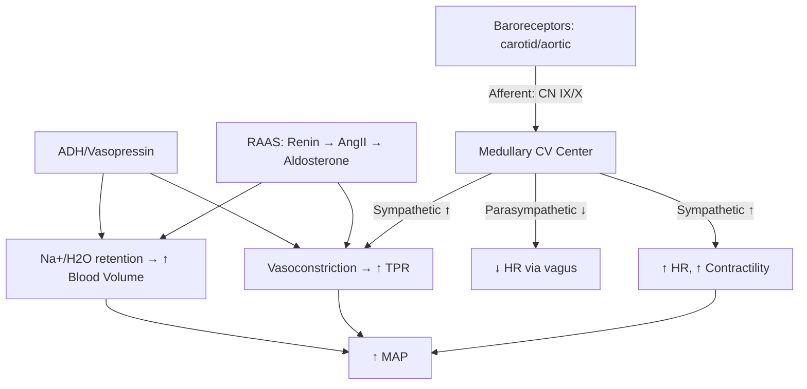
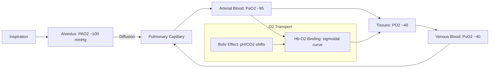
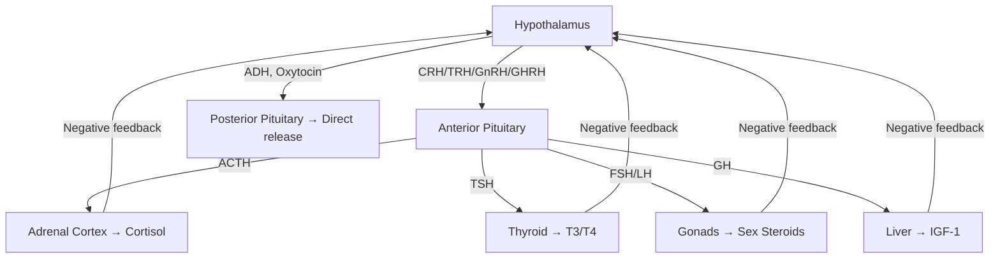

# Human Physiology

Cardiovascular, respiratory, renal, endocrine, and nervous system physiology with quantitative emphasis.

## References

- Guyton, A.C. & Hall, J.E. *Textbook of Medical Physiology*, 14th ed. Elsevier, 2020.
- Boron, W.F. & Boulpaep, E.L. *Medical Physiology*, 3rd ed. Elsevier, 2017.
- Silverthorn, D.U. *Human Physiology: An Integrated Approach*, 8th ed. Pearson, 2019.

---

## Part I — Cardiovascular Physiology

### Week 1: Cardiac Mechanics

**Cardiac cycle:** Systole (contraction, ~0.3s) → Diastole (relaxation, ~0.5s) at 72 bpm.
- Isovolumetric contraction → ejection → isovolumetric relaxation → rapid filling → atrial systole.
- Pressure-volume loop: area = stroke work.

**Cardiac output:**

$$CO = SV \times HR$$

Typical resting: $CO \approx 70 \;\text{mL} \times 72 \;\text{bpm} \approx 5 \;\text{L/min}$.

**Ejection fraction:** $EF = \frac{SV}{EDV} \times 100\%$. Normal $\approx 55$--$70\%$.

**Frank-Starling mechanism:** Increased preload (end-diastolic volume) → increased stretch of sarcomeres → increased force of contraction → increased stroke volume. Ensures left and right outputs match.

**Starling's law of the heart:**

$$SV \propto EDV \quad \text{(up to a limit)}$$

### Week 2: Hemodynamics

**Mean arterial pressure:**

$$MAP = \frac{1}{3}SBP + \frac{2}{3}DBP \approx DBP + \frac{1}{3}(SBP - DBP)$$

Normal: $\sim 93$ mmHg ($120/80$).

**Ohm's law analogue:**

$$CO = \frac{MAP - CVP}{TPR} \approx \frac{MAP}{TPR}$$

where $TPR$ = total peripheral resistance, $CVP$ = central venous pressure ($\approx 0$).

**Poiseuille's law:**

$$Q = \frac{\pi r^4 \Delta P}{8 \eta L}$$

Resistance $\propto 1/r^4$ — small changes in arteriolar radius have dramatic effects on blood flow.

**Blood pressure regulation:**
- **Short-term:** Baroreceptor reflex (carotid sinus, aortic arch) → medullary cardiovascular center → autonomic adjustments.
- **Long-term:** Renal pressure-natriuresis, RAAS, ADH.

---

## Part II — Respiratory Physiology

### Week 3: Ventilation & Gas Exchange

**Alveolar gas equation:**

$$P_AO_2 = F_IO_2(P_{atm} - P_{H_2O}) - \frac{P_aCO_2}{RQ}$$

At sea level: $P_AO_2 = 0.21(760 - 47) - 40/0.8 = 149.7 - 50 \approx 100$ mmHg.

**Ventilation:**
- Tidal volume ($V_T$) $\approx 500$ mL. Dead space ($V_D$) $\approx 150$ mL.
- Minute ventilation: $\dot{V}_E = V_T \times f \approx 500 \times 12 = 6$ L/min.
- **Alveolar ventilation:** $\dot{V}_A = (V_T - V_D) \times f = 350 \times 12 = 4.2$ L/min.

**Compliance:** $C = \Delta V / \Delta P$. Reduced in fibrosis, increased in emphysema. Surfactant (dipalmitoylphosphatidylcholine from type II pneumocytes) reduces surface tension, preventing alveolar collapse (LaPlace's law: $P = 2T/r$).

### Week 4: Oxygen Transport

**Oxygen dissociation curve** — Hill equation:

$$Y = \frac{pO_2^n}{P_{50}^n + pO_2^n}$$

where $Y$ = fractional saturation, $P_{50} \approx 26.6$ mmHg, Hill coefficient $n \approx 2.8$ (cooperativity).

**Shifts:**
- **Right shift** (↓ affinity, ↑ unloading): ↑ temperature, ↑ $P_{CO_2}$, ↓ pH (Bohr effect), ↑ 2,3-DPG.
- **Left shift** (↑ affinity): opposite conditions, fetal hemoglobin (HbF), CO poisoning.

**Total oxygen content:**

$$CaO_2 = (1.34 \times [Hb] \times SaO_2) + (0.003 \times PaO_2)$$

Typical: $(1.34 \times 15 \times 0.98) + (0.003 \times 100) \approx 20$ mL O$_2$/dL.

**Ventilation-perfusion (V/Q) matching:**
- Ideal: $V/Q = 1$.
- Apex of lung: high $V/Q$ (wasted ventilation).
- Base of lung: low $V/Q$ (relative shunt).
- Hypoxic pulmonary vasoconstriction diverts blood away from poorly ventilated regions.

---

## Part III — Renal Physiology

### Week 5: Filtration & Tubular Function

**Glomerular filtration rate (GFR):**

$$GFR = K_f \times (P_{GC} - P_{BS} - \pi_{GC}) \approx 125 \;\text{mL/min} \approx 180 \;\text{L/day}$$

where $K_f$ = filtration coefficient, $P_{GC}$ = glomerular capillary pressure ($\sim 55$ mmHg), $P_{BS}$ = Bowman's space pressure ($\sim 15$ mmHg), $\pi_{GC}$ = oncotic pressure ($\sim 30$ mmHg).

**Clearance:** $C_x = \frac{U_x \times V}{P_x}$. Inulin clearance = GFR (freely filtered, not reabsorbed/secreted).

**Tubular segments:**
- **Proximal tubule:** 65% Na$^+$/H$_2$O reabsorption, all glucose/amino acids (SGLT2/SGLT1), bicarbonate reclamation.
- **Loop of Henle:** Countercurrent multiplication → medullary osmotic gradient (300 → 1200 mOsm/kg). Descending: water permeable. Thick ascending: NaCl reabsorption (NKCC2), water impermeable.
- **Distal tubule/collecting duct:** Fine-tuning. Aldosterone → ENaC (Na$^+$ reabsorption). ADH → aquaporin-2 insertion → water reabsorption.

**RAAS axis:**
1. ↓ Renal perfusion / ↓ Na$^+$ at macula densa → renin release.
2. Renin cleaves angiotensinogen → angiotensin I.
3. ACE (lung endothelium) → angiotensin II.
4. Ang II → vasoconstriction, aldosterone release, ADH release, thirst, proximal Na$^+$ reabsorption.

### Week 6: Acid-Base Balance

**Henderson-Hasselbalch:**

$$pH = 6.1 + \log\frac{[HCO_3^-]}{0.03 \times P_{CO_2}}$$

Normal: $pH = 7.4$, $[HCO_3^-] = 24$ mEq/L, $P_{CO_2} = 40$ mmHg.

**Compensation:** Respiratory disorders → renal compensation (hours-days). Metabolic disorders → respiratory compensation (minutes).

| Disorder | Primary Change | Compensation |
|----------|---------------|-------------|
| Respiratory acidosis | ↑ $P_{CO_2}$ | ↑ renal $HCO_3^-$ reabsorption |
| Respiratory alkalosis | ↓ $P_{CO_2}$ | ↓ renal $HCO_3^-$ reabsorption |
| Metabolic acidosis | ↓ $HCO_3^-$ | Hyperventilation (↓ $P_{CO_2}$) |
| Metabolic alkalosis | ↑ $HCO_3^-$ | Hypoventilation (↑ $P_{CO_2}$) |

---

## Part IV — Endocrine & Nervous System

### Week 7: Endocrine Physiology

**Hypothalamic-pituitary axis:**
- Hypothalamus → releasing/inhibiting hormones → anterior pituitary → tropic hormones → target glands.
- **Negative feedback:** Target hormone inhibits hypothalamus and/or pituitary.

| Axis | Hypothalamic | Pituitary | Target | Hormone |
|------|-------------|-----------|--------|---------|
| Thyroid | TRH | TSH | Thyroid | T3/T4 |
| Adrenal | CRH | ACTH | Adrenal cortex | Cortisol |
| Gonadal | GnRH | FSH/LH | Gonads | Estrogen/Testosterone |
| Growth | GHRH / Somatostatin | GH | Liver/tissues | IGF-1 |

**Insulin/glucagon regulation:**
- **Insulin** (β-cells): ↓ blood glucose. Promotes GLUT4 translocation (muscle, adipose), glycogen synthesis, lipogenesis, protein synthesis.
- **Glucagon** (α-cells): ↑ blood glucose. Promotes glycogenolysis, gluconeogenesis, ketogenesis.
- Fed state: insulin:glucagon ratio high. Fasted: ratio low.

### Week 8: Autonomic Nervous System

**Sympathetic ("fight or flight"):**
- Preganglionic: short (thoracolumbar T1--L2), ACh at nicotinic receptors.
- Postganglionic: long, norepinephrine at adrenergic receptors ($\alpha_1$: vasoconstriction; $\beta_1$: ↑ HR, ↑ contractility; $\beta_2$: bronchodilation, vasodilation in muscle).
- Adrenal medulla: epinephrine release.

**Parasympathetic ("rest and digest"):**
- Preganglionic: long (craniosacral: CN III, VII, IX, X + S2--S4), ACh at nicotinic receptors.
- Postganglionic: short, ACh at muscarinic receptors (M2: ↓ HR; M3: ↑ GI motility, ↑ secretions, bronchoconstriction).
- Vagus nerve (CN X) innervates heart, lungs, GI tract.

**Motor control hierarchy:** Cortex (planning) → basal ganglia (selection/inhibition) → cerebellum (coordination/timing) → brainstem (posture/balance) → spinal cord (reflexes, CPGs) → motor neurons → muscle.

---

## Key Equations Summary

| Concept | Equation |
|---------|----------|
| Cardiac output | $CO = SV \times HR$ |
| Mean arterial pressure | $MAP = \frac{1}{3}SBP + \frac{2}{3}DBP$ |
| Poiseuille's law | $Q = \frac{\pi r^4 \Delta P}{8\eta L}$ |
| Alveolar gas equation | $P_AO_2 = F_IO_2(P_{atm}-P_{H_2O}) - P_aCO_2/RQ$ |
| O$_2$ dissociation (Hill) | $Y = pO_2^n/(P_{50}^n + pO_2^n)$ |
| GFR | $GFR = K_f(P_{GC} - P_{BS} - \pi_{GC})$ |
| Henderson-Hasselbalch | $pH = 6.1 + \log([HCO_3^-]/(0.03 \times P_{CO_2}))$ |
| O$_2$ content | $CaO_2 = 1.34[Hb]SaO_2 + 0.003 \times PaO_2$ |
