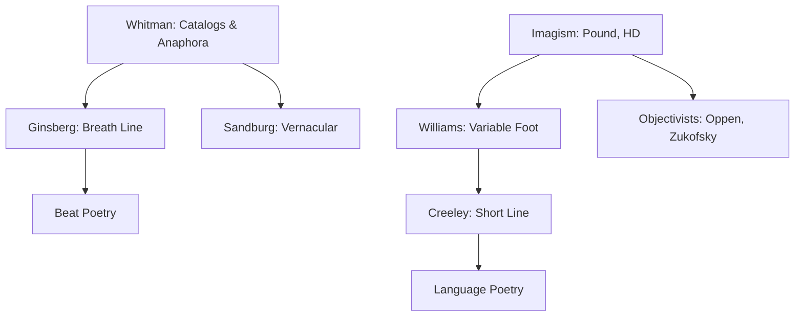
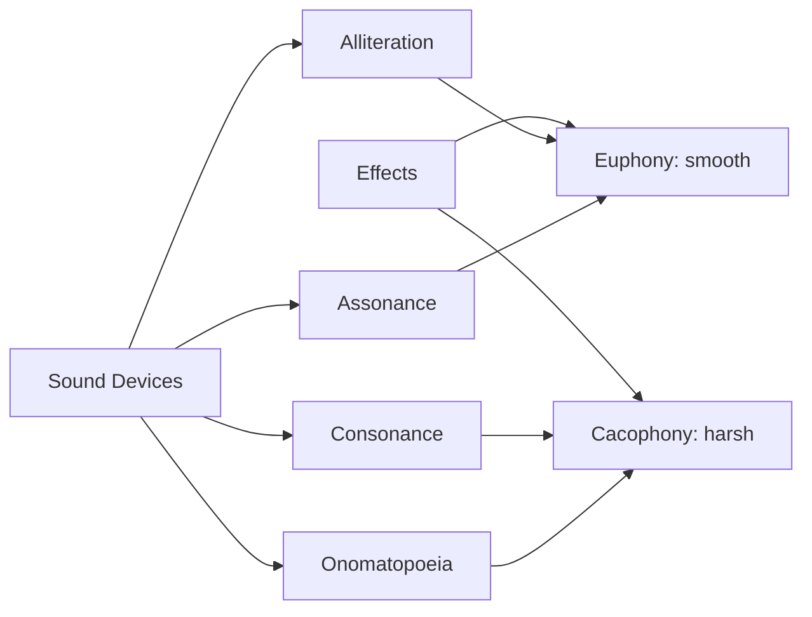
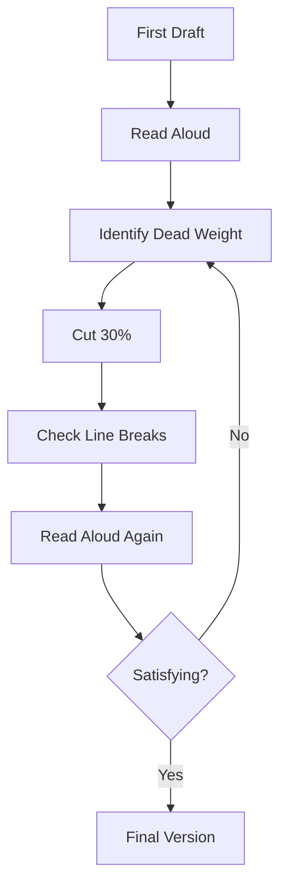

# Poetry — Forms, Prosody, and Craft

## Part I — Poetic Forms

### Week 1: The Sonnet

The sonnet is the supreme formal challenge in Western poetry: 14 lines, tight rhyme, a logical turn (volta).

**Petrarchan (Italian) Sonnet**
- Octave: $abbaabba$
- Sestet: $cdecde$ (or $cdcdcd$)
- Volta between octave and sestet — the argument shifts

**Shakespearean (English) Sonnet**
- Three quatrains + couplet: $ababcdcdefefgg$
- Volta typically at line 13 — the couplet resolves or subverts

**Spenserian Sonnet**
- Interlocking rhyme: $ababbcbccdcdee$
- Links quatrains via shared rhymes; smoother transitions

| Feature | Petrarchan | Shakespearean | Spenserian |
|---------|-----------|---------------|------------|
| Structure | 8+6 | 4+4+4+2 | 4+4+4+2 |
| Volta | Line 9 | Line 13 | Line 13 |
| Rhyme density | High (4 rhymes in octave) | Lower (7 rhyme pairs) | Medium (linked) |

### Week 2: Villanelle, Haiku, Ode, Elegy

**Villanelle**: 19 lines, 5 tercets + 1 quatrain. Two refrain lines alternate as final lines of each tercet, then close the quatrain together.

Scheme: $A_1bA_2\ abA_1\ abA_2\ abA_1\ abA_2\ abA_1A_2$

Examples: Dylan Thomas "Do not go gentle into that good night", Elizabeth Bishop "One Art"

**Haiku**: 5-7-5 mora (not strictly syllables in Japanese). Requires a *kigo* (seasonal reference) and *kireji* (cutting word). Basho, Buson, Issa. In English: avoid forced syllable counting; aim for juxtaposition and compression.

**Ode**: Elevated address to a subject. Pindaric (triadic: strophe/antistrophe/epode), Horatian (regular stanzas), Irregular (Keats's great odes).

**Elegy**: Poem of mourning. Pastoral elegy tradition (Milton's "Lycidas", Shelley's "Adonais"). Modern: Rilke's *Duineser Elegien*, Heaney's elegies for family.

### Week 3: Free Verse

Free verse is not formless — it replaces meter with other organizing principles:
- Line as unit of attention (not sentence)
- Visual spacing (Olson's "field composition")
- Breath-based rhythm (Ginsberg following Whitman)
- Repetition and catalog (Whitman's anaphora)

---

## Part II — Prosody and Meter

### Week 4: Metrical Feet and Scansion

| Foot | Pattern | Example |
|------|---------|---------|
| Iamb | $\cup /$ | a-BOVE |
| Trochee | $/ \cup$ | GAR-den |
| Anapest | $\cup \cup /$ | in-ter-VENE |
| Dactyl | $/ \cup \cup$ | MER-ri-ly |
| Spondee | $/ /$ | HEART-BREAK |
| Pyrrhic | $\cup \cup$ | of the |

**Iambic pentameter**: five iambs per line — the backbone of English verse from Chaucer through Frost.

> Shall I / com-PARE / thee TO / a SUM- / mer's DAY?

Substitutions create expressive variation:
- **Trochaic inversion** at line-start (common, energizing)
- **Spondaic substitution** for emphasis
- **Feminine ending** (extra unstressed syllable)

### Week 5: Line, Caesura, Enjambment

**Caesura**: a pause within the line, often marked by punctuation.
> "To be, || or not to be — || that is the question."

**Enjambment**: the sentence runs past the line-break without pause.
**End-stop**: the line-break coincides with a syntactic pause.

Enjambment creates tension between the line-unit and the sentence-unit. The reader's eye leaps forward; meaning is momentarily suspended. This is a primary tool in free verse.

---

## Part III — Figures and Devices

### Week 6: Tropes

- **Metaphor**: implicit comparison (A is B). "All the world's a stage."
- **Simile**: explicit comparison (A is like B). "My love is like a red, red rose."
- **Metonymy**: substitution by association. "The Crown" for the monarchy.
- **Synecdoche**: part for whole (or whole for part). "All hands on deck."
- **Personification**: attributing human qualities to non-human entities.
- **Irony**: gap between appearance and reality
  - *Dramatic*: audience knows what characters do not
  - *Verbal*: saying the opposite of what is meant
  - *Situational*: outcome contradicts expectation

### Week 7: Sound Devices

- **Alliteration**: repetition of initial consonants ("Peter Piper picked...")
- **Assonance**: repetition of vowel sounds ("the rain in Spain")
- **Consonance**: repetition of consonant sounds in any position
- **Onomatopoeia**: words that sound like their meaning (buzz, hiss, murmur)
- **Euphony**: smooth, pleasant sounds (liquids: l, r; nasals: m, n)
- **Cacophony**: harsh, discordant sounds (gutturals, plosives: k, g, t, d)

---

## Part IV — Major Poets

### Week 8: Spanish-Language Poetry

**Pablo Neruda — *Veinte poemas de amor y una cancion desesperada* (1924)**
Sensual, elemental imagery: body as landscape, love as oceanic force. Later: political poetry (*Canto General*), odes to common objects (socks, tomatoes, artichokes).

**Octavio Paz — "Piedra de sol" (1957)**
584 hendecasyllables (matching the Venus synodic cycle). Circular: the last six lines repeat the first six. Time folds; the poem enacts cyclical return.

**Borges**: master of the sonnet in Spanish. Philosophical compression — blindness, mirrors, labyrinths, tigers — in classical form.

### Week 9: English-Language and European Poetry

- **Emily Dickinson**: slant rhyme, dashes as breath marks, compression. "I felt a Funeral, in my Brain."
- **Walt Whitman — *Leaves of Grass* (1855-1891)**: the democratic catalog, the body electric, free verse as political form.
- **Rainer Maria Rilke — *Duineser Elegien* (1923)**: angels as figures of overwhelming perception; the poet's task is praise despite terror.
- **Seamus Heaney**: digging into Irish soil and language; poetry as archaeology. *North*, *Station Island*.
- **Wislawa Szymborska**: ironic precision, philosophical wit, "The Joy of Writing", Nobel 1996.

### Week 10: Non-Western Traditions

- **Rumi (Jalal al-Din)**: Sufi mystic poetry; the beloved as divine; whirling as ecstatic form. *Masnavi*.
- **Basho**: haiku master. "Furu ike ya / kawazu tobikomu / mizu no oto" (old pond / frog jumps in / sound of water).
- **Li Bai and Du Fu**: Tang dynasty, Chinese lyric at its apex — wine, moonlight, exile, friendship.

---

## Part V — Workshop and Practice

### Week 11: Close Reading Method

1. Read aloud — hear the rhythm, the vowel music
2. Identify the form (or its absence/subversion)
3. Scan the meter; note substitutions and their effects
4. Map the imagery: what senses are activated?
5. Trace the argument or emotional arc
6. Locate the volta or turn — where does the poem shift?
7. Consider what is *not* said (negative space)

### Week 12: Writing Exercises

- Write a Petrarchan sonnet with a true volta at line 9
- Compose a villanelle — feel the obsessive refrain
- Translate a haiku from Japanese (literal) and write a haiku-like English poem
- Write 20 lines of free verse using only concrete nouns and active verbs
- Revise a draft poem by cutting 30% of the words

---

## References

- Fussell, Paul. *Poetic Meter and Poetic Form*. Rev. ed. McGraw-Hill, 1979.
- Preminger, Alex, and T.V.F. Brogan, eds. *The New Princeton Encyclopedia of Poetry and Poetics*. Princeton UP, 1993.
- Strand, Mark, and Eavan Boland. *The Making of a Poem: A Norton Anthology of Poetic Forms*. Norton, 2000.
- Longenbach, James. *The Art of the Poetic Line*. Graywolf, 2008.
- Hirsch, Edward. *A Poet's Glossary*. Houghton Mifflin Harcourt, 2014.
- Paz, Octavio. *El arco y la lira*. Fondo de Cultura Economica, 1956.
