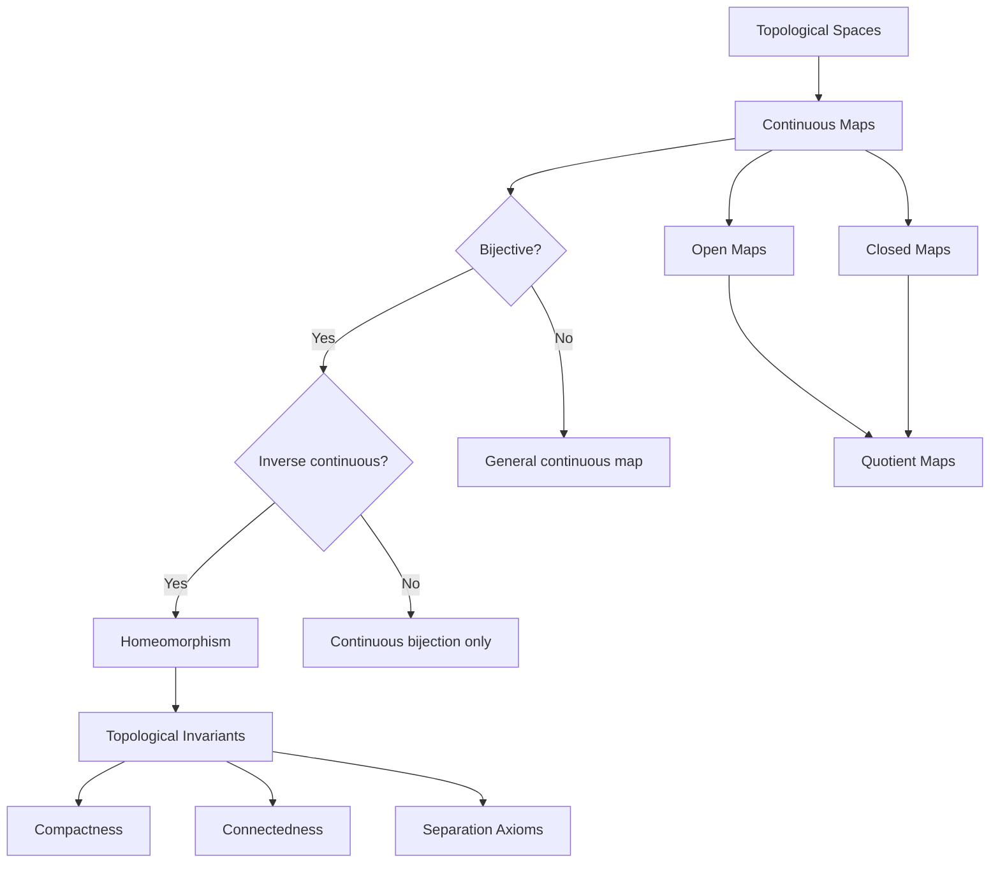
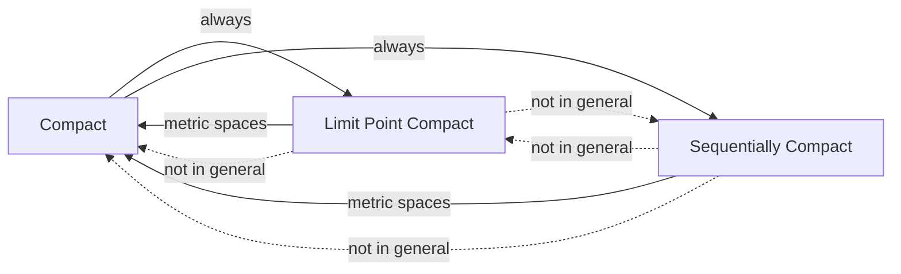
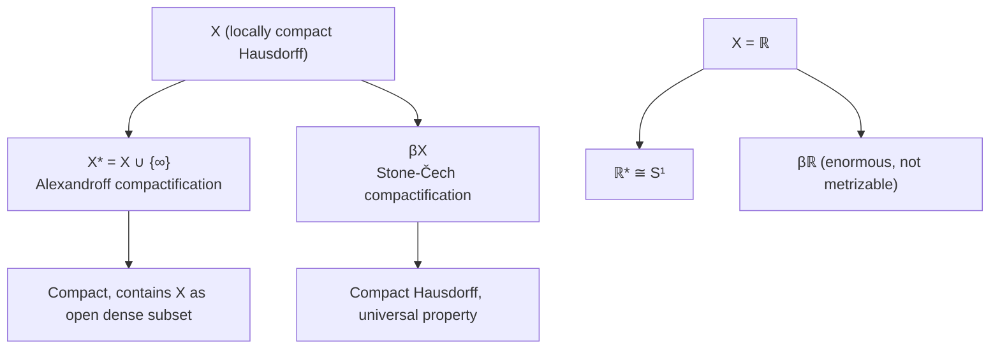

# Point-Set Topology

> The study of topological spaces and continuous functions — the abstract framework underpinning all of modern analysis and geometry.

---

## Part I — Topological Spaces and Continuity

### Week 1: Topological Spaces

**Definition.** A *topological space* is a pair $(X, \mathcal{T})$ where $\mathcal{T} \subseteq \mathcal{P}(X)$ satisfies:
1. $\emptyset, X \in \mathcal{T}$
2. Arbitrary unions: $\{U_\alpha\}_{\alpha \in A} \subseteq \mathcal{T} \implies \bigcup_{\alpha \in A} U_\alpha \in \mathcal{T}$
3. Finite intersections: $U_1, \ldots, U_n \in \mathcal{T} \implies \bigcap_{i=1}^n U_i \in \mathcal{T}$

**Key examples:**
- Discrete topology $\mathcal{T} = \mathcal{P}(X)$, indiscrete topology $\mathcal{T} = \{\emptyset, X\}$
- Standard topology on $\mathbb{R}$: generated by open intervals $(a,b)$
- Cofinite topology: $U \in \mathcal{T}$ iff $X \setminus U$ is finite or $U = \emptyset$

**Basis and subbasis.** A *basis* $\mathcal{B}$ for $\mathcal{T}$ satisfies:
1. $\forall x \in X, \exists B \in \mathcal{B}: x \in B$
2. $B_1 \cap B_2 \ni x \implies \exists B_3 \in \mathcal{B}: x \in B_3 \subseteq B_1 \cap B_2$

The topology generated by $\mathcal{B}$:
$$\mathcal{T}_\mathcal{B} = \left\{ U \subseteq X \;\middle|\; \forall x \in U, \exists B \in \mathcal{B}: x \in B \subseteq U \right\}$$

### Week 2: Closed Sets, Closure, and Interior

**Closure operator.** For $A \subseteq X$:
$$\overline{A} = \bigcap \{ F \supseteq A \mid F \text{ is closed} \}$$

**Kuratowski closure axioms** — $\overline{\cdot}$ determines the topology:
1. $\overline{\emptyset} = \emptyset$
2. $A \subseteq \overline{A}$
3. $\overline{\overline{A}} = \overline{A}$
4. $\overline{A \cup B} = \overline{A} \cup \overline{B}$

**Interior and boundary:**
$$\text{Int}(A) = \bigcup \{ U \subseteq A \mid U \text{ open} \}, \qquad \partial A = \overline{A} \setminus \text{Int}(A)$$

**Limit points.** $x$ is a limit point of $A$ if every open set containing $x$ meets $A \setminus \{x\}$. Then $\overline{A} = A \cup A'$ where $A'$ is the derived set.

### Week 3: Continuous Functions and Homeomorphisms

**Continuity.** $f: X \to Y$ is continuous iff $f^{-1}(V) \in \mathcal{T}_X$ for all $V \in \mathcal{T}_Y$.

Equivalent formulations:
- $f^{-1}(C)$ is closed for every closed $C \subseteq Y$
- $f(\overline{A}) \subseteq \overline{f(A)}$ for all $A \subseteq X$
- For every $x \in X$ and neighborhood $V$ of $f(x)$, there exists a neighborhood $U$ of $x$ with $f(U) \subseteq V$

**Homeomorphism.** A bijection $f: X \to Y$ such that both $f$ and $f^{-1}$ are continuous. The central equivalence relation of topology.

### Week 4: Product and Subspace Topologies

**Subspace topology.** For $A \subseteq X$: $\mathcal{T}_A = \{ U \cap A \mid U \in \mathcal{T} \}$.

**Product topology.** On $\prod_{\alpha} X_\alpha$, generated by basis elements $\prod_{\alpha} U_\alpha$ where $U_\alpha = X_\alpha$ for all but finitely many $\alpha$.

**Tychonoff's theorem (preview).** $\prod_{\alpha} X_\alpha$ is compact iff each $X_\alpha$ is compact. (Proved in Part III.)

---

## Part II — Connectedness and Compactness

### Week 5: Connectedness

**Definition.** $X$ is *connected* if the only clopen subsets are $\emptyset$ and $X$. Equivalently, $X$ cannot be written as $U \cup V$ with $U, V$ disjoint nonempty open sets.

**Path connectedness.** $X$ is *path connected* if for all $x, y \in X$ there exists a continuous $\gamma: [0,1] \to X$ with $\gamma(0) = x, \gamma(1) = y$.

$$\text{Path connected} \implies \text{Connected} \quad (\text{converse fails: topologist's sine curve})$$

**Connected components.** Each space partitions into maximal connected subspaces. Path components may be strictly finer.

**Key theorems:**
- Continuous image of a connected space is connected
- $\prod_\alpha X_\alpha$ connected iff each $X_\alpha$ connected
- **Intermediate Value Theorem** follows: $f: [a,b] \to \mathbb{R}$ continuous, $f$ connected $\implies$ $f$ hits every value between $f(a)$ and $f(b)$

### Week 6: Compactness

**Definition.** $X$ is *compact* if every open cover has a finite subcover:
$$X = \bigcup_{\alpha \in A} U_\alpha \implies \exists \alpha_1, \ldots, \alpha_n: X = \bigcup_{i=1}^n U_{\alpha_i}$$

**Heine-Borel theorem.** A subset of $\mathbb{R}^n$ is compact iff it is closed and bounded.

**Key properties:**
- Closed subset of a compact space is compact
- Compact subset of a Hausdorff space is closed
- Continuous image of a compact space is compact
- $f: X \to \mathbb{R}$ continuous, $X$ compact $\implies$ $f$ attains its bounds (extreme value theorem)

**Lebesgue number lemma.** If $(X,d)$ is a compact metric space and $\{U_\alpha\}$ is an open cover, then there exists $\delta > 0$ such that every subset of diameter $< \delta$ lies in some $U_\alpha$.

### Week 7: Limit Point and Sequential Compactness

**Limit point compactness.** Every infinite subset has a limit point.

**Sequential compactness.** Every sequence has a convergent subsequence.

For metric spaces, all three notions coincide:
$$\text{Compact} \iff \text{Sequentially compact} \iff \text{Limit point compact}$$

In general topological spaces, only compact $\implies$ limit point compact holds.

---

## Part III — Separation and Metrization

### Week 8: Separation Axioms

The separation axiom hierarchy ($T_0$ through $T_4$):

| Axiom | Name | Condition |
|-------|------|-----------|
| $T_0$ | Kolmogorov | Points are topologically distinguishable |
| $T_1$ | Fréchet | Points are separated (singletons are closed) |
| $T_2$ | Hausdorff | Distinct points have disjoint neighborhoods |
| $T_3$ | Regular | Point and closed set separated by neighborhoods |
| $T_{3\frac{1}{2}}$ | Completely regular | By continuous function to $[0,1]$ |
| $T_4$ | Normal | Disjoint closed sets separated by neighborhoods |

$$T_4 \implies T_{3\frac{1}{2}} \implies T_3 \implies T_2 \implies T_1 \implies T_0$$

**Metric spaces are $T_4$** — this is a major reason separation axioms matter: metrizable spaces satisfy all of them.

### Week 9: Urysohn's Lemma and Tietze Extension

**Urysohn's Lemma.** If $X$ is normal and $A, B$ are disjoint closed sets, then there exists a continuous function $f: X \to [0,1]$ with $f(A) = \{0\}$ and $f(B) = \{1\}$.

*Proof idea:* Construct open sets $\{U_r\}_{r \in \mathbb{Q} \cap [0,1]}$ with $A \subseteq U_0$, $U_1 = X \setminus B$, and $r < s \implies \overline{U_r} \subseteq U_s$. Define:
$$f(x) = \inf\{ r \in \mathbb{Q} \cap [0,1] \mid x \in U_r \}$$

**Tietze Extension Theorem.** If $X$ is normal, $A \subseteq X$ is closed, and $f: A \to \mathbb{R}$ is continuous, then $f$ extends to a continuous $F: X \to \mathbb{R}$.

**Applications:**
- Urysohn metrization theorem: second-countable $T_3$ space is metrizable
- Partition of unity arguments in differential topology

### Week 10: Metrization Theorems

**Urysohn Metrization Theorem.** Every second-countable regular Hausdorff space is metrizable.

*Proof sketch:* Embed $X$ into $\mathbb{R}^\omega$ (Hilbert cube) using Urysohn functions.

**Nagata-Smirnov Metrization Theorem.** $X$ is metrizable iff $X$ is $T_3$ and has a $\sigma$-locally finite basis.

---

## Part IV — Quotient Spaces and Compactification

### Week 11: Quotient Topology

**Definition.** Given $f: X \twoheadrightarrow Y$ surjective, the *quotient topology* on $Y$: $V \subseteq Y$ is open iff $f^{-1}(V)$ is open in $X$.

**Quotient by equivalence relation.** $X/\!\!\sim$ with the natural projection $\pi: X \to X/\!\!\sim$.

**Examples:**
- $[0,1] / \{0 \sim 1\} \cong S^1$
- $I^2 / \partial I^2 \cong S^2$
- $\mathbb{R}^{n+1} \setminus \{0\} / (x \sim \lambda x) \cong \mathbb{RP}^n$
- Möbius band: $[0,1] \times [0,1] / (0,y) \sim (1, 1-y)$

### Week 12: Compactifications

**One-point (Alexandroff) compactification.** For locally compact Hausdorff $X$, adjoin a point $\infty$:
$$X^* = X \cup \{\infty\}, \quad \mathcal{T}^* = \mathcal{T} \cup \{ (X \setminus K) \cup \{\infty\} \mid K \subseteq X \text{ compact} \}$$

Examples: $\mathbb{R}^* \cong S^1$, $\mathbb{R}^2{}^* \cong S^2$, $\mathbb{C}^* \cong \hat{\mathbb{C}}$ (Riemann sphere).

**Stone-Cech compactification.** For completely regular $X$, there exists a compact Hausdorff space $\beta X$ with $X$ dense in $\beta X$, universal for maps to compact Hausdorff spaces:
$$f: X \to K \text{ continuous} \implies \exists! \bar{f}: \beta X \to K \text{ extending } f$$

### Week 13: Tychonoff's Theorem and Applications

**Tychonoff's Theorem.** The product $\prod_{\alpha \in A} X_\alpha$ (with the product topology) is compact if and only if each $X_\alpha$ is compact.

*Proof:* Uses Zorn's Lemma (equivalent to Axiom of Choice). Key step: show that a collection of closed sets with the finite intersection property in the product has nonempty total intersection.

**Alexander Subbasis Theorem.** $X$ is compact iff every cover by subbasis elements has a finite subcover. This simplifies Tychonoff's proof.

**Application.** The Cantor set $\{0,1\}^\mathbb{N}$ is compact (product of compact spaces). Every compact metrizable space is a continuous image of the Cantor set.

---

## Part V — Metric Spaces and Completeness

### Week 14: Complete Metric Spaces

**Cauchy sequences.** $(x_n)$ in $(X,d)$ is *Cauchy* if $\forall \varepsilon > 0, \exists N: m,n \geq N \implies d(x_m, x_n) < \varepsilon$.

**Complete metric space.** Every Cauchy sequence converges.

**Baire Category Theorem.** In a complete metric space, the intersection of countably many dense open sets is dense:
$$\bigcap_{n=1}^\infty G_n \text{ is dense if each } G_n \text{ is open and dense}$$

**Completion.** Every metric space $(X,d)$ embeds isometrically and densely into a complete metric space $(\hat{X}, \hat{d})$, unique up to isometry.

### Week 15: Compactness in Metric Spaces

**Totally bounded.** $\forall \varepsilon > 0$, $X$ can be covered by finitely many $\varepsilon$-balls.

**Characterization:**
$$\text{Compact} \iff \text{Complete and totally bounded}$$

**Arzelà-Ascoli Theorem.** Let $X$ be compact and $C(X, \mathbb{R})$ have the sup metric. Then $\mathcal{F} \subseteq C(X, \mathbb{R})$ has compact closure iff $\mathcal{F}$ is:
1. Uniformly bounded: $\exists M: |f(x)| \leq M$ for all $f \in \mathcal{F}, x \in X$
2. Equicontinuous: $\forall \varepsilon > 0, \exists \delta > 0: d(x,y) < \delta \implies |f(x) - f(y)| < \varepsilon$ for all $f \in \mathcal{F}$

---

## References

1. **Munkres, J.R.** *Topology* (2nd ed., 2000). Prentice Hall. — The standard undergraduate/graduate text.
2. **Willard, S.** *General Topology* (1970, Dover reprint 2004). — More comprehensive treatment of separation axioms and cardinal functions.
3. **Kelley, J.L.** *General Topology* (1955, Springer reprint 1975). — Classical graduate reference, especially strong on nets and filters.
