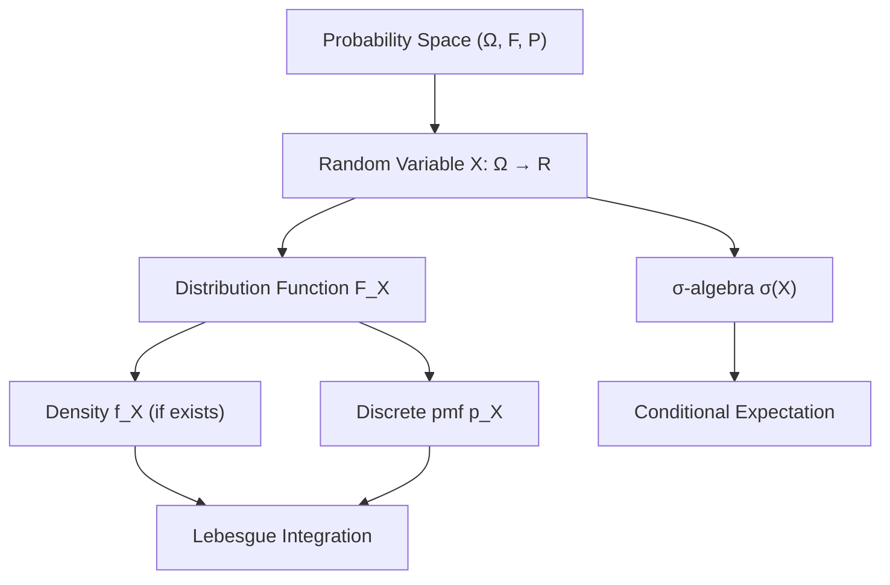
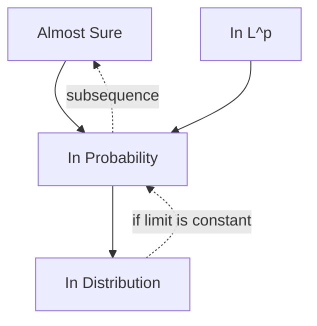
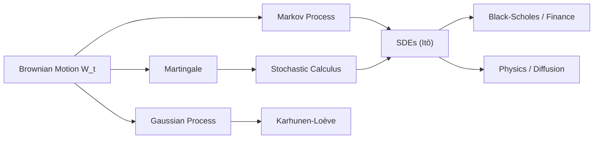

# Probability Theory

> Measure-theoretic foundations of probability, convergence theory, and martingales.

**Primary References:**
- Durrett, R. *Probability: Theory and Examples* (5th ed., Cambridge, 2019)
- Billingsley, P. *Probability and Measure* (Anniversary ed., Wiley, 2012)
- Shiryaev, A. N. *Probability* (2nd ed., Springer, 1996)

---

## Part I — Measure-Theoretic Foundations

### Week 1: $\sigma$-Algebras and Measurable Spaces

A **$\sigma$-algebra** $\mathcal{F}$ on a set $\Omega$ satisfies:
1. $\Omega \in \mathcal{F}$
2. $A \in \mathcal{F} \Rightarrow A^c \in \mathcal{F}$
3. $A_1, A_2, \ldots \in \mathcal{F} \Rightarrow \bigcup_{n=1}^{\infty} A_n \in \mathcal{F}$

The **Borel $\sigma$-algebra** $\mathcal{B}(\mathbb{R})$ is generated by open sets of $\mathbb{R}$.

A **probability space** is a triple $(\Omega, \mathcal{F}, P)$ where $P: \mathcal{F} \to [0,1]$ with $P(\Omega) = 1$ and countable additivity:

$$P\left(\bigcup_{n=1}^{\infty} A_n\right) = \sum_{n=1}^{\infty} P(A_n) \quad \text{for disjoint } A_n$$

**Continuity of measure:** If $A_n \uparrow A$, then $P(A_n) \uparrow P(A)$.

### Week 2: Random Variables and Distributions

A **random variable** is a measurable function $X: (\Omega, \mathcal{F}) \to (\mathbb{R}, \mathcal{B}(\mathbb{R}))$:

$$X^{-1}(B) = \{\omega : X(\omega) \in B\} \in \mathcal{F} \quad \forall B \in \mathcal{B}(\mathbb{R})$$

The **distribution function** $F_X(x) = P(X \le x)$ is right-continuous and non-decreasing.

The **Radon-Nikodym theorem:** If $\mu \ll \nu$ ($\mu$ absolutely continuous w.r.t. $\nu$), there exists a density:

$$\mu(A) = \int_A \frac{d\mu}{d\nu} \, d\nu$$

### Week 3: Expectation and Integration

For a non-negative random variable, the **Lebesgue integral**:

$$E[X] = \int_\Omega X \, dP = \int_0^\infty P(X > t) \, dt$$

Key inequalities:
- **Markov:** $P(X \ge a) \le \frac{E[X]}{a}$ for $X \ge 0, a > 0$
- **Chebyshev:** $P(|X - \mu| \ge k\sigma) \le \frac{1}{k^2}$
- **Jensen:** $\varphi(E[X]) \le E[\varphi(X)]$ for convex $\varphi$
- **Hölder:** $E[|XY|] \le (E[|X|^p])^{1/p}(E[|Y|^q])^{1/q}$ where $\frac{1}{p} + \frac{1}{q} = 1$

**Monotone Convergence Theorem (MCT):** If $0 \le X_n \uparrow X$, then $E[X_n] \uparrow E[X]$.

**Dominated Convergence Theorem (DCT):** If $X_n \to X$ a.s. and $|X_n| \le Y$ with $E[Y] < \infty$, then $E[X_n] \to E[X]$.

---

## Part II — Convergence Theory

### Week 4: Modes of Convergence

| Mode | Notation | Definition |
|------|----------|------------|
| Almost sure | $X_n \xrightarrow{a.s.} X$ | $P(\lim X_n = X) = 1$ |
| In probability | $X_n \xrightarrow{P} X$ | $P(\|X_n - X\| > \varepsilon) \to 0$ |
| In $L^p$ | $X_n \xrightarrow{L^p} X$ | $E[\|X_n - X\|^p] \to 0$ |
| In distribution | $X_n \xrightarrow{d} X$ | $F_{X_n}(x) \to F_X(x)$ at continuity pts |

**Implication hierarchy:**

**Borel-Cantelli Lemmas:**
1. If $\sum P(A_n) < \infty$, then $P(A_n \text{ i.o.}) = 0$
2. If $A_n$ independent and $\sum P(A_n) = \infty$, then $P(A_n \text{ i.o.}) = 1$

### Week 5: Laws of Large Numbers

**Weak LLN (Khintchine):** If $X_1, X_2, \ldots$ are i.i.d. with $E[X_1] = \mu$:

$$\bar{X}_n = \frac{1}{n}\sum_{i=1}^n X_i \xrightarrow{P} \mu$$

**Strong LLN (Kolmogorov):** Under the same conditions:

$$\bar{X}_n \xrightarrow{a.s.} \mu$$

### Week 6: Central Limit Theorem

**Classical CLT:** If $X_1, X_2, \ldots$ are i.i.d. with $E[X_i] = \mu$, $\text{Var}(X_i) = \sigma^2 < \infty$:

$$\frac{\sqrt{n}(\bar{X}_n - \mu)}{\sigma} \xrightarrow{d} N(0, 1)$$

Equivalently via **characteristic functions** $\varphi_X(t) = E[e^{itX}]$:

$$\varphi_{\bar{X}_n}(t) \to e^{-t^2/2}$$

**Berry-Esseen bound:** $\sup_x |F_n(x) - \Phi(x)| \le \frac{C \rho}{\sigma^3 \sqrt{n}}$ where $\rho = E[|X_1 - \mu|^3]$.

**Lindeberg-Feller CLT:** For independent (not necessarily identical) $X_{n,k}$, the CLT holds if the Lindeberg condition is satisfied:

$$\forall \varepsilon > 0: \quad \frac{1}{s_n^2} \sum_{k=1}^n E\left[(X_{n,k} - \mu_{n,k})^2 \mathbf{1}_{|X_{n,k} - \mu_{n,k}| > \varepsilon s_n}\right] \to 0$$

---

## Part III — Conditional Expectation and Martingales

### Week 7: Conditional Expectation

$E[X | \mathcal{G}]$ is the unique $\mathcal{G}$-measurable r.v. satisfying:

$$\int_G E[X|\mathcal{G}] \, dP = \int_G X \, dP \quad \forall G \in \mathcal{G}$$

Properties:
- **Tower:** $E[E[X|\mathcal{G}]] = E[X]$
- **Pull-out:** $E[YX|\mathcal{G}] = Y \cdot E[X|\mathcal{G}]$ if $Y$ is $\mathcal{G}$-measurable
- **Independence:** $E[X|\mathcal{G}] = E[X]$ if $X \perp \mathcal{G}$

### Week 8: Martingale Theory

A sequence $(X_n, \mathcal{F}_n)$ is a **martingale** if:
1. $X_n$ is $\mathcal{F}_n$-adapted and integrable
2. $E[X_{n+1} | \mathcal{F}_n] = X_n$

**Submartingale:** $E[X_{n+1} | \mathcal{F}_n] \ge X_n$. **Supermartingale:** $\le$.

**Doob's Optional Stopping Theorem:** If $T$ is a bounded stopping time and $(X_n)$ a martingale, then $E[X_T] = E[X_0]$.

**Martingale Convergence Theorem:** If $(X_n)$ is a supermartingale bounded in $L^1$, then $X_n \xrightarrow{a.s.} X_\infty$.

**Doob's maximal inequality:** For a non-negative submartingale:

$$P\left(\max_{1 \le k \le n} X_k \ge \lambda\right) \le \frac{E[X_n]}{\lambda}$$

### Week 9: Brownian Motion

**Brownian motion** $\{W_t\}_{t \ge 0}$ satisfies:
1. $W_0 = 0$
2. Independent increments: $W_t - W_s \perp W_s - W_u$ for $u < s < t$
3. Gaussian increments: $W_t - W_s \sim N(0, t-s)$
4. Continuous sample paths a.s.

Key properties:
- **Quadratic variation:** $[W]_t = t$
- **Nowhere differentiable** a.s.
- **Scaling:** $\{cW_{t/c^2}\} \stackrel{d}{=} \{W_t\}$
- **Reflection principle:** $P(\max_{s \le t} W_s \ge a) = 2P(W_t \ge a)$ for $a > 0$

---

## Key Theorems Summary

| Theorem | Statement |
|---------|-----------|
| Kolmogorov 0-1 | Tail events have probability 0 or 1 |
| Kolmogorov extension | Consistent finite-dim distributions $\Rightarrow$ process exists |
| Lévy continuity | $\varphi_{X_n} \to \varphi$ pointwise, $\varphi$ continuous at 0 $\Rightarrow$ $X_n \xrightarrow{d} X$ |
| Slutsky | $X_n \xrightarrow{d} X$, $Y_n \xrightarrow{P} c$ $\Rightarrow$ $X_n + Y_n \xrightarrow{d} X + c$ |
| Cramér-Wold | $X_n \xrightarrow{d} X$ in $\mathbb{R}^d$ iff $t'X_n \xrightarrow{d} t'X$ for all $t$ |
