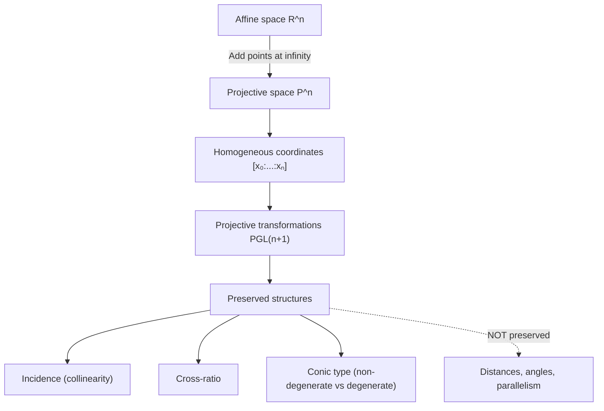
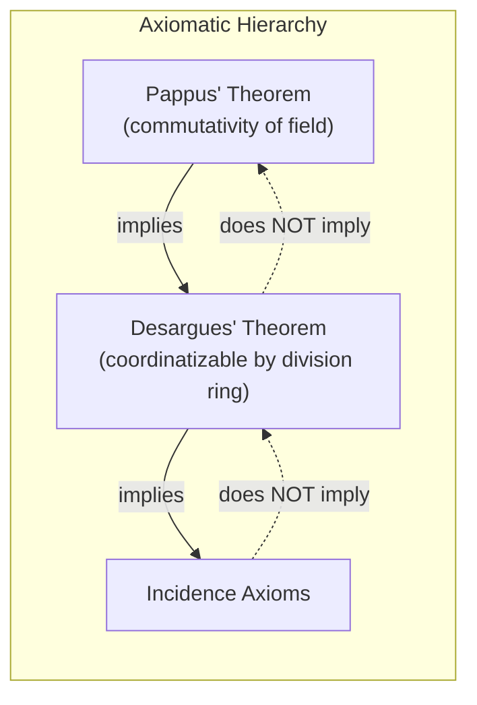
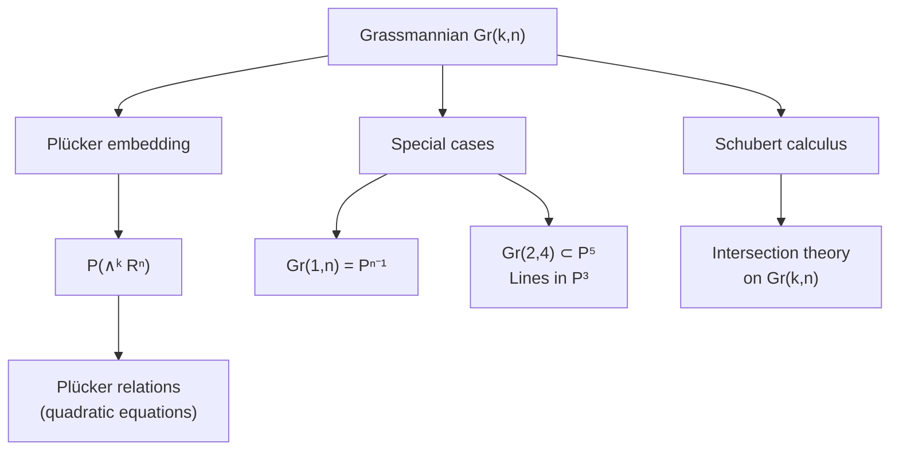

# Projective Geometry

From axiomatic foundations through classical theorems to algebraic curves and Grassmannians. The geometry of perspective, duality, and invariance.

---

## Part I: Foundations

### Week 1: Projective Spaces

**Real projective $n$-space** is the set of lines through the origin in $\mathbb{R}^{n+1}$:

$$\mathbb{P}^n(\mathbb{R}) = (\mathbb{R}^{n+1} \setminus \{0\}) / \sim$$

where $\mathbf{x} \sim \lambda\mathbf{x}$ for all $\lambda \neq 0$. A point is represented by **homogeneous coordinates** $[x_0 : x_1 : \cdots : x_n]$, defined up to a common nonzero scalar.

**Key structure:**
- $\mathbb{P}^n = \mathbb{R}^n \cup \mathbb{P}^{n-1}_\infty$ (affine space plus a hyperplane at infinity)
- $\mathbb{P}^1 \cong S^1$ (the projective line is a circle)
- $\mathbb{P}^2$: every two distinct lines meet in exactly one point -- no "parallel lines" in projective geometry

**Projective subspaces:** A $k$-dimensional projective subspace of $\mathbb{P}^n$ is the image of a $(k+1)$-dimensional linear subspace of $\mathbb{R}^{n+1}$. The **dimension formula**:

$$\dim(V \vee W) = \dim V + \dim W - \dim(V \cap W)$$

where $V \vee W$ is the join (smallest subspace containing both).

**General position:** $k+2$ points in $\mathbb{P}^k$ are in **general position** if no $k+1$ of them lie in a hyperplane. Any two sets of $n+2$ points in general position in $\mathbb{P}^n$ are projectively equivalent.

### Week 2: Projective Transformations

A **projective transformation** (projectivity, collineation) of $\mathbb{P}^n$ is induced by an invertible linear map $A \in GL(n+1, \mathbb{R})$:

$$[x_0 : \cdots : x_n] \mapsto [a_{00}x_0 + \cdots + a_{0n}x_n : \cdots : a_{n0}x_0 + \cdots + a_{nn}x_n]$$

Since $A$ and $\lambda A$ induce the same map, the group of projective transformations is:

$$PGL(n+1, \mathbb{R}) = GL(n+1, \mathbb{R}) / \mathbb{R}^*$$

This has dimension $(n+1)^2 - 1$. For $\mathbb{P}^2$, $\dim PGL(3) = 8$, and a projective transformation is determined by the images of 4 points in general position.

#### Fundamental Theorem of Projective Geometry

> **Theorem.** Every collineation (bijection preserving collinearity) of $\mathbb{P}^n$ over a field $k$ with $n \geq 2$ is a **semi-linear** transformation: a composition of a linear map with a field automorphism. Over $\mathbb{R}$ (which has no nontrivial automorphisms), every collineation is projective.

### Week 3: Duality

The **principle of duality** in $\mathbb{P}^n$: points and hyperplanes are interchangeable.

In $\mathbb{P}^2$, duality exchanges:
- Points $\leftrightarrow$ Lines
- "Point lies on line" $\leftrightarrow$ "Line passes through point"
- Collinear points $\leftrightarrow$ Concurrent lines

The **dual space** $(\mathbb{P}^n)^*$ parametrizes hyperplanes in $\mathbb{P}^n$. A hyperplane $a_0 x_0 + \cdots + a_n x_n = 0$ is represented by $[a_0 : \cdots : a_n] \in (\mathbb{P}^n)^*$.

Every theorem in projective geometry has a **dual theorem** obtained by swapping points and hyperplanes. This is not merely a formal trick -- duality is realized by the isomorphism $\mathbb{P}^n \cong (\mathbb{P}^n)^*$ induced by any nondegenerate bilinear form.

### Week 4: Cross-Ratio

The **cross-ratio** of four collinear points $A, B, C, D$ (with homogeneous coordinates on $\mathbb{P}^1$) is:

$$(A, B; C, D) = \frac{(c_0 a_1 - c_1 a_0)(d_0 b_1 - d_1 b_0)}{(d_0 a_1 - d_1 a_0)(c_0 b_1 - c_1 b_0)}$$

In affine coordinates (when the points are finite):

$$(A, B; C, D) = \frac{(C - A)(D - B)}{(D - A)(C - B)}$$

**Fundamental property:** The cross-ratio is the **only** projective invariant of four collinear points. It is invariant under all projective transformations.

The symmetric group $S_4$ acts on the cross-ratio by permuting points, generating (in general) 6 distinct values:

$$\lambda, \quad \frac{1}{\lambda}, \quad 1 - \lambda, \quad \frac{1}{1-\lambda}, \quad \frac{\lambda}{\lambda-1}, \quad \frac{\lambda-1}{\lambda}$$

Four points form a **harmonic range** when $(A, B; C, D) = -1$.

---

## Part II: Classical Theorems

### Week 5: Desargues and Pappus

#### Desargues' Theorem

> **Theorem (Desargues).** Two triangles $ABC$ and $A'B'C'$ are in **perspective from a point** (lines $AA'$, $BB'$, $CC'$ are concurrent) if and only if they are in **perspective from a line** (the intersections $AB \cap A'B'$, $BC \cap B'C'$, $CA \cap C'A'$ are collinear).

This holds in any projective space $\mathbb{P}^n$ for $n \geq 2$ but can fail in non-Desarguesian planes (exotic projective planes not arising from division rings).

#### Pappus' Theorem

> **Theorem (Pappus).** If $A, B, C$ lie on a line $\ell$ and $A', B', C'$ lie on a line $\ell'$, then the three intersection points $AB' \cap A'B$, $AC' \cap A'C$, $BC' \cap B'C$ are collinear.

Pappus' theorem holds if and only if the underlying division ring is **commutative** (i.e., a field). It implies Desargues' theorem.

---

## Part III: Conics and Algebraic Curves

### Week 6: Projective Conics

A **conic** in $\mathbb{P}^2$ is the zero set of a homogeneous quadratic:

$$Q(x_0, x_1, x_2) = \sum_{i \leq j} a_{ij} x_i x_j = 0$$

equivalently $\mathbf{x}^T A \mathbf{x} = 0$ for a symmetric matrix $A \in \mathbb{R}^{3 \times 3}$.

**Classification** (over $\mathbb{R}$, by Sylvester's law of inertia):

| Signature of $A$ | Type |
|---|---|
| $(+, +, +)$ or $(-,-,-)$ | Empty (no real points) |
| $(+, +, -)$ or $(+, -, -)$ | Non-degenerate conic |
| $(+, +, 0)$ or $(-,-, 0)$ | Single point |
| $(+, -, 0)$ | Pair of lines |
| $(+, 0, 0)$ or $(-, 0, 0)$ | Double line |

Over $\mathbb{C}$, all non-degenerate conics are projectively equivalent. Over $\mathbb{R}$, there are exactly two classes: empty and non-empty.

**Five points determine a conic:** A conic has 6 coefficients up to scale = 5 parameters, so it is determined by 5 points in general position (no 3 collinear).

**Polarity:** A non-degenerate conic $Q$ induces a **polarity** -- a correlation (duality) $\mathbb{P}^2 \to (\mathbb{P}^2)^*$ sending point $P$ to its **polar line** $\ell_P$. If $P = [p]$, then $\ell_P: \mathbf{p}^T A \mathbf{x} = 0$.

### Week 7: Bezout's Theorem and Algebraic Curves

A **projective algebraic curve** $C \subset \mathbb{P}^2$ is defined by a homogeneous polynomial $F(x_0, x_1, x_2) = 0$ of degree $d = \deg(C)$.

> **Theorem (Bezout).** Let $C_1$ and $C_2$ be projective plane curves over an algebraically closed field with no common component. Then, counted with multiplicity:
> $$|C_1 \cap C_2| = \deg(C_1) \cdot \deg(C_2)$$

The **intersection multiplicity** $I_P(C_1, C_2)$ at a point $P$ accounts for tangencies and singularities. Bezout's theorem requires:
1. Working over an algebraically closed field (e.g., $\mathbb{C}$, not $\mathbb{R}$)
2. Projective space (to capture intersections at infinity)
3. Counting with multiplicity

**Examples:**
- Two distinct lines: $1 \cdot 1 = 1$ intersection point
- A line and a conic: $1 \cdot 2 = 2$ points (possibly coinciding = tangency)
- Two conics: $2 \cdot 2 = 4$ points

**Genus** of a smooth curve of degree $d$: $g = \frac{(d-1)(d-2)}{2}$. Lines have $g=0$, conics $g=0$, cubics $g=1$ (elliptic curves), quartics $g=3$.

---

## Part IV: Higher Structures

### Week 8: Quadrics in Higher Dimensions

A **quadric** in $\mathbb{P}^n$ is defined by $\mathbf{x}^T A \mathbf{x} = 0$ for a symmetric $(n+1) \times (n+1)$ matrix $A$. Over $\mathbb{C}$, non-degenerate quadrics are classified by dimension alone.

A non-degenerate quadric $Q \subset \mathbb{P}^n$ contains **linear subspaces** of maximum dimension:
- $Q \subset \mathbb{P}^3$: contains two families of lines (rulings)
- $Q \subset \mathbb{P}^5$: contains two families of planes

The quadric $Q \subset \mathbb{P}^3$ (a smooth quadric surface) is isomorphic to $\mathbb{P}^1 \times \mathbb{P}^1$ via the **Segre embedding**.

### Week 9: Grassmannians

The **Grassmannian** $\operatorname{Gr}(k, n)$ parametrizes $k$-dimensional linear subspaces of an $n$-dimensional vector space (equivalently, $(k-1)$-dimensional projective subspaces of $\mathbb{P}^{n-1}$).

$$\dim \operatorname{Gr}(k, n) = k(n - k)$$

**Special cases:**
- $\operatorname{Gr}(1, n) = \mathbb{P}^{n-1}$: the projective space itself
- $\operatorname{Gr}(2, 4)$: the space of lines in $\mathbb{P}^3$, a 4-dimensional variety

#### Plucker Embedding

$\operatorname{Gr}(k, n)$ embeds into $\mathbb{P}(\bigwedge^k \mathbb{R}^n)$ via **Plucker coordinates**. For $\operatorname{Gr}(2, 4)$, a 2-plane spanned by vectors $\mathbf{v}, \mathbf{w} \in \mathbb{R}^4$ maps to:

$$\mathbf{v} \wedge \mathbf{w} = [p_{01} : p_{02} : p_{03} : p_{12} : p_{13} : p_{23}] \in \mathbb{P}^5$$

where $p_{ij} = v_i w_j - v_j w_i$. The image satisfies the **Plucker relation**:

$$p_{01}p_{23} - p_{02}p_{13} + p_{03}p_{12} = 0$$

This exhibits $\operatorname{Gr}(2,4)$ as a quadric hypersurface in $\mathbb{P}^5$ -- connecting Grassmannians to the theory of quadrics.

---

## Key Invariants and Correspondences

| Affine Concept | Projective Generalization |
|---|---|
| Parallel lines | Lines meeting at a point at infinity |
| Affine transformation group | $PGL(n+1)$ |
| Ratio of collinear points | Cross-ratio (4 points) |
| Euclidean conic classification | Signature of associated matrix |
| Intersection count (approximate) | Bezout (exact, with multiplicity) |

---

## References

1. Coxeter, H. S. M. *Projective Geometry*. 2nd ed., Springer, 2003.
2. Samuel, P. *Projective Geometry*. Springer Undergraduate Texts, 1988.
3. Richter-Gebert, J. *Perspectives on Projective Geometry*. Springer, 2011.
4. Harris, J. *Algebraic Geometry: A First Course*. Springer GTM 133, 1992.
5. Griffiths, P. & Harris, J. *Principles of Algebraic Geometry*. Wiley, 1978.
