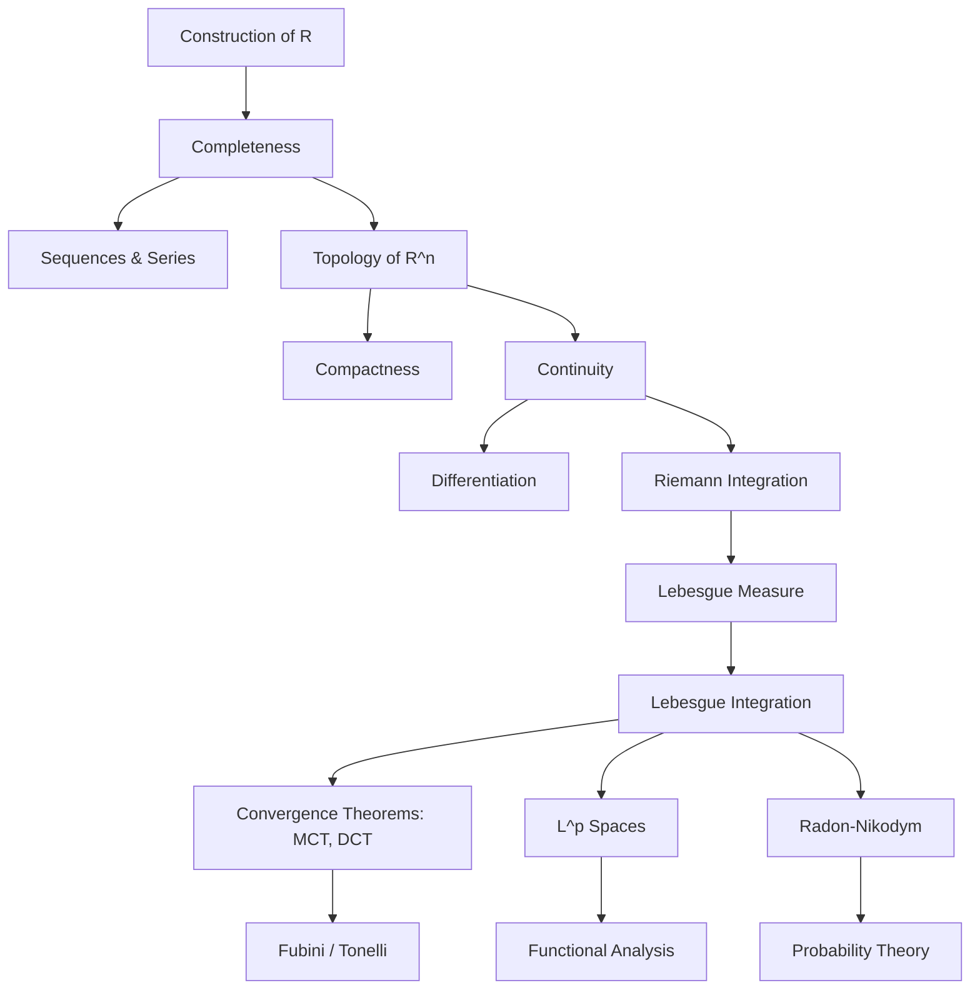
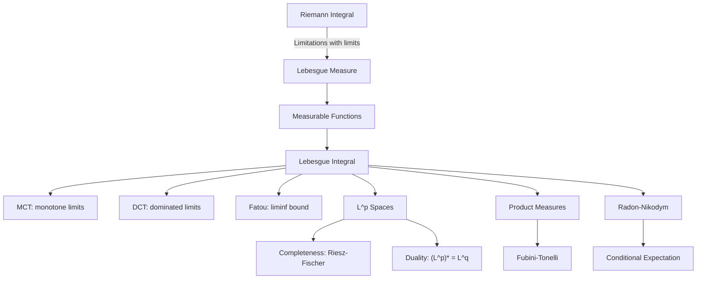

# Real Analysis

> *"The art of analysis consists in the art of making good approximations."* — adapted from various analysts

Back to [[../math-syllabus|Mathematics Syllabus]] | Related: [[linear-algebra]], [[probability-statistics]], [[optimization]]

---

## Concept Map

---

## Motivation

Real analysis provides the rigorous foundation for calculus and its generalizations. It answers questions that calculus assumes away: What is a real number? When can you interchange limits? Which functions are integrable? The theory culminates in Lebesgue's measure and integration theory, which is the language of modern probability, functional analysis, and PDE theory. Without real analysis, one cannot do serious work in any quantitative field.

## Prerequisites

- [[linear-algebra]] (for $\mathbb{R}^n$ topology and multivariate differentiation)
- Mathematical maturity: fluency with epsilon-delta arguments, induction, proof by contradiction
- Naive set theory (countability, cardinality, axiom of choice)

## Recommended References

- **Rudin**, *Principles of Mathematical Analysis* ("Baby Rudin") — terse, elegant, the classic
- **Pugh**, *Real Mathematical Analysis* — excellent exposition with harder exercises
- **Folland**, *Real Analysis* — the standard graduate text for measure theory
- **Stein & Shakarchi**, *Real Analysis* (Princeton Lectures in Analysis III) — beautifully written
- **Royden & Fitzpatrick**, *Real Analysis* — accessible graduate text

---

## Part I: Foundations and Topology (Weeks 1--4)

### Week 1: Construction of the Real Numbers

**Topics:**
- The rationals $\mathbb{Q}$ and their deficiency: $\mathbb{Q}$ is not order-complete
- Dedekind cuts: a real number as a partition of $\mathbb{Q}$
- Alternative: Cauchy sequences of rationals modulo equivalence
- Completeness axiom: every nonempty bounded-above subset of $\mathbb{R}$ has a least upper bound
- Consequences: Archimedean property, density of $\mathbb{Q}$ in $\mathbb{R}$, uncountability of $\mathbb{R}$

**Key Results:**
- **Completeness of $\mathbb{R}$:** (Axiom/Construction.) Every nonempty set bounded above has a supremum.
  - *This is not a theorem but the defining property. Everything in analysis flows from it.*
- **Uncountability of $\mathbb{R}$ (Cantor's Diagonal Argument):** There is no bijection between $\mathbb{N}$ and $\mathbb{R}$.
  - *Proof sketch:* Assume an enumeration $x_1, x_2, \ldots$ of $[0,1]$. Construct a decimal that differs from $x_n$ in the $n$-th digit. This number is not in the list — contradiction.

### Week 2: Sequences and Series

**Topics:**
- Convergence of sequences; limit laws
- Monotone convergence theorem for sequences
- Bolzano-Weierstrass theorem: every bounded sequence in $\mathbb{R}$ has a convergent subsequence
- Cauchy sequences; completeness of $\mathbb{R}$ restated: every Cauchy sequence converges
- $\limsup$ and $\liminf$
- Series: convergence, absolute vs conditional convergence
- Tests: comparison, ratio, root, integral, Dirichlet, Abel
- Rearrangements: Riemann rearrangement theorem (conditionally convergent series can be rearranged to sum to any value)

**Key Results:**
- **Bolzano-Weierstrass:** Every bounded sequence in $\mathbb{R}^n$ has a convergent subsequence.
  - *Proof sketch ($\mathbb{R}$):* A bounded sequence lies in $[a,b]$. Bisect the interval; at least one half contains infinitely many terms. Repeat. The nested intervals converge to a point, and we extract a subsequence converging to it.
- **Riemann Rearrangement Theorem:** A conditionally convergent series can be rearranged to converge to any prescribed sum (or diverge).
  - *Intuition:* Conditional convergence means the positive and negative parts both diverge; you can accumulate positive terms until you overshoot the target, then negative terms until you undershoot, etc.

### Week 3: Topology of $\mathbb{R}^n$

**Topics:**
- Open and closed sets in $\mathbb{R}^n$; interior, closure, boundary
- Compactness: open cover definition
- Heine-Borel theorem: compact in $\mathbb{R}^n$ iff closed and bounded
- Sequential compactness (equivalent in metric spaces)
- Connectedness and path-connectedness
- Perfect sets and the Cantor set
  - The Cantor set: uncountable, measure zero, nowhere dense, totally disconnected, perfect

**Key Results:**
- **Heine-Borel Theorem:** A subset of $\mathbb{R}^n$ is compact iff it is closed and bounded.
  - *Proof sketch ($\Leftarrow$):* Closed and bounded implies sequentially compact (Bolzano-Weierstrass). Sequential compactness implies compactness in metric spaces.
- **Cantor Set Properties:** $\mathcal{C}$ is uncountable (bijection with $\{0,2\}^{\mathbb{N}}$ via ternary expansions), has Lebesgue measure zero (total length removed $= 1$), and is nowhere dense (contains no interval).

### Week 4: Continuity

**Topics:**
- Epsilon-delta definition; sequential characterization
- Continuous image of a compact set is compact; hence continuous functions on compact sets attain their bounds (extreme value theorem)
- Continuous image of a connected set is connected; intermediate value theorem
- Uniform continuity; every continuous function on a compact set is uniformly continuous
- Discontinuities: classification, monotone functions have countably many
- Semicontinuity

**Key Results:**
- **Extreme Value Theorem:** A continuous function on a compact set attains its maximum and minimum.
- **Intermediate Value Theorem:** If $f: [a,b] \to \mathbb{R}$ is continuous and $f(a) < c < f(b)$, then $f(d) = c$ for some $d \in (a,b)$.
  - *Proof:* Let $S = \{x \in [a,b] : f(x) < c\}$. $S$ is nonempty ($a \in S$) and bounded. Let $d = \sup S$. By continuity, $f(d) = c$.

---

## Part II: Differentiation and Integration (Weeks 5--8)

### Week 5: Differentiation in One Variable

**Topics:**
- Definition of derivative; chain rule, product rule
- Mean value theorem and consequences
- L'Hopital's rule (with precise hypotheses)
- Taylor's theorem with various remainder forms (Lagrange, Cauchy, integral)
- Higher derivatives; smooth functions, analytic functions
- Nowhere-differentiable continuous functions (Weierstrass function)

**Key Results:**
- **Mean Value Theorem:** If $f$ is continuous on $[a,b]$ and differentiable on $(a,b)$, then $f'(c) = \frac{f(b) - f(a)}{b - a}$ for some $c \in (a,b)$.
  - *Proof:* Apply Rolle's theorem to $g(x) = f(x) - f(a) - \frac{f(b)-f(a)}{b-a}(x-a)$.
- **Taylor's Theorem:**
$$f(x) = \sum_{k=0}^{n} \frac{f^{(k)}(a)}{k!} (x-a)^k + R_n(x)$$
where the Lagrange remainder is $R_n(x) = \frac{f^{(n+1)}(c)}{(n+1)!} (x-a)^{n+1}$.

### Week 6: Riemann Integration

**Topics:**
- Partitions, upper and lower sums
- Riemann integrability: upper integral $=$ lower integral
- Continuous functions are Riemann integrable; monotone functions are Riemann integrable
- Lebesgue's criterion: $f$ is Riemann integrable iff the set of discontinuities has measure zero
- Fundamental theorem of calculus (both parts)
- Improper integrals

**Key Results:**
- **Fundamental Theorem of Calculus (Part I):** If $f$ is Riemann integrable on $[a,b]$ and $F(x) = \int_a^x f(t)\, dt$, then $F$ is continuous. If $f$ is continuous at $x_0$, then $F'(x_0) = f(x_0)$.
- **FTC (Part II):** If $F$ is differentiable on $[a,b]$ and $F'$ is Riemann integrable, then $\int_a^b F'(t)\, dt = F(b) - F(a)$.
- **Lebesgue's Criterion:** $f: [a,b] \to \mathbb{R}$ is Riemann integrable iff $f$ is bounded and continuous almost everywhere (the set of discontinuities has Lebesgue measure zero).

### Week 7: Sequences and Series of Functions

**Topics:**
- Pointwise vs uniform convergence
- Uniform limit of continuous functions is continuous
- Weierstrass $M$-test for uniform convergence of series
- Term-by-term differentiation and integration (under uniform convergence)
- Equicontinuity and Arzela-Ascoli theorem
- Stone-Weierstrass theorem: continuous functions on compact sets can be uniformly approximated by polynomials

**Key Results:**
- **Arzela-Ascoli Theorem:** A sequence of functions in $C(K)$ ($K$ compact metric) has a uniformly convergent subsequence iff the sequence is uniformly bounded and equicontinuous.
  - *Intuition:* This is the "Bolzano-Weierstrass theorem for function spaces."
- **Stone-Weierstrass Theorem:** If $\mathcal{A}$ is a subalgebra of $C(K, \mathbb{R})$ that separates points and contains constants, then $\mathcal{A}$ is dense in $C(K, \mathbb{R})$ in the uniform norm.

### Week 8: Multivariable Differentiation

**Topics:**
- Partial derivatives, total derivative (Frechet derivative), Jacobian matrix
- Chain rule in several variables
- Inverse function theorem and implicit function theorem
- Higher-order derivatives; equality of mixed partials (Clairaut/Schwarz)
- Taylor expansion in several variables

**Key Results:**
- **Inverse Function Theorem:** If $f: \mathbb{R}^n \to \mathbb{R}^n$ is $C^1$ and $Df(a)$ is invertible, then $f$ is a local diffeomorphism near $a$.
  - *Proof sketch:* Use the contraction mapping principle. Define $g(x) = x - [Df(a)]^{-1} f(x)$. Near $a$, $g$ is a contraction, so the equation $f(x) = y$ has a unique local solution.
- **Implicit Function Theorem:** Derived from the inverse function theorem. If $F(x,y) = 0$ and $\partial F/\partial y$ is invertible, then locally $y = g(x)$ for some smooth $g$.

---

## Part III: Measure Theory and Lebesgue Integration (Weeks 9--13)

### Week 9: Measure Spaces

**Topics:**
- Sigma-algebras: definition, generated sigma-algebras, Borel sigma-algebra on $\mathbb{R}^n$
- Measures: definition, properties (monotonicity, countable subadditivity, continuity from below/above)
- Outer measure; Caratheodory's extension theorem
- Lebesgue measure on $\mathbb{R}^n$: construction via outer measure
- Measurable sets; Lebesgue vs Borel sets
- Non-measurable sets (Vitali set, requires axiom of choice)

**Key Results:**
- **Caratheodory Extension Theorem:** A premeasure on an algebra extends uniquely (if sigma-finite) to a measure on the generated sigma-algebra.
  - *This is the foundational construction tool for measures.*
- **Existence of non-measurable sets:** Assuming the axiom of choice, there exist subsets of $\mathbb{R}$ that are not Lebesgue measurable (Vitali's construction using cosets of $\mathbb{Q}$ in $\mathbb{R}$).

### Week 10: Measurable Functions and Integration

**Topics:**
- Measurable functions: definition, properties, approximation by simple functions
- Lebesgue integral: definition via simple functions $\to$ non-negative measurable functions $\to$ general integrable functions
- Comparison with Riemann integral: every Riemann integrable function is Lebesgue integrable (with the same value), but Lebesgue theory integrates more functions (e.g., $\mathbf{1}_{\mathbb{Q}}$)
- Almost everywhere (a.e.) properties

**Key Insight:** The Lebesgue integral partitions the *range* rather than the *domain*. This is why it handles limits so much better than the Riemann integral — it is naturally compatible with measure-theoretic limit operations.

### Week 11: Convergence Theorems

**Topics:**
- Monotone Convergence Theorem (MCT)
- Fatou's Lemma
- Dominated Convergence Theorem (DCT)
- Interchanging limits and integrals: when and why

**Key Results:**
- **Monotone Convergence Theorem:** If $0 \leq f_1 \leq f_2 \leq \cdots$ are measurable, then $\int \lim f_n = \lim \int f_n$.
  - *Proof sketch:* $\leq$ direction is easy (monotonicity of integral). For $\geq$, approximate each $f_n$ by simple functions and use the definition of the integral as a supremum.
- **Fatou's Lemma:** $\int \liminf f_n \leq \liminf \int f_n$ (for non-negative measurable $f_n$).
  - *Proof:* Apply MCT to $g_n = \inf_{k \geq n} f_k$, which increases to $\liminf f_n$.
- **Dominated Convergence Theorem:** If $f_n \to f$ a.e. and $|f_n| \leq g$ with $g$ integrable, then $\int f_n \to \int f$.
  - *Proof:* Apply Fatou's lemma to $g + f_n \geq 0$ and $g - f_n \geq 0$ to get both inequality directions.
  - *Importance:* This is the workhorse theorem for interchanging limits and integrals. It replaces the much more restrictive uniform convergence condition.

### Week 12: $L^p$ Spaces

**Topics:**
- Definition: $L^p(X, \mu) = \{f \text{ measurable} : \int |f|^p < \infty\} / (\text{a.e. equivalence})$
- Holder's inequality: $\|fg\|_1 \leq \|f\|_p \|g\|_q$ where $\frac{1}{p} + \frac{1}{q} = 1$
- Minkowski's inequality: $\|f+g\|_p \leq \|f\|_p + \|g\|_p$ (triangle inequality)
- Completeness: $L^p$ is a Banach space (Riesz-Fischer theorem)
- $L^2$ as a Hilbert space; orthogonal projections, Fourier series
- Duality: $(L^p)^* \cong L^q$ for $1 \leq p < \infty$
- Dense subsets: $C_c(\mathbb{R}^n)$ is dense in $L^p(\mathbb{R}^n)$ for $1 \leq p < \infty$

**Key Results:**
- **Riesz-Fischer Theorem:** $L^p$ is complete.
  - *Proof sketch:* Given a Cauchy sequence, extract a subsequence with $\|f_{n_{k+1}} - f_{n_k}\|_p < 2^{-k}$. The telescoping series converges a.e. (by MCT applied to partial sums of $|f_{n_{k+1}} - f_{n_k}|$). The limit is in $L^p$, and the original Cauchy sequence converges to it.
- **Riesz Representation (for $L^p$):** For $1 \leq p < \infty$, every bounded linear functional on $L^p$ is of the form $f \mapsto \int fg$ for a unique $g \in L^q$.

### Week 13: Product Measures and Fubini's Theorem

**Topics:**
- Product sigma-algebras and product measures
- Tonelli's theorem (non-negative functions: can always interchange order of integration)
- Fubini's theorem (integrable functions: can interchange order)
- Convolution and Young's inequality
- Applications: computing multivariate integrals, Gaussian integral

**Key Results:**
- **Tonelli's Theorem:** For non-negative measurable $f$ on $X \times Y$: $\iint f\, d\mu\, d\nu = \iint f\, d\nu\, d\mu = \int f\, d(\mu \times \nu)$. No integrability assumption needed.
- **Fubini's Theorem:** If $f \in L^1(X \times Y, \mu \times \nu)$, then the iterated integrals exist and equal the product integral.
  - *Key distinction:* Tonelli is for non-negative (always works); Fubini requires integrability (of the product integral).

---

## Part IV: Differentiation Theory (Weeks 14--15)

### Week 14: Differentiation of Measures

**Topics:**
- Signed measures; Hahn decomposition, Jordan decomposition
- Absolute continuity and singularity of measures
- Radon-Nikodym theorem: if $\nu \ll \mu$ ($\nu$ is absolutely continuous w.r.t. $\mu$), then $d\nu = f\, d\mu$ for some measurable $f$ (the Radon-Nikodym derivative)
- Lebesgue decomposition theorem: $\nu = \nu_{ac} + \nu_s$ (absolutely continuous + singular part)

**Key Results:**
- **Radon-Nikodym Theorem:** If $\nu \ll \mu$ (both sigma-finite), there exists a measurable $f \geq 0$ such that $\nu(A) = \int_A f\, d\mu$ for all measurable $A$.
  - *Proof sketch (von Neumann):* Consider the Hilbert space $L^2(\mu + \nu)$. The functional $g \mapsto \int g\, d\nu$ is bounded (since $\nu \leq \mu + \nu$). By Riesz representation, $\int g\, d\nu = \int gh\, d(\mu+\nu)$ for some $h \in L^2$. Algebraic manipulation yields the density $f = h/(1-h)$.
  - *Importance:* This theorem is the foundation of conditional expectation in probability theory.

### Week 15: Lebesgue Differentiation and Functions of Bounded Variation

**Topics:**
- Lebesgue differentiation theorem: for $f \in L^1_{\text{loc}}$, $\frac{1}{|B_r(x)|} \int_{B_r(x)} f \to f(x)$ a.e.
- Hardy-Littlewood maximal function and maximal inequality
- Functions of bounded variation (BV); Jordan's decomposition as difference of monotone functions
- Absolutely continuous functions: $F$ is AC iff $F(x) = F(a) + \int_a^x f$ for some $L^1$ function $f$; equivalently, $F$ is differentiable a.e. with $F' \in L^1$ and FTC holds
- Monotone functions are differentiable a.e. (Lebesgue's theorem)

**Key Results:**
- **Lebesgue Differentiation Theorem:** If $f \in L^1(\mathbb{R}^n)$, then for a.e. $x$, the average of $f$ over balls centered at $x$ converges to $f(x)$ as the radius $\to 0$.
  - *This is the measure-theoretic generalization of the fundamental theorem of calculus.*
- **Fundamental Theorem of Calculus (Lebesgue version):** $f \in L^1$ implies $F(x) = \int_a^x f$ is absolutely continuous and $F' = f$ a.e. Conversely, if $F$ is AC, then $F' \in L^1$ and $F(x) - F(a) = \int_a^x F'$.

---

## Integration Theory Roadmap

---

## Applications

### Probability Theory
- Probability spaces are measure spaces with total measure 1
- Random variables are measurable functions; expectation is the Lebesgue integral
- Convergence theorems (DCT, MCT) yield probabilistic limit theorems
- Radon-Nikodym derivative = density function; conditional expectation is defined via Radon-Nikodym
- $L^p$ spaces give the framework for moments and $L^p$ convergence
- See [[probability-statistics]] for the full probabilistic development

### Functional Analysis
- Banach spaces ($L^p$) and Hilbert spaces ($L^2$) are built on Lebesgue integration
- Dual space characterizations (Riesz representation) depend on Radon-Nikodym
- Spectral theory of self-adjoint operators on $L^2$ extends the finite-dimensional [[linear-algebra]] spectral theorem
- Distribution theory (generalized functions) requires measure-theoretic foundations

### Partial Differential Equations
- Weak solutions live in Sobolev spaces ($W^{k,p}$), which are built on $L^p$
- Energy methods use $L^2$ inner products and Hilbert space theory
- Fundamental solutions and Green's functions involve convolution (Fubini/Tonelli)

---

## Summary of Key Theorems

| Theorem | Statement (abbreviated) | Significance |
|---------|------------------------|--------------|
| MCT | $0 \leq f_n \uparrow f \implies \int f_n \to \int f$ | Monotone limits commute with integration |
| DCT | $f_n \to f$, $\|f_n\| \leq g \in L^1 \implies \int f_n \to \int f$ | The workhorse limit theorem |
| Fubini/Tonelli | Iterated integrals $=$ product integral | Interchange order of integration |
| Radon-Nikodym | $\nu \ll \mu \implies d\nu = f\, d\mu$ | Densities, conditional expectation |
| Riesz-Fischer | $L^p$ is complete | Foundation for functional analysis |
| Lebesgue Diff. | Averages $\to$ function value a.e. | Generalized FTC |

---

*Last updated: 2026-03-22*
