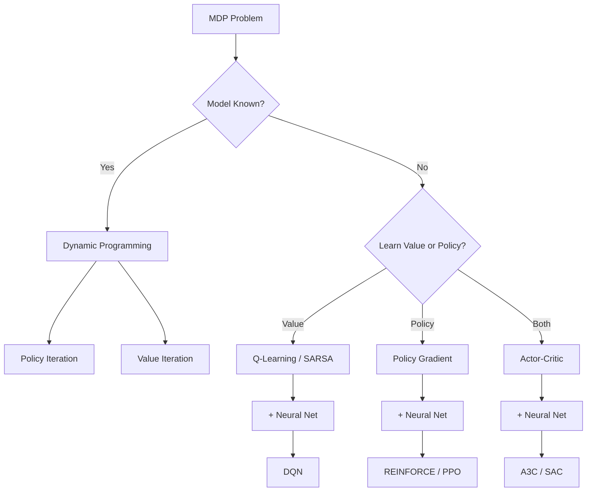
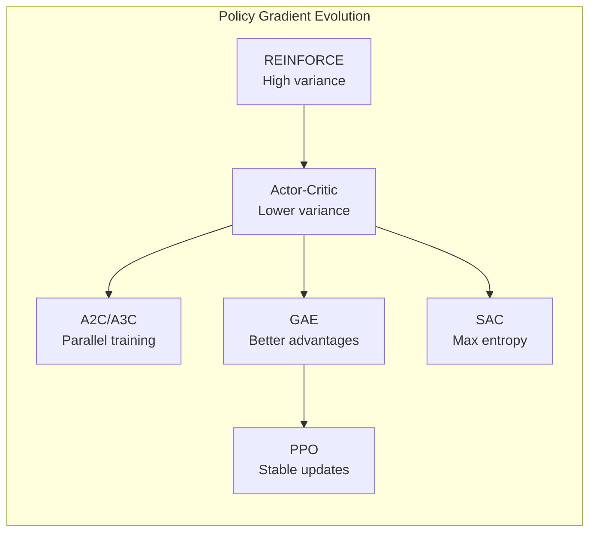

# Reinforcement Learning

> From MDPs and dynamic programming through deep RL and multi-agent systems.

## References

- Sutton, R. S. & Barto, A. G. *Reinforcement Learning: An Introduction*, 2nd ed. MIT Press, 2018.
- Bertsekas, D. P. *Dynamic Programming and Optimal Control*, 4th ed. Athena Scientific, 2017.
- Silver, D. UCL Course on RL (lectures). 2015.
- Schulman, J. et al. "Proximal Policy Optimization Algorithms." arXiv:1707.06347, 2017.
- Silver, D. et al. "Mastering the Game of Go without Human Knowledge." Nature, 2017.
- Haarnoja, T. et al. "Soft Actor-Critic." ICML, 2018.

---

# Part I — Foundations

## Week 1: Markov Decision Processes

### MDP Definition

An MDP is a tuple $\langle S, A, P, R, \gamma \rangle$:

- $S$: state space
- $A$: action space
- $P(s' | s, a)$: transition probability
- $R(s, a)$: reward function (or $R(s, a, s')$)
- $\gamma \in [0, 1)$: discount factor

### Value Functions

**State-value function** under policy $\pi$:

$$V^\pi(s) = E_\pi\left[\sum_{t=0}^{\infty} \gamma^t R(s_t, a_t) \;\middle|\; s_0 = s\right]$$

**Action-value function**:

$$Q^\pi(s, a) = E_\pi\left[\sum_{t=0}^{\infty} \gamma^t R(s_t, a_t) \;\middle|\; s_0 = s, a_0 = a\right]$$

### Bellman Equations

**Bellman expectation equation**:

$$V^\pi(s) = \sum_a \pi(a|s) \left[R(s,a) + \gamma \sum_{s'} P(s'|s,a) V^\pi(s')\right]$$

**Bellman optimality equation**:

$$V^*(s) = \max_a \left[R(s,a) + \gamma \sum_{s'} P(s'|s,a) V^*(s')\right]$$

$$Q^*(s,a) = R(s,a) + \gamma \sum_{s'} P(s'|s,a) \max_{a'} Q^*(s',a')$$

### Dynamic Programming

**Policy Evaluation**: iteratively apply Bellman expectation equation until convergence.

**Policy Improvement**: act greedily w.r.t. current value function.

**Policy Iteration**: alternate evaluation and improvement. Converges in finite steps.

**Value Iteration**: directly iterate on Bellman optimality equation:

$$V_{k+1}(s) = \max_a \left[R(s,a) + \gamma \sum_{s'} P(s'|s,a) V_k(s')\right]$$

---

# Part II — Model-Free Methods

## Week 2: Temporal Difference Learning

### TD(0) Update

$$V(s_t) \leftarrow V(s_t) + \alpha \left[r_t + \gamma V(s_{t+1}) - V(s_t)\right]$$

The term $\delta_t = r_t + \gamma V(s_{t+1}) - V(s_t)$ is the **TD error**.

### SARSA (On-Policy)

$$Q(s_t, a_t) \leftarrow Q(s_t, a_t) + \alpha \left[r_t + \gamma Q(s_{t+1}, a_{t+1}) - Q(s_t, a_t)\right]$$

Follows the current policy (e.g., $\epsilon$-greedy) for both behavior and update.

### Q-Learning (Off-Policy)

$$Q(s, a) \leftarrow Q(s, a) + \alpha \left[r + \gamma \max_{a'} Q(s', a') - Q(s, a)\right]$$

Learns the optimal $Q^*$ regardless of the behavior policy. Converges under standard stochastic approximation conditions.

### Eligibility Traces: TD($\lambda$)

Interpolate between TD(0) and Monte Carlo:

$$G_t^\lambda = (1-\lambda)\sum_{n=1}^{\infty} \lambda^{n-1} G_t^{(n)}$$

where $G_t^{(n)}$ is the $n$-step return. Implemented efficiently via eligibility traces $e_t(s) = \gamma \lambda \, e_{t-1}(s) + \mathbb{1}[s_t = s]$.

## Week 3: Deep Q-Networks

### DQN (Mnih et al., 2015)

Approximate $Q^*(s, a)$ with a neural network $Q(s, a; \theta)$.

Key innovations:
1. **Experience replay**: store $(s, a, r, s')$ tuples, sample mini-batches uniformly
2. **Target network**: separate network $\theta^-$ updated periodically, stabilizes training

$$\mathcal{L}(\theta) = E_{(s,a,r,s') \sim \mathcal{D}}\left[\left(r + \gamma \max_{a'} Q(s', a'; \theta^-) - Q(s, a; \theta)\right)^2\right]$$

### Improvements

- **Double DQN**: decouple action selection and evaluation to reduce overestimation: $y = r + \gamma Q(s', \arg\max_{a'} Q(s', a'; \theta); \theta^-)$
- **Dueling DQN**: decompose $Q(s,a) = V(s) + A(s,a)$
- **Prioritized Experience Replay**: sample transitions with high TD error more often
- **Rainbow**: combine all improvements (Hessel et al., 2018)

---

# Part III — Policy Gradient Methods

## Week 4: REINFORCE and Actor-Critic

### Policy Gradient Theorem

For a parameterized policy $\pi_\theta(a|s)$:

$$\nabla_\theta J(\theta) = E_{\pi_\theta}\left[\nabla_\theta \log \pi_\theta(a|s) \cdot Q^{\pi_\theta}(s, a)\right]$$

### REINFORCE (Williams, 1992)

Monte Carlo policy gradient with baseline:

$$\nabla_\theta J(\theta) = E\left[\nabla_\theta \log \pi_\theta(a_t|s_t) \cdot (G_t - b(s_t))\right]$$

where $G_t = \sum_{k=0}^{\infty} \gamma^k r_{t+k}$ is the return and $b(s_t)$ is a baseline (often $V(s_t)$).

High variance — requires many samples.

### Actor-Critic

Replace Monte Carlo return with a learned critic $V_\phi(s)$:

**Actor update**: $\theta \leftarrow \theta + \alpha_\theta \nabla_\theta \log \pi_\theta(a|s) \cdot \delta_t$

**Critic update**: $\phi \leftarrow \phi + \alpha_\phi \delta_t \nabla_\phi V_\phi(s_t)$

where $\delta_t = r_t + \gamma V_\phi(s_{t+1}) - V_\phi(s_t)$ is the advantage estimate.

### Generalized Advantage Estimation (GAE)

$$\hat{A}_t^{\text{GAE}(\gamma, \lambda)} = \sum_{l=0}^{\infty} (\gamma \lambda)^l \delta_{t+l}$$

Provides a tunable bias-variance tradeoff via $\lambda$.

## Week 5: PPO, A3C, and SAC

### Proximal Policy Optimization (PPO)

Clip the probability ratio to prevent large updates:

$$r_t(\theta) = \frac{\pi_\theta(a_t|s_t)}{\pi_{\theta_{\text{old}}}(a_t|s_t)}$$

$$\mathcal{L}^{\text{CLIP}}(\theta) = E_t\left[\min\left(r_t(\theta)\hat{A}_t, \; \text{clip}(r_t(\theta), 1-\epsilon, 1+\epsilon)\hat{A}_t\right)\right]$$

### Asynchronous Advantage Actor-Critic (A3C)

Multiple agents run in parallel environments, compute gradients asynchronously, update shared parameters. Reduces correlation between samples.

### Soft Actor-Critic (SAC)

Maximum entropy RL — augment reward with entropy bonus:

$$J(\pi) = \sum_t E\left[r(s_t, a_t) + \alpha \mathcal{H}(\pi(\cdot|s_t))\right]$$

Soft Bellman equation:

$$Q^*(s,a) = R(s,a) + \gamma E_{s'}\left[V^*(s')\right], \quad V^*(s) = E_{a \sim \pi^*}\left[Q^*(s,a) - \alpha \log \pi^*(a|s)\right]$$

Automatically tunes temperature $\alpha$. Works well for continuous control.

---

# Part IV — Planning and Model-Based RL

## Week 6: MCTS and AlphaGo

### Monte Carlo Tree Search

Four phases per simulation:
1. **Selection**: traverse tree using UCB1: $a^* = \arg\max_a \left[Q(s,a) + c\sqrt{\frac{\ln N(s)}{N(s,a)}}\right]$
2. **Expansion**: add a new node
3. **Simulation**: rollout random policy to terminal state
4. **Backpropagation**: update statistics along the path

### AlphaGo (Silver et al., 2016)

- SL policy network $p_\sigma$ trained on expert games
- RL policy network $p_\rho$ trained via self-play
- Value network $v_\theta(s)$ predicting game outcome
- MCTS combining $p_\sigma$, $v_\theta$, and rollouts

### AlphaGo Zero / AlphaZero (2017)

No human data. Single neural network $f_\theta(s) = (p, v)$ predicting both policy and value. MCTS uses the network for selection and evaluation — no rollouts needed.

Training loop: self-play with MCTS $\rightarrow$ store games $\rightarrow$ train network $\rightarrow$ repeat.

### Model-Based RL

Learn the dynamics model $\hat{P}(s'|s,a)$ and $\hat{R}(s,a)$, then plan:

- **Dyna-Q**: interleave real experience and simulated experience
- **World models** (Ha & Schmidhuber, 2018): VAE + RNN for learning environment dynamics
- **MuZero** (Schrittwieser et al., 2020): learned model in latent space, no reconstruction needed

---

# Part V — Advanced Topics

## Week 7: Multi-Agent RL

### Problem Setting

$N$ agents with observations $o_i$, actions $a_i$, and rewards $r_i$. The transition depends on joint actions: $P(s'|s, a_1, \ldots, a_N)$.

### Paradigms

- **Independent learners**: each agent treats others as environment (non-stationary)
- **Centralized training, decentralized execution (CTDE)**: access full state during training, act on local observations
- **Communication**: agents learn to share information

### Key Algorithms

- **QMIX**: factorize joint $Q$ as monotonic combination of per-agent $Q_i$
- **MAPPO**: multi-agent PPO with shared critic
- **Self-play**: agent trains against copies of itself (used in AlphaGo, OpenAI Five)

### Emergent Behavior

Complex strategies emerge from simple reward signals:
- Cooperation and competition in mixed environments
- Tool use in hide-and-seek (Baker et al., 2020)
- Language emergence in communication games

---

## Summary Checklist

- [ ] Solve a gridworld with value iteration
- [ ] Implement Q-learning and observe convergence
- [ ] Code DQN with experience replay and target network
- [ ] Derive the policy gradient theorem
- [ ] Implement PPO with GAE on a continuous control task
- [ ] Understand MCTS and its application in AlphaZero
- [ ] Compare model-free vs. model-based sample efficiency
