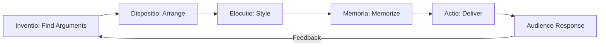
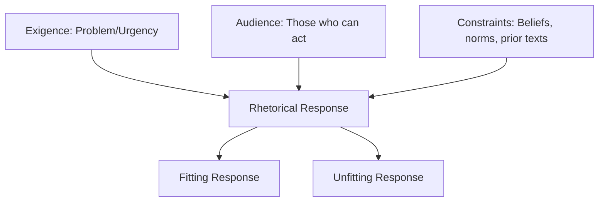
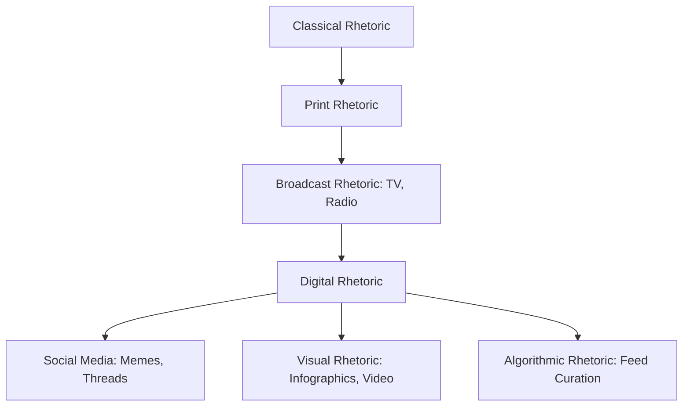

# Rhetoric — Classical and Modern Argumentation

## Part I — Classical Rhetoric

### Week 1: Aristotle's Framework

**The Three Appeals** (*Rhetoric*, c. 335 BCE)

| Appeal | Definition | How It Persuades |
|--------|-----------|-----------------|
| **Ethos** | Character/credibility of the speaker | Trust, authority, expertise |
| **Pathos** | Emotional engagement of the audience | Fear, pity, anger, hope, pride |
| **Logos** | Logical reasoning and evidence | Syllogism, example, data |

Effective rhetoric deploys all three in balance. Over-reliance on one produces distortion:
- Ethos alone = argument from authority
- Pathos alone = manipulation
- Logos alone = dry, unpersuasive technicality

**Kairos**: the opportune moment — *when* to speak matters as much as *what* you say. Kairos is situational awareness: reading the room, the cultural moment, the audience's readiness.

### Week 2: The Five Canons

The classical rhetorical process, codified by Cicero and the *Rhetorica ad Herennium*:

1. **Inventio** (Invention): discovering arguments. Use *topoi* (commonplaces): definition, comparison, cause/effect, testimony, authority.
2. **Dispositio** (Arrangement): organizing the speech. See Week 3.
3. **Elocutio** (Style): choosing language. Levels: plain (docere/teach), middle (delectare/delight), grand (movere/move).
4. **Memoria** (Memory): memorizing the speech. The *method of loci* (memory palace) originates here.
5. **Actio** (Delivery): voice, gesture, presence. Demosthenes practiced with pebbles in his mouth.

### Week 3: Arrangement of a Speech

The six-part classical oration (Cicero, *De Inventione*):

1. **Exordium** (Introduction): capture attention (*captatio benevolentiae*), establish ethos, preview the argument
2. **Narratio** (Statement of Facts): provide background; frame the situation favorably
3. **Divisio** (Division): outline the points to be made
4. **Confirmatio** (Confirmation): present arguments and evidence
5. **Refutatio** (Refutation): anticipate and dismantle counterarguments
6. **Peroratio** (Conclusion): summarize, make emotional appeal, call to action

---

## Part II — Rhetorical Figures

### Week 4: Figures of Speech and Thought

**Repetition figures**:
- **Anaphora**: repetition at the start of successive clauses. "We shall fight on the beaches, we shall fight on the landing grounds, we shall fight..."
- **Epistrophe**: repetition at the end. "...of the people, by the people, for the people."
- **Symploce**: anaphora + epistrophe combined.
- **Anadiplosis**: end of one clause repeated at start of next. "Fear leads to anger. Anger leads to hate."

**Structural figures**:
- **Chiasmus**: ABBA reversal. "Ask not what your country can do for you — ask what you can do for your country." (JFK)
- **Antithesis**: juxtaposition of opposites. "It was the best of times, it was the worst of times."
- **Parallelism**: matching grammatical structure for balanced emphasis.

**Figures of thought**:
- **Hyperbole**: deliberate exaggeration
- **Litotes**: understatement by negation ("not bad" = good)
- **Rhetorical question**: question asked for effect, not answer
- **Irony**: saying the opposite of what is meant (see also Socratic irony)

### Week 5: The Rhetorical Situation

**Lloyd Bitzer's model (1968)**:
- **Exigence**: the urgency or problem that calls for a rhetorical response
- **Audience**: those who can be influenced and act on the exigence
- **Constraints**: beliefs, attitudes, documents, traditions, prior rhetoric that shape what can be said

Every act of communication occurs within a rhetorical situation. The situation is not created by the speaker — it pre-exists, and the speaker responds to it.

---

## Part III — Argumentation Theory

### Week 6: The Toulmin Model

Stephen Toulmin (*The Uses of Argument*, 1958) proposed a practical model superior to formal syllogism for everyday reasoning:

| Component | Definition | Example |
|-----------|-----------|---------|
| **Claim** | The thesis, what you're arguing | "We should raise the minimum wage" |
| **Data** | Evidence supporting the claim | "Workers cannot afford basic needs at current wages" |
| **Warrant** | The logical bridge from data to claim | "A just society ensures workers can meet basic needs" |
| **Backing** | Support for the warrant | "Constitutional principles, economic studies" |
| **Qualifier** | Degree of certainty | "Probably," "in most cases" |
| **Rebuttal** | Conditions that would defeat the claim | "Unless it causes mass unemployment" |

The warrant is the most important — and most often unstated — element. Exposing hidden warrants is the core of rhetorical analysis.

### Week 7: Logical Fallacies

**Fallacies of Relevance**:
- **Ad hominem**: attacking the person, not the argument
- **Tu quoque**: "you do it too" — deflecting criticism by pointing to hypocrisy
- **Appeal to authority** (*argumentum ad verecundiam*): citing an authority outside their expertise
- **Appeal to emotion** (*argumentum ad passiones*): substituting emotion for evidence
- **Red herring**: introducing an irrelevant topic to divert attention

**Fallacies of Presumption**:
- **False dilemma**: presenting only two options when more exist
- **Slippery slope**: asserting a chain of consequences without justification
- **Begging the question** (*petitio principii*): assuming what you're trying to prove
- **Hasty generalization**: drawing broad conclusions from insufficient evidence

**Fallacies of Ambiguity**:
- **Equivocation**: shifting the meaning of a term mid-argument
- **Straw man**: misrepresenting an opponent's position to make it easier to attack
- **Post hoc ergo propter hoc**: "after this, therefore because of this" — correlation is not causation

---

## Part IV — Modern Rhetoric

### Week 8: Kenneth Burke — Identification and the Pentad

Burke (*A Rhetoric of Motives*, 1950) redefined rhetoric around **identification**: persuasion works when speaker and audience perceive shared identity, interests, or values. "You persuade a man only insofar as you can talk his language."

**The Dramatistic Pentad** (*A Grammar of Motives*, 1945):

| Element | Question |
|---------|----------|
| **Act** | What happened? |
| **Scene** | Where/when did it happen? |
| **Agent** | Who did it? |
| **Agency** | How did they do it? |
| **Purpose** | Why did they do it? |

The **ratio** between pentadic elements reveals ideology. Emphasizing *Scene* over *Agent* suggests environmental determinism; emphasizing *Agent* over *Scene* suggests individual responsibility.

### Week 9: Digital and Visual Rhetoric

**Digital rhetoric**: how persuasion operates in online spaces — memes, virality, algorithmic amplification, filter bubbles, platform affordances. The medium shapes the message (McLuhan).

**Visual rhetoric**: images argue. Consider:
- Composition and framing (what is included/excluded)
- Color, contrast, typography as persuasive elements
- Multimodal texts: how image and text interact (anchorage, relay per Barthes)
- Data visualization as argument: axes, scales, cherry-picked ranges

### Week 10: Rhetoric in Practice

**Speechwriting**: study Lincoln's Gettysburg Address (272 words, perfect structure), MLK's "I Have a Dream" (anaphora, biblical cadence, kairos), Obama's 2008 "A More Perfect Union" (racial rhetoric, identification).

**Debate**: proposition vs. opposition, cross-examination, flowing arguments, weighing impacts.

**Academic argument**: thesis-driven essay, evidence integration (quotation, paraphrase, summary), counterargument and rebuttal, hedging and qualification.

---

## Part V — Synthesis and Application

### Week 11: Rhetorical Analysis Method

1. Identify the **rhetorical situation** (exigence, audience, constraints)
2. Identify the **claim** and **purpose** (to inform, persuade, entertain, call to action)
3. Analyze **ethos, pathos, logos** — which dominates? In what balance?
4. Catalog **rhetorical figures** and their effects
5. Assess **effectiveness**: does the rhetoric fit the situation? Does it achieve its purpose?

### Week 12: Ethics of Persuasion

Plato vs. the Sophists: is rhetoric inherently manipulative (Plato's critique in *Gorgias*) or a neutral art (Aristotle's defense)? Quintilian's definition: rhetoric is "a good man speaking well" (*vir bonus dicendi peritus*).

Modern concerns: propaganda (Bernays), manufacturing consent (Chomsky/Herman), dark patterns in UX design, deepfakes. The ethical rhetor argues with evidence, acknowledges uncertainty, and respects the audience's autonomy.

---

## References

- Aristotle. *Rhetoric*. Trans. W. Rhys Roberts. Dover, 2004.
- Corbett, Edward P.J., and Robert J. Connors. *Classical Rhetoric for the Modern Student*. 4th ed. Oxford UP, 1999.
- Lanham, Richard A. *A Handlist of Rhetorical Terms*. 2nd ed. U of California P, 1991.
- Toulmin, Stephen. *The Uses of Argument*. Updated ed. Cambridge UP, 2003.
- Burke, Kenneth. *A Rhetoric of Motives*. U of California P, 1950.
- Bitzer, Lloyd. "The Rhetorical Situation." *Philosophy & Rhetoric* 1.1 (1968): 1-14.
- Booth, Wayne C. *The Rhetoric of Fiction*. 2nd ed. U of Chicago P, 1983.
