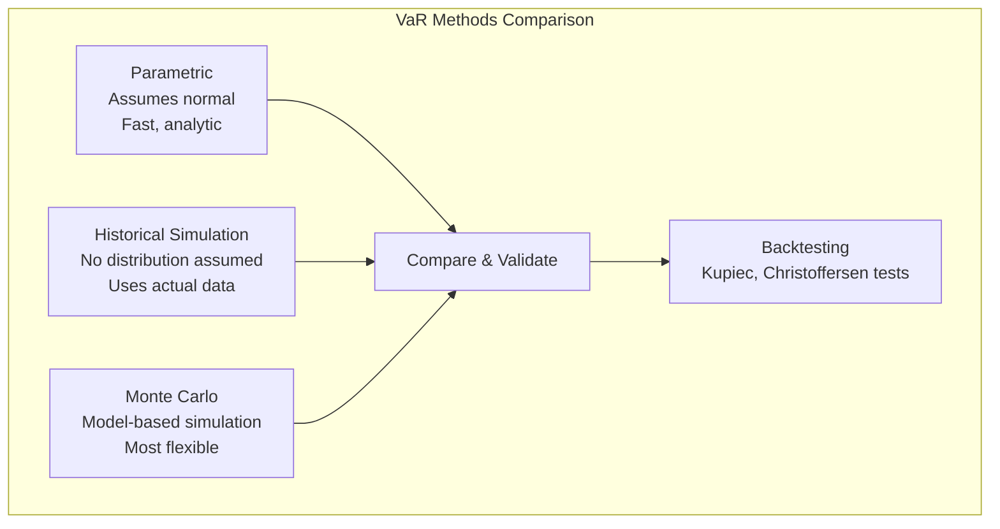
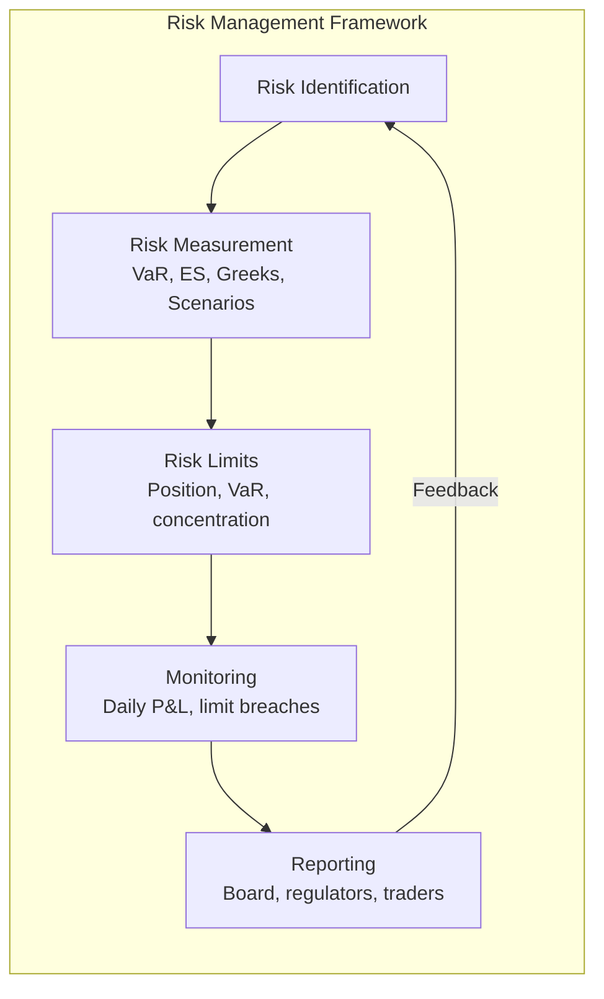
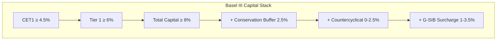

# Risk Management

## Part I: Value at Risk (VaR)

### Definition

VaR at confidence level $\alpha$ over horizon $h$:

$$P(L > \text{VaR}_\alpha) = 1 - \alpha$$

Interpretation: "We are $\alpha$% confident that losses will not exceed VaR over the next $h$ days."

Example: 1-day 99% VaR = \$10M means there is a 1% probability of losing more than \$10M in one day.

### Parametric (Variance-Covariance) VaR

Assumes returns are normally distributed:

$$\text{VaR}_\alpha = \mu + z_\alpha \sigma$$

where $z_\alpha$ = standard normal quantile (e.g., $z_{0.99} = 2.326$).

For a portfolio: $\text{VaR}_\alpha = z_\alpha \sqrt{\mathbf{w}^T \Sigma \mathbf{w}} \cdot V_{\text{portfolio}}$

**Time scaling** (assuming i.i.d. returns): $\text{VaR}_h = \text{VaR}_1 \cdot \sqrt{h}$

### Historical Simulation VaR

1. Collect $T$ historical return observations
2. Apply each historical return to current portfolio
3. Sort resulting P&L from worst to best
4. VaR = the $(1-\alpha) \times T$-th worst loss

Advantages: no distributional assumption, captures fat tails and non-linearity.
Disadvantages: limited by historical sample, ghost effects, equal weighting of all observations.

### Monte Carlo VaR

1. Specify a stochastic model for risk factors (e.g., GBM, correlated normals)
2. Simulate $N$ scenarios (typically $N \geq 10{,}000$)
3. Revalue portfolio under each scenario
4. VaR = empirical quantile of simulated P&L distribution

Most flexible method; computationally intensive; model-dependent.

### VaR Limitations

- Not subadditive ($\text{VaR}(A+B)$ can exceed $\text{VaR}(A) + \text{VaR}(B)$) — not a coherent risk measure
- Says nothing about tail severity (how bad losses can be beyond VaR)
- Horizon and confidence level are arbitrary choices
- Assumes stable distributions/models

## Part II: Expected Shortfall (CVaR)

### Definition

$$\text{ES}_\alpha = E[L \;|\; L > \text{VaR}_\alpha]$$

Average loss in the worst $(1-\alpha)$% of scenarios. Also called CVaR or Tail VaR.

For normal distribution: $\text{ES}_\alpha = \mu + \sigma \cdot \frac{\phi(z_\alpha)}{1-\alpha}$

where $\phi$ is the standard normal PDF.

### Properties
- **Coherent risk measure** (satisfies subadditivity, monotonicity, positive homogeneity, translation invariance)
- Always $\geq$ VaR
- Required by Basel III for market risk capital (replaced VaR in FRTB)
- More sensitive to tail shape

## Part III: Stress Testing and Scenario Analysis

### Types of Stress Tests

| Type | Description |
|---|---|
| **Historical scenarios** | Replay specific crises (2008 GFC, COVID, dot-com) |
| **Hypothetical scenarios** | Designed shocks (rates +300bp, equity -40%, vol spike) |
| **Sensitivity analysis** | Vary one factor at a time, measure impact |
| **Reverse stress test** | Find scenarios that cause insolvency/breach |

### Regulatory Stress Testing
- **CCAR/DFAST** (US): Fed-designed scenarios; banks must demonstrate capital adequacy
- **EBA** (EU): Common methodology across EU banks
- Scenarios: baseline, adverse, severely adverse
- Assess: capital ratios, revenue, losses, liquidity under each scenario

### Designing Effective Stress Tests
- Cover tail risks beyond VaR
- Include correlation breakdowns (assets that normally diversify may co-move in crisis)
- Consider second-order effects (margin calls → forced selling → further price drops)
- Update regularly; avoid fighting the last war

## Part IV: Counterparty Credit Risk

### Credit Valuation Adjustment (CVA)

$$\text{CVA} = \text{LGD} \cdot \int_0^T EE(t)\,dPD(t)$$

Discrete approximation:

$$\text{CVA} = \text{LGD} \cdot \sum_{i=1}^{n} EE(t_i) \cdot [PD(t_i) - PD(t_{i-1})]$$

where:
- $EE(t)$ = Expected Exposure at time $t$ (discounted)
- $PD(t)$ = cumulative default probability by time $t$ (from CDS spreads)
- $\text{LGD} = 1 - \text{Recovery Rate}$

### Debit Valuation Adjustment (DVA)

Symmetric to CVA — reflects the benefit from one's own possible default:

$$\text{DVA} = \text{LGD}_{\text{own}} \cdot \sum_{i=1}^{n} ENE(t_i) \cdot [PD_{\text{own}}(t_i) - PD_{\text{own}}(t_{i-1})]$$

$ENE$ = Expected Negative Exposure.

Bilateral CVA: $\text{BCVA} = \text{CVA} - \text{DVA}$

### Wrong-Way Risk

Exposure increases when counterparty credit quality deteriorates. Example: buying protection from a bank whose credit is correlated with the reference entity.

### Exposure Metrics

| Metric | Definition |
|---|---|
| $MtM(t)$ | Current mark-to-market |
| $EE(t)$ | $E[\max(V(t), 0)]$ |
| $PFE(t)$ | Potential Future Exposure at $\alpha$ quantile |
| $EPE$ | Time-averaged EE: $\frac{1}{T}\int_0^T EE(t)dt$ |
| $EE^*$ | Effective EE (non-decreasing EE) |

## Part V: Market Risk — Delta-Gamma Approximation

### Taylor Expansion

$$\Delta V \approx \sum_i \Delta_i \cdot \Delta S_i + \frac{1}{2}\sum_i \sum_j \Gamma_{ij} \cdot \Delta S_i \cdot \Delta S_j + \sum_i \mathcal{V}_i \cdot \Delta\sigma_i + \Theta \cdot \Delta t$$

For a single risk factor:

$$\Delta V \approx \Delta \cdot \Delta S + \frac{1}{2}\Gamma \cdot (\Delta S)^2$$

### Delta-Gamma VaR

The P&L distribution under delta-gamma is a quadratic form in normal variables — not itself normal. Methods:
- Cornish-Fisher expansion (adjust for skewness/kurtosis)
- Monte Carlo on the quadratic approximation
- Johnson transformation

## Part VI: Operational Risk and Basel Capital

### Operational Risk Categories
- Internal fraud
- External fraud
- Employment practices
- Clients, products, business practices
- Damage to physical assets
- Business disruption
- Execution, delivery, process management

### Basel Capital Approaches

| Approach | Method |
|---|---|
| **Basic Indicator (BIA)** | $K = \alpha \cdot GI$ (15% of gross income) |
| **Standardized (SA)** | Different $\beta$ per business line (12-18%) |
| **Advanced (AMA/IMA)** | Internal models (VaR-based, scenario analysis) |

### Risk-Adjusted Return on Capital (RAROC)

$$\text{RAROC} = \frac{\text{Risk-Adjusted Revenue} - \text{Expected Losses} - \text{Operating Costs}}{\text{Economic Capital}}$$

Hurdle rate: accept if $\text{RAROC} > \text{Cost of Equity}$.

### Risk Budgeting

Allocate total risk budget across business units/strategies:

$$\text{Total Risk} = \sum_i RC_i, \quad RC_i = w_i \cdot \frac{\partial \sigma_p}{\partial w_i}$$

Each unit manages within its allocated risk limit. Marginal contribution to risk determines efficient allocation.

## References

- McNeil, A.J., Frey, R., & Embrechts, P. *Quantitative Risk Management: Concepts, Techniques and Tools* (Revised ed.). Princeton University Press.
- Jorion, P. *Value at Risk: The New Benchmark for Managing Financial Risk* (3rd ed.). McGraw-Hill.
- Hull, J.C. *Risk Management and Financial Institutions* (5th ed.). Wiley.
- Gregory, J. *Counterparty Credit Risk and Credit Value Adjustment* (2nd ed.). Wiley.
- Basel Committee on Banking Supervision. *Minimum Capital Requirements for Market Risk* (FRTB, 2019).
