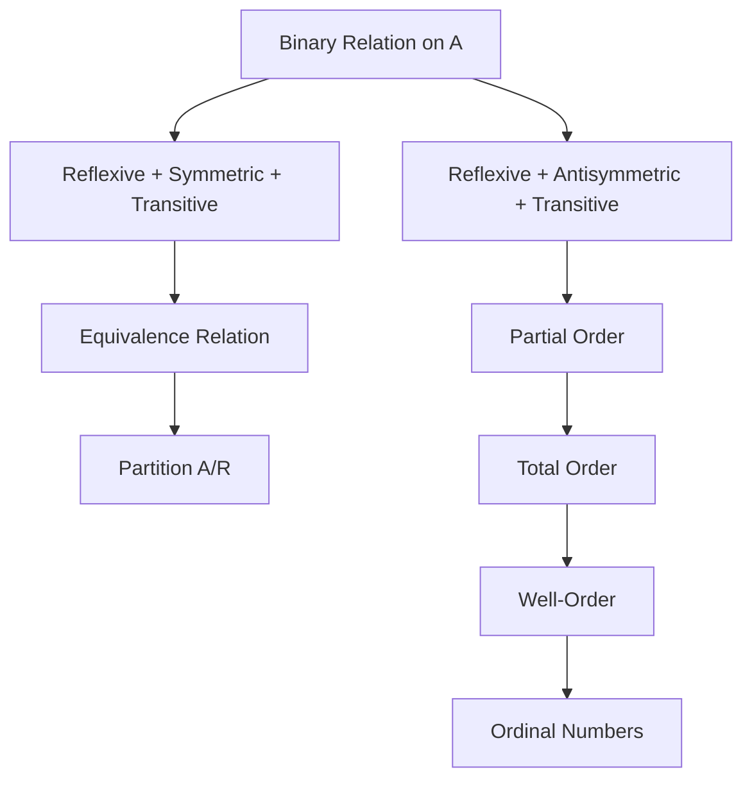
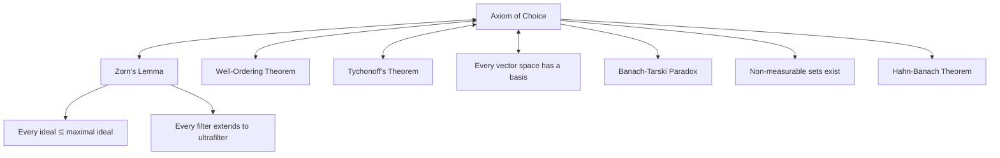

# Set Theory

A graduate-level course covering naive and axiomatic set theory, cardinality, ordinals, the Axiom of Choice, and the Continuum Hypothesis.

**Prerequisites:** Familiarity with basic proof techniques and mathematical reasoning.
**Related courses:** [[logic-proof-theory]], [[category-theory]]

---

## Part I: Naive Set Theory and Foundations

### Week 1: Sets, Membership, and Basic Operations

**Primitive notions:** A **set** is a collection of objects. The membership relation $\in$ is undefined but governed by axioms.

**Set-builder notation:** $\{x : P(x)\}$ — the set of all $x$ satisfying property $P$.

**Basic operations:**
- **Union:** $A \cup B = \{x : x \in A \lor x \in B\}$
- **Intersection:** $A \cap B = \{x : x \in A \land x \in B\}$
- **Difference:** $A \setminus B = \{x : x \in A \land x \notin B\}$
- **Power set:** $\mathcal{P}(A) = \{X : X \subseteq A\}$
- **Cartesian product:** $A \times B = \{(a, b) : a \in A,\, b \in B\}$

**Russell's Paradox:** Let $R = \{x : x \notin x\}$. Then $R \in R \iff R \notin R$. This contradiction shows unrestricted comprehension is inconsistent, motivating axiomatic set theory.

### Week 2: The ZFC Axioms

The **Zermelo-Fraenkel axioms with Choice (ZFC):**

| # | Axiom | Formal Statement | Meaning |
|---|-------|-----------------|---------|
| 1 | Extensionality | $\forall A\, \forall B\, (\forall x\, (x \in A \iff x \in B) \implies A = B)$ | Sets with the same elements are equal |
| 2 | Empty Set | $\exists \emptyset\, \forall x\, (x \notin \emptyset)$ | The empty set exists |
| 3 | Pairing | $\forall a\, \forall b\, \exists C\, \forall x\, (x \in C \iff x = a \lor x = b)$ | $\{a, b\}$ exists |
| 4 | Union | $\forall \mathcal{F}\, \exists U\, \forall x\, (x \in U \iff \exists A \in \mathcal{F}\, (x \in A))$ | $\bigcup \mathcal{F}$ exists |
| 5 | Power Set | $\forall A\, \exists P\, \forall X\, (X \in P \iff X \subseteq A)$ | $\mathcal{P}(A)$ exists |
| 6 | Separation (Schema) | $\forall A\, \exists B\, \forall x\, (x \in B \iff x \in A \land \varphi(x))$ | $\{x \in A : \varphi(x)\}$ exists |
| 7 | Replacement (Schema) | If $F$ is a definable function and $A$ is a set, then $\{F(x) : x \in A\}$ is a set | Images of sets under definable functions are sets |
| 8 | Infinity | $\exists I\, (\emptyset \in I \land \forall x \in I\, (x \cup \{x\} \in I))$ | An inductive set (model of $\mathbb{N}$) exists |
| 9 | Foundation (Regularity) | $\forall A \neq \emptyset\, \exists x \in A\, (x \cap A = \emptyset)$ | No infinite descending $\in$-chains |
| 10 | Choice | $\forall \mathcal{F}$ of nonempty pairwise disjoint sets, $\exists C$ with $|C \cap A| = 1$ for each $A \in \mathcal{F}$ | Choice functions exist |

**Separation vs. Comprehension:** Separation restricts comprehension to subsets of existing sets, blocking Russell's paradox.

---

## Part II: Relations, Functions, and Orders

### Week 3: Relations and Functions

**Ordered pair (Kuratowski):** $(a, b) = \{\{a\}, \{a, b\}\}$.

**Relation:** A set $R \subseteq A \times B$. Write $a\, R\, b$ for $(a, b) \in R$.

**Function:** A relation $f \subseteq A \times B$ such that $\forall a \in A\, \exists! b \in B\, ((a, b) \in f)$.

**Properties of relations on $A$:**
- **Reflexive:** $\forall a \in A,\, a\, R\, a$
- **Symmetric:** $a\, R\, b \implies b\, R\, a$
- **Transitive:** $a\, R\, b \land b\, R\, c \implies a\, R\, c$
- **Antisymmetric:** $a\, R\, b \land b\, R\, a \implies a = b$

**Equivalence relation:** Reflexive + symmetric + transitive. Induces a **partition** $A / R$ into equivalence classes $[a]_R = \{b \in A : a\, R\, b\}$.

**Partial order:** Reflexive + antisymmetric + transitive. A **total (linear) order** additionally satisfies $\forall a, b\, (a\, R\, b \lor b\, R\, a)$.

**Well-order:** A total order where every nonempty subset has a least element.

---

## Part III: Cardinality

### Week 4: Countable and Uncountable Sets

**Equinumerosity:** $|A| = |B|$ iff there exists a bijection $f: A \to B$.

**Definitions:**
- $A$ is **finite** if $|A| = n$ for some $n \in \mathbb{N}$ (i.e., $A \sim \{0, 1, \ldots, n-1\}$).
- $A$ is **countably infinite** if $|A| = |\mathbb{N}| = \aleph_0$.
- $A$ is **countable** if $A$ is finite or countably infinite.
- $A$ is **uncountable** if $A$ is not countable.

**Theorem:** $\mathbb{N}$, $\mathbb{Z}$, $\mathbb{Q}$ are all countably infinite. More precisely, $|\mathbb{N}| = |\mathbb{Z}| = |\mathbb{Q}| = \aleph_0$.

**Theorem (Cantor-Schroder-Bernstein):** If $|A| \leq |B|$ and $|B| \leq |A|$, then $|A| = |B|$. That is, if injections $f: A \hookrightarrow B$ and $g: B \hookrightarrow A$ exist, then a bijection $A \to B$ exists.

### Week 5: Cantor's Diagonal Argument

**Theorem (Cantor, 1891):** $|\mathbb{R}|$ is uncountable. More generally, for any set $A$, $|A| < |\mathcal{P}(A)|$.

*Proof (Diagonal Argument for $\mathbb{R}$):*

Suppose for contradiction that $\mathbb{R}$ (or even $[0,1]$) is countable, so we can list all reals:

$$r_1 = 0.d_{11}\, d_{12}\, d_{13}\, \ldots$$
$$r_2 = 0.d_{21}\, d_{22}\, d_{23}\, \ldots$$
$$r_3 = 0.d_{31}\, d_{32}\, d_{33}\, \ldots$$
$$\vdots$$

Define $r^* = 0.d_1^*\, d_2^*\, d_3^*\, \ldots$ where:

$$d_n^* = \begin{cases} 5 & \text{if } d_{nn} \neq 5 \\ 6 & \text{if } d_{nn} = 5 \end{cases}$$

Then $r^*$ differs from $r_n$ in the $n$-th decimal place for every $n$, so $r^* \notin \{r_1, r_2, \ldots\}$. Contradiction. $\blacksquare$

*Proof (General: $|A| < |\mathcal{P}(A)|$):*

The injection $a \mapsto \{a\}$ shows $|A| \leq |\mathcal{P}(A)|$. Suppose $f: A \to \mathcal{P}(A)$ is surjective. Define:

$$D = \{a \in A : a \notin f(a)\}$$

Then $D \in \mathcal{P}(A)$, so $D = f(d)$ for some $d \in A$. But $d \in D \iff d \notin f(d) = D$. Contradiction. $\blacksquare$

**Corollary:** There is no "set of all sets" in ZFC. The hierarchy $\mathbb{N}, \mathcal{P}(\mathbb{N}), \mathcal{P}(\mathcal{P}(\mathbb{N})), \ldots$ produces ever-larger infinities.

### Week 6: Cardinal Arithmetic

**Cardinal numbers:** The cardinality of a set, denoted $|A|$. The **aleph numbers** $\aleph_0, \aleph_1, \aleph_2, \ldots$ enumerate infinite cardinal numbers in order.

**Operations:**
- $|A| + |B| = |A \sqcup B|$ (disjoint union)
- $|A| \cdot |B| = |A \times B|$
- $|A|^{|B|} = |A^B|$ (set of all functions $B \to A$)

**Key results for infinite cardinals:**

$$\aleph_0 + \aleph_0 = \aleph_0 \qquad \aleph_0 \cdot \aleph_0 = \aleph_0$$

$$\kappa + \lambda = \kappa \cdot \lambda = \max(\kappa, \lambda) \quad \text{for infinite } \kappa, \lambda$$

$$|\mathcal{P}(\mathbb{N})| = 2^{\aleph_0} = |\mathbb{R}| = \mathfrak{c}$$

**Konig's theorem:** If $\kappa_i < \lambda_i$ for all $i \in I$, then $\sum_{i \in I} \kappa_i < \prod_{i \in I} \lambda_i$.

**Corollary:** $\text{cf}(2^{\aleph_0}) > \aleph_0$, so $2^{\aleph_0} \neq \aleph_\omega$.

---

## Part IV: Ordinal Numbers

### Week 7: Well-Orders and Ordinals

**Von Neumann ordinals:** An ordinal is a transitive set well-ordered by $\in$.

$$0 = \emptyset, \quad 1 = \{0\} = \{\emptyset\}, \quad 2 = \{0, 1\} = \{\emptyset, \{\emptyset\}\}, \quad \ldots$$

$$\omega = \{0, 1, 2, \ldots\}, \quad \omega + 1 = \omega \cup \{\omega\}, \quad \ldots$$

**Successor and limit ordinals:**
- $\alpha + 1 = \alpha \cup \{\alpha\}$ is the **successor** of $\alpha$.
- A nonzero ordinal with no immediate predecessor is a **limit ordinal** (e.g., $\omega, \omega \cdot 2, \omega^2, \ldots$).

**Theorem (Trichotomy for ordinals):** For any ordinals $\alpha, \beta$: exactly one of $\alpha \in \beta$, $\alpha = \beta$, $\beta \in \alpha$ holds.

### Week 8: Transfinite Induction and Recursion

**Transfinite induction:** To prove $P(\alpha)$ for all ordinals $\alpha$:
1. **Base:** $P(0)$.
2. **Successor:** $P(\alpha) \implies P(\alpha + 1)$.
3. **Limit:** If $\lambda$ is a limit ordinal and $P(\beta)$ for all $\beta < \lambda$, then $P(\lambda)$.

**Transfinite recursion:** Defines functions on ordinals:
- $F(0) = a$
- $F(\alpha + 1) = G(F(\alpha))$
- $F(\lambda) = H(\{F(\beta) : \beta < \lambda\})$ for limit $\lambda$

**Ordinal arithmetic:**
- $\alpha + \beta$ via transfinite recursion on $\beta$
- $\alpha \cdot \beta$ and $\alpha^\beta$ similarly

**Warning:** Ordinal arithmetic is **not commutative**: $1 + \omega = \omega \neq \omega + 1$.

**Cantor Normal Form:** Every ordinal $\alpha > 0$ has a unique representation:

$$\alpha = \omega^{\beta_1} \cdot c_1 + \omega^{\beta_2} \cdot c_2 + \cdots + \omega^{\beta_n} \cdot c_n$$

where $\alpha \geq \beta_1 > \beta_2 > \cdots > \beta_n \geq 0$ and $c_i \in \mathbb{N} \setminus \{0\}$.

---

## Part V: The Axiom of Choice and Equivalents

### Week 9: Axiom of Choice (AC)

**AC (Zermelo, 1904):** For every family $\{A_i\}_{i \in I}$ of nonempty sets, there exists a function $f: I \to \bigcup_{i \in I} A_i$ with $f(i) \in A_i$ for all $i$.

Equivalently: $\prod_{i \in I} A_i \neq \emptyset$ when each $A_i \neq \emptyset$.

### Week 10: Equivalents of AC

**Theorem:** The following are equivalent (over ZF):

**(i) Axiom of Choice**

**(ii) Zorn's Lemma:** If every chain in a partially ordered set $(P, \leq)$ has an upper bound in $P$, then $P$ has a maximal element.

**(iii) Well-Ordering Theorem (Zermelo):** Every set can be well-ordered.

**(iv) Tychonoff's Theorem:** Any product of compact topological spaces is compact.

**(v) Every vector space has a basis.**

**(vi) Every surjection has a right inverse.**

*Proof sketch (AC $\implies$ Zorn's Lemma):*
Let $(P, \leq)$ satisfy the chain condition. Use AC to select a choice function on nonempty subsets. Build a maximal chain by transfinite recursion: at each step, if the current chain has an upper bound that is not maximal, choose a strictly larger element. Continue until no such element exists. By the chain condition, the chain has an upper bound, which must be maximal. $\blacksquare$

*Proof sketch (Zorn $\implies$ Well-Ordering):*
Consider the set of well-orderings of subsets of a given set $A$, ordered by end-extension. Every chain has an upper bound (the union). By Zorn's Lemma, there is a maximal well-ordering, which must well-order all of $A$ (otherwise extend it). $\blacksquare$

### Week 11: Consequences and Controversies

**Banach-Tarski Paradox:** Using AC, a solid ball in $\mathbb{R}^3$ can be decomposed into finitely many pieces and reassembled (via rotations and translations) into two solid balls of the same size.

**Non-measurable sets:** AC implies the existence of Vitali sets — subsets of $\mathbb{R}$ that are not Lebesgue measurable.

**Constructive mathematics** and certain **large cardinal axioms** explore alternatives: the Axiom of Determinacy (AD), which contradicts AC but produces a "nicer" measure-theoretic universe.

---

## Part VI: The Continuum Hypothesis

### Week 12: Statement and Independence

**Continuum Hypothesis (CH):** $2^{\aleph_0} = \aleph_1$. That is, there is no set whose cardinality is strictly between $|\mathbb{N}|$ and $|\mathbb{R}|$.

**Generalized Continuum Hypothesis (GCH):** For every infinite cardinal $\kappa$, $2^\kappa = \kappa^+$ (the next cardinal).

**Theorem (Godel, 1938):** CH is consistent with ZFC. Specifically, the **constructible universe** $L$ (defined by transfinite recursion: $L_0 = \emptyset$, $L_{\alpha+1} = \text{Def}(L_\alpha)$, $L_\lambda = \bigcup_{\beta < \lambda} L_\beta$) satisfies ZFC + GCH.

**Theorem (Cohen, 1963):** $\neg$CH is consistent with ZFC, proved via the method of **forcing**. Cohen adjoined $\aleph_2$ many new reals to a ground model, producing a model where $2^{\aleph_0} = \aleph_2$.

**Conclusion:** CH is **independent** of ZFC — it can neither be proved nor refuted from the standard axioms.

### Week 13: Beyond ZFC

**Large cardinal axioms:** Inaccessible, measurable, supercompact, ... cardinals. These extend ZFC's strength and imply consistency of ZFC.

**Determinacy axioms:** AD (Axiom of Determinacy) — every two-player game of perfect information on $\omega$ is determined. Inconsistent with full AC but consistent with $\text{ZF} + \text{DC}$ (dependent choice).

**The set-theoretic multiverse:** Hamkins's view that there are many equally legitimate set-theoretic universes versus Woodin's program seeking a "canonical" model via Ultimate-$L$.

**Open questions:**
- Is $2^{\aleph_0} = \aleph_2$ the "correct" value? (Woodin's $\Omega$-logic program)
- Does the Proper Forcing Axiom (PFA) settle the value? (PFA $\implies 2^{\aleph_0} = \aleph_2$)

---

## References

1. Halmos, P. R. *Naive Set Theory*. Springer, 1960.
2. Jech, T. *Set Theory*. 3rd millennium ed. Springer, 2003.
3. Kunen, K. *Set Theory: An Introduction to Independence Proofs*. North-Holland, 1980.
4. Cantor, G. "Ueber eine Eigenschaft des Inbegriffes aller reellen algebraischen Zahlen." *Journal fur die reine und angewandte Mathematik*, 77, 1874.
5. Cohen, P. "The Independence of the Continuum Hypothesis." *Proceedings of the National Academy of Sciences*, 50(6), 1963.
6. Godel, K. *The Consistency of the Continuum Hypothesis*. Princeton University Press, 1940.
7. Enderton, H. B. *Elements of Set Theory*. Academic Press, 1977.
