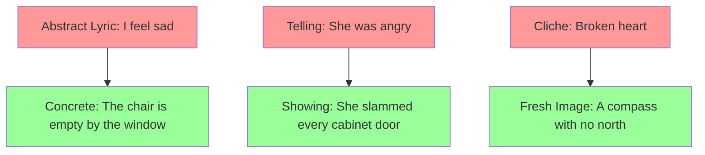
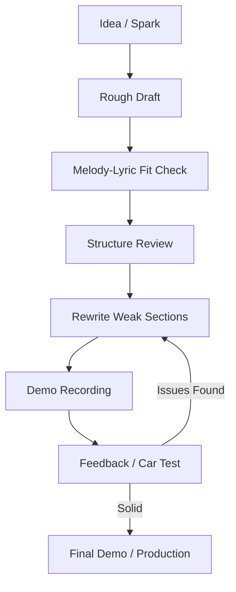

# Songwriting — Melody, Lyrics, and Structure

## Part I — Song Structure

### Week 1: Common Song Forms

**Verse-Chorus (ABABCB)**

The dominant pop/rock form since the 1960s:
- **Verse (A)**: advances the narrative, different lyrics each time
- **Chorus (B)**: the emotional/thematic core, same lyrics repeated, contains the hook
- **Bridge (C)**: contrast — new melody, new chords, new perspective; typically appears once before the final chorus
- Optional: **Pre-chorus** (channel/climb) — builds tension between verse and chorus

**AABA (Tin Pan Alley / Great American Songbook)**

32-bar form: 8 bars per section. A = main melody (with lyric variation), B = bridge ("middle eight"). Standards: "Over the Rainbow," "Yesterday," many jazz standards.

**Other Forms**:
- **Verse-only (strophic)**: same melody, new lyrics each verse. Folk, blues, hymns.
- **Through-composed**: no repeated sections. Art song, some progressive rock.
- **AAA with refrain**: verse-only but with a recurring refrain line (often the title) at the end of each verse. Dylan, folk tradition.

| Form | Sections | Typical Genres |
|------|----------|---------------|
| Verse-Chorus | ABABCB | Pop, Rock, Country |
| AABA | AABA (32-bar) | Jazz Standards, Musical Theatre |
| Strophic | AAA | Folk, Blues, Hymns |
| Through-composed | No repeats | Art Song, Prog |
| Verse-Chorus-Rap | Hybrid | Hip-hop/Pop crossover |

### Week 2: Arrangement and Sections

**Arrangement principles**:
- **Build energy** across sections: strip down for verses, add layers for choruses
- **Contrast**: if verse is low and quiet, chorus should be higher and louder
- **The "drop"**: a momentary reduction in texture (e.g., drums cut out) before a big chorus return — used in pop, EDM, Latin pop
- **Outro**: can fade out, end cold (hard stop), or reprise intro material

---

## Part II — Melody

### Week 3: Melodic Contour and Range

**Contour**: the shape of a melody as it moves through pitch space.
- **Ascending**: builds energy, anticipation
- **Descending**: resolution, sadness, closure
- **Arch (rise then fall)**: the most common phrase shape
- **Wave (oscillating)**: creates a rocking, cyclical feel

**Tessitura**: the comfortable singing range for a given melody. Most pop melodies span an octave to an octave and a half. Keep verses in mid-range; let choruses expand upward.

**The Hook**: the most memorable element of the song. Can be:
- **Melodic hook**: a catchy interval or rhythm (the riff in "Satisfaction")
- **Rhythmic hook**: a distinctive rhythmic pattern (Bo Diddley beat)
- **Lyrical hook**: a striking phrase, usually the title ("Like a Rolling Stone")
- **Instrumental hook**: a riff or lick (guitar riff in "Smoke on the Water")

### Week 4: Motif Development

A **motif** is a short melodic idea (2-7 notes) that recurs and develops through a song.

Techniques:
- **Repetition**: restate the motif to establish it
- **Sequence**: repeat at a higher or lower pitch
- **Inversion**: flip the intervals (ascending becomes descending)
- **Augmentation/Diminution**: stretch or compress rhythmically
- **Fragmentation**: use only part of the motif
- **Variation**: alter rhythm or intervals while preserving contour

---

## Part III — Lyrics

### Week 5: Rhyme and Prosody

**Rhyme schemes**:
- Perfect rhyme: love/dove, moon/June
- **Slant (near/half) rhyme**: love/move, moon/mine — more sophisticated, less predictable
- **Internal rhyme**: rhyme within a line, not just at the end
- **Multisyllabic rhyme**: common in hip-hop (facilitate/manipulate)

**Prosody**: the alignment of lyrical stress with melodic stress. Mismatched prosody sounds awkward — stressed syllables should land on strong beats and high notes.

Example of good prosody: "Yes-TER-day" — the stressed syllable "TER" hits the highest, longest note. If the melody stressed "yes" or "day" instead, it would feel wrong.

**Writing from titles**: start with a compelling title/hook phrase, then build the song outward. The title should appear in the chorus (usually the first or last line).

### Week 6: Imagery and Storytelling

- **Concrete over abstract**: "rusty screen door slamming" > "memories of home"
- **Sensory detail**: engage sight, sound, touch, taste, smell
- **Object correlative** (Eliot): an object that embodies an emotion without stating it
- **Show, don't tell**: "she left the ring on the kitchen counter" > "she didn't love me anymore"
- **Narrative perspective**: first person (confessional), third person (storytelling), second person (direct address — "you")

---

## Part IV — Harmony and Chord Progressions

### Week 7: Common Progressions

**The "Four Chords" (I-V-vi-IV)**

The most common pop progression since the 2000s. In C major: C-G-Am-F. ("Someone Like You," "Let It Be," "No Woman No Cry," countless others.)

**Blues: I-IV-V (12-bar blues)**

| Bars 1-4 | Bars 5-6 | Bars 7-8 | Bars 9-10 | Bars 11-12 |
|----------|----------|----------|-----------|------------|
| I | IV | I | V (or IV) | I (turnaround) |

**Jazz: ii-V-I**

The fundamental jazz cadence. In C: Dm7-G7-Cmaj7. Voice leading is smooth; each chord shares tones with the next.

**Modal interchange (borrowing)**: using chords from the parallel minor in a major key (or vice versa). bVI and bVII in a major key create a "rock" or "epic" sound (e.g., Ab and Bb in C major).

### Week 8: Genre-Specific Conventions

**Country**: I-IV-V and I-vi-IV-V with pedal steel, storytelling lyrics, train-beat rhythm.

**Hip-Hop/Rap**:
- **Flow**: the rhythmic pattern of syllables over the beat
- **Bars**: a bar = one measure; a standard verse = 16 bars
- **Rhyme density**: internal rhymes, multisyllabic rhymes, chain rhyming
- Beat-driven: the producer creates the track first; the MC writes to it

**Latin genres**:
- **Bolero**: slow romantic ballad, $\frac{4}{4}$ with characteristic guitar arpeggiation
- **Son cubano**: clave rhythm (3-2 or 2-3), call-and-response, montuno section
- **Reggaeton**: dembow rhythm ($\frac{4}{4}$: kick on 1 and 3, snare on 2 and 4, hi-hat syncopation). Originated in Puerto Rico from Jamaican dancehall.
- **Cumbia**: 2/4 or 4/4, strong offbeat emphasis, accordion or guitar lead

**R&B**: extended chords (7ths, 9ths, 11ths), melismatic vocal style, groove-based, influence of gospel harmony.

---

## Part V — Production and Process

### Week 9: From Idea to Demo

**Starting points** — a song can begin with any element:
- A chord progression (noodle until something sounds good)
- A melody (hum, whistle, sing nonsense syllables)
- A lyric (a phrase, a title, a line of overheard conversation)
- A groove/beat (drum pattern, bass line)
- A concept (story, emotion, theme)

**Demo recording**: capture the essential idea. Voice memo, GarageBand, a DAW. Fidelity doesn't matter — the song matters. Record early, revise later.

### Week 10: Co-Writing

Modern pop songwriting is overwhelmingly collaborative. Typical Nashville/LA session:
- **Topliner**: writes melody and lyrics over a producer's track
- **Producer**: creates the beat/track, shapes the sound
- **Artist**: contributes vocal performance, may write or co-write

**Co-writing etiquette**: splits are agreed before the session. Default is equal splits among all writers in the room. Don't bring pre-written material to a co-write without disclosing it.

### Week 11: Revision and Craft

- **Kill your darlings**: a brilliant line that doesn't serve the song must go
- **Rewrite the second verse**: it's almost always the weakest
- **Sing it**: if a lyric is awkward to sing, it's wrong — prosody trumps cleverness
- **The car test**: play the demo in your car. Does it hold up outside the studio?
- **Feedback**: play for trusted listeners. Where do they zone out? That's where the problem is.

### Week 12: Music Business Basics

- **Copyright**: a song has two copyrights — the composition (lyrics + melody) and the sound recording (master)
- **Publishing**: the songwriter's royalty stream. Performance royalties (ASCAP/BMI/SESAC), mechanical royalties, sync licenses
- **Split sheets**: legal document recording who wrote what percentage
- **Sampling**: using another recording requires clearance of both composition and master

---

## References

- Pattison, Pat. *Writing Better Lyrics*. 2nd ed. Writer's Digest, 2009.
- Blume, Jason. *6 Steps to Songwriting Success*. Rev. ed. Billboard, 2008.
- Webb, Jimmy. *Tunesmith: Inside the Art of Songwriting*. Hyperion, 1998.
- Zollo, Paul. *Songwriters on Songwriting*. Da Capo, 2003.
- Perricone, Jack. *Melody in Songwriting*. Berklee Press, 2000.
- Kachulis, Jimmy. *The Songwriter's Workshop: Melody*. Berklee Press, 2003.
