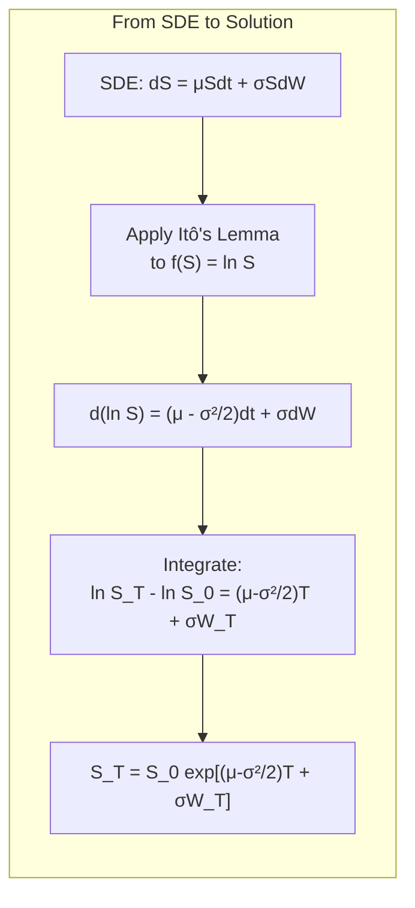
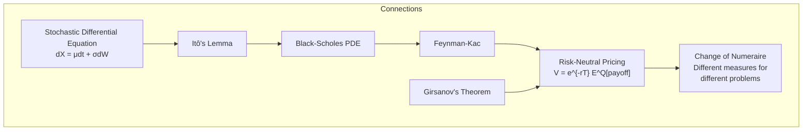

# Stochastic Calculus for Finance

## Part I: Probability Foundations

### Probability Spaces and Filtrations

A filtered probability space $(\Omega, \mathcal{F}, \{\mathcal{F}_t\}_{t \geq 0}, P)$ where:
- $\Omega$ = sample space (set of all possible outcomes/paths)
- $\mathcal{F}$ = sigma-algebra (collection of measurable events)
- $\mathcal{F}_t$ = filtration at time $t$ (information available up to $t$)
- $P$ = probability measure

**Adapted process:** A stochastic process $X_t$ is adapted to $\{\mathcal{F}_t\}$ if $X_t$ is $\mathcal{F}_t$-measurable for all $t$ (no looking into the future).

**Martingale:** An adapted process $M_t$ is a martingale if $E[|M_t|] < \infty$ and:

$$E[M_t | \mathcal{F}_s] = M_s \quad \text{for all } s \leq t$$

Interpretation: best forecast of future value is the current value (fair game).

### Conditional Expectation Properties
- **Tower property:** $E[E[X|\mathcal{F}_s]|\mathcal{F}_t] = E[X|\mathcal{F}_{\min(s,t)}]$
- **Linearity:** $E[aX + bY | \mathcal{F}] = aE[X|\mathcal{F}] + bE[Y|\mathcal{F}]$
- **Known factor:** $E[X \cdot Y | \mathcal{F}] = Y \cdot E[X|\mathcal{F}]$ if $Y$ is $\mathcal{F}$-measurable

## Part II: Brownian Motion

### Definition and Properties

A standard Brownian motion (Wiener process) $W_t$ satisfies:

1. $W_0 = 0$
2. **Independent increments:** $W_t - W_s$ is independent of $\mathcal{F}_s$ for $s < t$
3. **Normal increments:** $W_t - W_s \sim N(0, t-s)$
4. **Continuous paths:** $t \mapsto W_t$ is continuous (a.s.)

### Key Properties

- $E[W_t] = 0$, $\text{Var}(W_t) = t$
- $\text{Cov}(W_s, W_t) = \min(s, t)$
- $W_t$ is a martingale (and so is $W_t^2 - t$)
- Paths are nowhere differentiable (a.s.)
- **Quadratic variation:** $\langle W \rangle_t = t$ (i.e., $(dW)^2 = dt$)
- **Non-zero quadratic variation** is what makes stochastic calculus differ from ordinary calculus

### Brownian Motion with Drift

$$X_t = \mu t + \sigma W_t$$

$X_t \sim N(\mu t, \sigma^2 t)$. This is an arithmetic Brownian motion — can go negative, not suitable for stock prices directly.

```mermaid
graph TD
    subgraph "Hierarchy of Stochastic Processes"
        SP[Stochastic Process] --> MART[Martingale<br/>E[X_t|F_s] = X_s]
        SP --> MARK[Markov Process<br/>Future depends only on present]
        MART --> BM["Brownian Motion W_t<br/>Continuous martingale"]
        BM --> GBM2["Geometric BM<br/>dS = μSdt + σSdW"]
        BM --> OU["Ornstein-Uhlenbeck<br/>dX = θ(μ-X)dt + σdW"]
    end
```

## Part III: Itô Integral and Itô's Lemma

### The Itô Integral

For an adapted process $f(t, \omega)$, the Itô integral:

$$\int_0^T f(t, \omega)\,dW_t = \lim_{n\to\infty} \sum_{i=0}^{n-1} f(t_i, \omega)(W_{t_{i+1}} - W_{t_i})$$

Key property: the integrand is evaluated at the **left** endpoint $t_i$ (non-anticipating).

**Itô isometry:**

$$E\left[\left(\int_0^T f\,dW\right)^2\right] = E\left[\int_0^T f^2\,dt\right]$$

The Itô integral is a martingale: $E[\int_0^T f\,dW] = 0$.

### Itô's Lemma (Itô's Formula)

For $f(t, X_t)$ where $dX_t = \mu\,dt + \sigma\,dW_t$:

$$df = \frac{\partial f}{\partial t}dt + \frac{\partial f}{\partial x}dX_t + \frac{1}{2}\frac{\partial^2 f}{\partial x^2}(dX_t)^2$$

Using the multiplication rules $(dt)^2 = 0$, $dt \cdot dW = 0$, $(dW)^2 = dt$:

$$df = \left(\frac{\partial f}{\partial t} + \mu\frac{\partial f}{\partial x} + \frac{1}{2}\sigma^2\frac{\partial^2 f}{\partial x^2}\right)dt + \sigma\frac{\partial f}{\partial x}dW$$

The extra $\frac{1}{2}\sigma^2 f''$ term (Itô correction) is the fundamental difference from ordinary calculus.

### Multi-dimensional Itô's Lemma

For $f(t, X_t^1, \ldots, X_t^n)$:

$$df = \frac{\partial f}{\partial t}dt + \sum_i \frac{\partial f}{\partial x_i}dX_i + \frac{1}{2}\sum_i\sum_j \frac{\partial^2 f}{\partial x_i \partial x_j}dX_i\,dX_j$$

## Part IV: Geometric Brownian Motion

### SDE for Stock Prices

$$dS_t = \mu S_t\,dt + \sigma S_t\,dW_t$$

### Solving via Itô's Lemma

Let $f(S) = \ln S$. By Itô's lemma:

$$d(\ln S) = \frac{1}{S}dS - \frac{1}{2}\frac{1}{S^2}(dS)^2 = \left(\mu - \frac{\sigma^2}{2}\right)dt + \sigma\,dW_t$$

Integrating:

$$S_T = S_0 \exp\left[\left(\mu - \frac{\sigma^2}{2}\right)T + \sigma W_T\right]$$

Log returns are normally distributed: $\ln(S_T/S_0) \sim N\left((\mu - \sigma^2/2)T, \; \sigma^2 T\right)$

The term $-\sigma^2/2$ is the **Itô correction** — the drift of the log is less than the drift of the level.

$$E[S_T] = S_0 e^{\mu T} \quad \text{(not } S_0 e^{(\mu - \sigma^2/2)T}\text{)}$$



## Part V: Girsanov's Theorem and Risk-Neutral Pricing

### Change of Measure

**Girsanov's Theorem:** Given a process $\theta_t$ (market price of risk), define:

$$dW_t^Q = dW_t^P + \theta_t\,dt$$

Then $W_t^Q$ is a Brownian motion under the new measure $Q$, where $Q$ is defined by the Radon-Nikodym derivative:

$$\frac{dQ}{dP}\bigg|_{\mathcal{F}_T} = \mathcal{E}(\theta) = \exp\left(-\int_0^T \theta_t\,dW_t^P - \frac{1}{2}\int_0^T \theta_t^2\,dt\right)$$

### Risk-Neutral Pricing

Under GBM with $dS = \mu S\,dt + \sigma S\,dW^P$, set $\theta = (\mu - r)/\sigma$:

$$dS = r S\,dt + \sigma S\,dW^Q$$

Under $Q$, the stock grows at the risk-free rate $r$. The discounted stock $e^{-rt}S_t$ is a $Q$-martingale.

**Fundamental Theorem of Asset Pricing:**

$$V_0 = e^{-rT} E^Q[V_T]$$

Any derivative's price equals the discounted expected payoff under the risk-neutral measure $Q$.

### Martingale Representation Theorem

Every $Q$-martingale $M_t$ adapted to the Brownian filtration can be written as:

$$M_t = M_0 + \int_0^t \phi_s\,dW_s^Q$$

This guarantees that markets (with enough traded assets) are complete — every contingent claim can be replicated.

## Part VI: Feynman-Kac and Change of Numeraire

### Feynman-Kac Formula

If $V(t, x)$ solves the PDE:

$$\frac{\partial V}{\partial t} + \mu(x)\frac{\partial V}{\partial x} + \frac{1}{2}\sigma^2(x)\frac{\partial^2 V}{\partial x^2} - rV = 0$$

with terminal condition $V(T, x) = g(x)$, then:

$$V(t, x) = e^{-r(T-t)} E^Q[g(X_T) | X_t = x]$$

This connects PDEs (Black-Scholes equation) to probabilistic expectations (risk-neutral pricing).

### Change of Numeraire

For numeraire $N_t$ (any positive traded asset), define measure $Q^N$:

$$\frac{dQ^N}{dQ}\bigg|_{\mathcal{F}_T} = \frac{N_T / N_0}{B_T / B_0}$$

Under $Q^N$, the ratio $V_t / N_t$ is a martingale:

$$\frac{V_0}{N_0} = E^{Q^N}\left[\frac{V_T}{N_T}\right]$$

Applications: forward measure (numeraire = zero-coupon bond), stock measure (exchange options), annuity measure (swaptions).



## References

- Shreve, S.E. *Stochastic Calculus for Finance II: Continuous-Time Models*. Springer.
- Øksendal, B. *Stochastic Differential Equations* (6th ed.). Springer.
- Karatzas, I. & Shreve, S.E. *Brownian Motion and Stochastic Calculus* (2nd ed.). Springer.
- Björk, T. *Arbitrage Theory in Continuous Time* (4th ed.). Oxford University Press.
- Musiela, M. & Rutkowski, M. *Martingale Methods in Financial Modelling* (2nd ed.). Springer.
