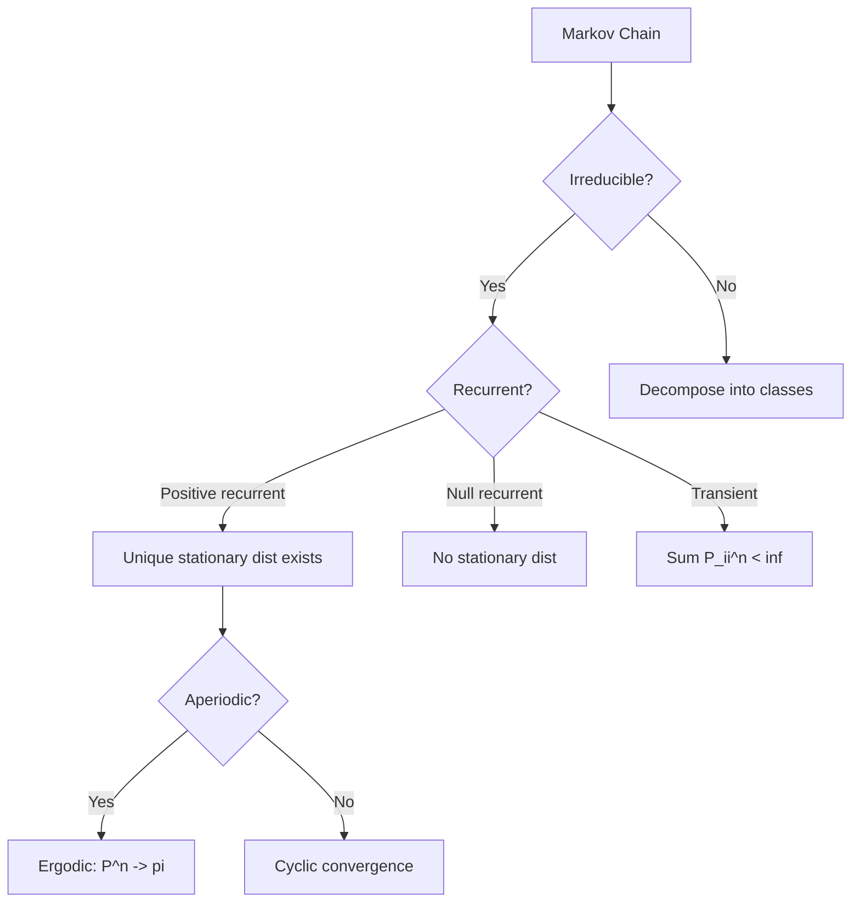
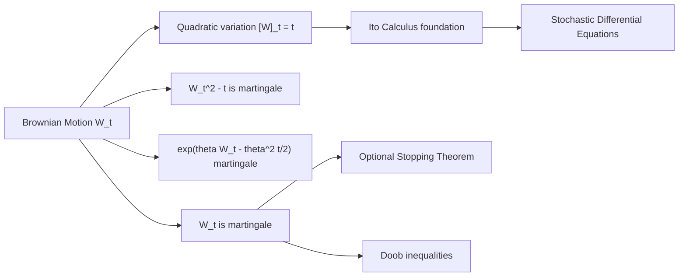
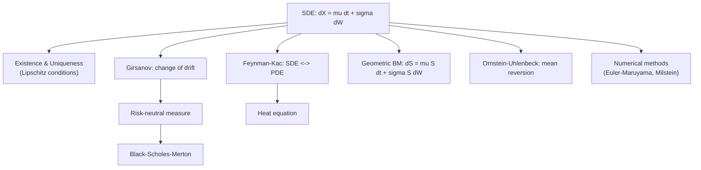

# Stochastic Processes

> From Markov chains to Ito calculus: the mathematical theory of random evolution over time.

Related: [[bayesian-statistics]] | [[time-series]] | [[numerical-analysis]]

---

## Part I: Discrete-Time Markov Chains (Weeks 1-3)

### 1.1 Definitions and Transition Matrices

A **discrete-time Markov chain** (DTMC) is a sequence of random variables $\{X_n\}_{n \geq 0}$ taking values in a countable state space $S$, satisfying the **Markov property**:

$$P(X_{n+1} = j \mid X_n = i, X_{n-1} = i_{n-1}, \ldots, X_0 = i_0) = P(X_{n+1} = j \mid X_n = i) = P_{ij}$$

The **transition matrix** $P = (P_{ij})$ is a stochastic matrix: $P_{ij} \geq 0$ and $\sum_j P_{ij} = 1$.

The **$n$-step transition probability**: $P_{ij}^{(n)} = (P^n)_{ij}$ (Chapman-Kolmogorov equations).

### 1.2 Classification of States

- **Communicating:** $i \leftrightarrow j$ if $P_{ij}^{(n)} > 0$ and $P_{ji}^{(m)} > 0$ for some $n, m$.
- **Period** of state $i$: $d(i) = \gcd\{n \geq 1 : P_{ii}^{(n)} > 0\}$.
- **Recurrence:** State $i$ is **recurrent** if $P(\text{return to } i) = 1$, equivalently $\sum_n P_{ii}^{(n)} = \infty$.
- **Positive recurrence:** Expected return time $m_i = E[T_i \mid X_0 = i] < \infty$.
- **Ergodic** = positive recurrent + aperiodic.

### 1.3 Stationary Distributions

A probability vector $\pi$ is **stationary** if:

$$\pi P = \pi, \quad \text{i.e., } \pi_j = \sum_i \pi_i P_{ij}$$

**Ergodic theorem:** For an irreducible, aperiodic, positive recurrent chain:

$$\lim_{n \to \infty} P_{ij}^{(n)} = \pi_j = \frac{1}{m_j}$$

The stationary distribution is unique and $\pi_j$ equals the long-run fraction of time in state $j$.

**Detailed balance** (reversibility): $\pi_i P_{ij} = \pi_j P_{ji}$ for all $i, j$ implies $\pi$ is stationary.

---

## Part II: Continuous-Time Markov Chains (Weeks 4-5)

### 2.1 Generator Matrix

A **continuous-time Markov chain** (CTMC) on state space $S$ has transition rates encoded in the **generator matrix** (or $Q$-matrix):

$$Q = (q_{ij}), \quad q_{ij} \geq 0 \text{ for } i \neq j, \quad q_{ii} = -\sum_{j \neq i} q_{ij}$$

The holding time in state $i$ is exponential with rate $q_i = -q_{ii}$. Upon leaving state $i$, the chain jumps to $j$ with probability $q_{ij}/q_i$.

**Kolmogorov equations:**

- Forward: $P'(t) = P(t)Q$
- Backward: $P'(t) = QP(t)$

Solution: $P(t) = e^{Qt}$ (matrix exponential).

### 2.2 Birth-Death Processes

Special case with state space $\{0, 1, 2, \ldots\}$ and transitions only to nearest neighbors:

$$q_{i,i+1} = \lambda_i \quad (\text{birth rate}), \quad q_{i,i-1} = \mu_i \quad (\text{death rate})$$

Stationary distribution (when it exists): $\pi_n = \pi_0 \prod_{k=0}^{n-1} \frac{\lambda_k}{\mu_{k+1}}$.

---

## Part III: Poisson Process and Renewal Theory (Weeks 6-7)

### 3.1 The Poisson Process

The counting process $\{N(t)\}_{t \geq 0}$ is a **Poisson process** with rate $\lambda > 0$ if:

1. $N(0) = 0$
2. Independent increments
3. $N(t) - N(s) \sim \text{Poi}(\lambda(t-s))$ for $0 \leq s < t$

$$P(N(t) = k) = \frac{(\lambda t)^k e^{-\lambda t}}{k!}$$

Properties: $E[N(t)] = \lambda t$, $\text{Var}(N(t)) = \lambda t$. Inter-arrival times are i.i.d. $\text{Exp}(\lambda)$.

### 3.2 Renewal Theory

A **renewal process** $\{N(t)\}$ counts arrivals where inter-arrival times $X_1, X_2, \ldots$ are i.i.d. with distribution $F$ and mean $\mu = E[X_1]$.

**Elementary renewal theorem:**

$$\lim_{t \to \infty} \frac{E[N(t)]}{t} = \frac{1}{\mu}$$

**Renewal reward theorem:** If rewards $R_n$ are earned at each renewal with $E[R] < \infty$:

$$\lim_{t \to \infty} \frac{\text{Total reward by } t}{t} = \frac{E[R]}{E[X]}$$

**Key renewal theorem:** Under mild conditions, $P(S_{N(t)+1} - t \leq x) \to \frac{1}{\mu}\int_0^x (1 - F(u))\,du$ (spread-out case).

---

## Part IV: Brownian Motion and Martingales (Weeks 8-10)

### 4.1 Brownian Motion

A standard **Brownian motion** (Wiener process) $\{W_t\}_{t \geq 0}$ satisfies:

1. $W_0 = 0$
2. Independent increments
3. $W_t - W_s \sim \mathcal{N}(0, t-s)$ for $0 \leq s < t$
4. $t \mapsto W_t$ is continuous a.s.

Properties:
- $E[W_t] = 0$, $\text{Cov}(W_s, W_t) = \min(s, t)$
- **Self-similarity:** $\{c^{-1/2}W_{ct}\} \overset{d}{=} \{W_t\}$
- **Nowhere differentiable** a.s.
- **Quadratic variation:** $[W]_t = t$

### 4.2 Stopping Times and Optional Stopping

A random time $\tau$ is a **stopping time** if $\{\tau \leq t\} \in \mathcal{F}_t$ for all $t$.

**Optional stopping theorem:** If $M_t$ is a uniformly integrable martingale and $\tau$ is a finite stopping time, then $E[M_\tau] = E[M_0]$.

**Wald's identity:** If $\tau$ is a stopping time for Brownian motion with $E[\tau] < \infty$, then $E[W_\tau] = 0$ and $E[W_\tau^2] = E[\tau]$.

### 4.3 Martingale Theory

A process $\{M_t\}$ adapted to $\{\mathcal{F}_t\}$ is a **martingale** if $E[|M_t|] < \infty$ and:

$$E[M_t \mid \mathcal{F}_s] = M_s \quad \text{for } s \leq t$$

Key examples from Brownian motion:
- $W_t$ is a martingale
- $W_t^2 - t$ is a martingale
- $\exp(\theta W_t - \theta^2 t/2)$ is a martingale (exponential martingale)

**Doob's maximal inequality:** For a submartingale $M_t \geq 0$:

$$P\left(\sup_{0 \leq s \leq t} M_s \geq \lambda\right) \leq \frac{E[M_t]}{\lambda}$$

---

## Part V: Ito Calculus and SDEs (Weeks 11-14)

### 5.1 The Ito Integral

For an adapted process $H_t$ with $E[\int_0^T H_t^2 \, dt] < \infty$:

$$\int_0^T H_t \, dW_t = \lim_{n \to \infty} \sum_{k} H_{t_k}(W_{t_{k+1}} - W_{t_k})$$

The Ito integral is a **martingale** with **Ito isometry**:

$$E\left[\left(\int_0^T H_t \, dW_t\right)^2\right] = E\left[\int_0^T H_t^2 \, dt\right]$$

### 5.2 Ito's Lemma

If $X_t$ satisfies $dX_t = \mu_t \, dt + \sigma_t \, dW_t$ and $f \in C^2$, then:

$$df(X_t) = f'(X_t) \, dX_t + \frac{1}{2} f''(X_t) \sigma_t^2 \, dt$$

Expanded:

$$df(X_t) = \left[ f'(X_t)\mu_t + \frac{1}{2}f''(X_t)\sigma_t^2 \right] dt + f'(X_t)\sigma_t \, dW_t$$

The extra $\frac{1}{2}f''\sigma^2$ term is the Ito correction, arising from $dW_t^2 = dt$.

### 5.3 Stochastic Differential Equations

A general **SDE**:

$$dX_t = \mu(X_t, t) \, dt + \sigma(X_t, t) \, dW_t$$

**Geometric Brownian motion** (GBM): $dS_t = \mu S_t \, dt + \sigma S_t \, dW_t$ has solution:

$$S_t = S_0 \exp\left[\left(\mu - \frac{\sigma^2}{2}\right)t + \sigma W_t\right]$$

**Ornstein-Uhlenbeck process:** $dX_t = -\theta X_t \, dt + \sigma \, dW_t$ (mean-reverting).

### 5.4 Feynman-Kac Formula

If $u(x,t) = E^x[e^{-\int_t^T r(X_s)ds} g(X_T)]$ where $dX_s = \mu \, ds + \sigma \, dW_s$, then $u$ solves:

$$\frac{\partial u}{\partial t} + \mu \frac{\partial u}{\partial x} + \frac{1}{2}\sigma^2 \frac{\partial^2 u}{\partial x^2} - r \, u = 0, \quad u(x, T) = g(x)$$

This connects SDEs to PDEs — the probabilistic representation of elliptic/parabolic PDE solutions.

### 5.5 Girsanov Theorem

Let $W_t$ be a Brownian motion under measure $P$ and define:

$$\tilde{W}_t = W_t + \int_0^t \theta_s \, ds$$

Then under the new measure $Q$ defined by the Radon-Nikodym derivative:

$$\frac{dQ}{dP}\bigg|_{\mathcal{F}_T} = \exp\left(-\int_0^T \theta_s \, dW_s - \frac{1}{2}\int_0^T \theta_s^2 \, ds\right)$$

$\tilde{W}_t$ is a Brownian motion under $Q$ (provided Novikov's condition holds).

This is foundational for risk-neutral pricing in mathematical finance.

---

## References

1. Karlin, S. & Taylor, H. M. *A First Course in Stochastic Processes*. 2nd ed., Academic Press, 1975.
2. Norris, J. R. *Markov Chains*. Cambridge University Press, 1997.
3. Oksendal, B. *Stochastic Differential Equations*. 6th ed., Springer, 2003.
4. Revuz, D. & Yor, M. *Continuous Martingales and Brownian Motion*. 3rd ed., Springer, 1999.
5. Karatzas, I. & Shreve, S. E. *Brownian Motion and Stochastic Calculus*. 2nd ed., Springer, 1991.
6. Ross, S. M. *Stochastic Processes*. 2nd ed., Wiley, 1996.
