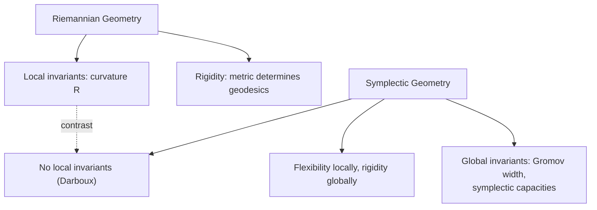
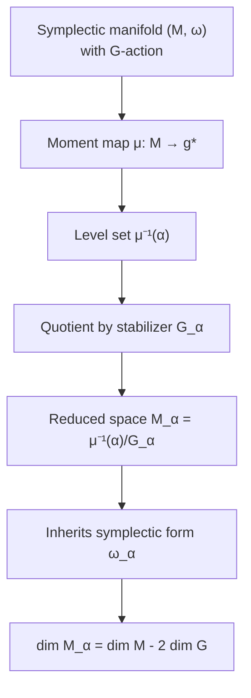
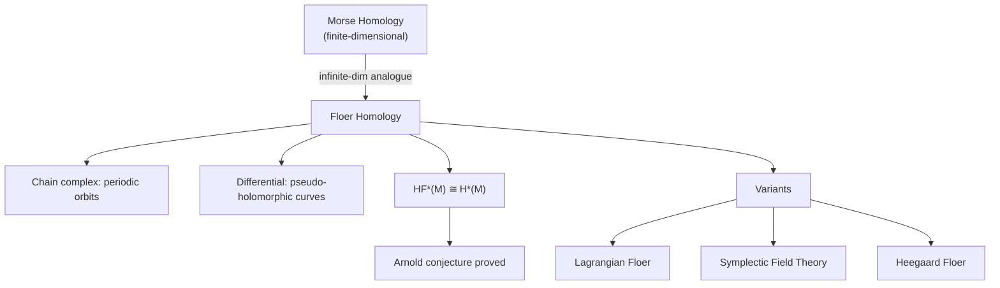

# Symplectic Geometry

The geometry of phase spaces: symplectic manifolds, Hamiltonian dynamics, moment maps, and modern developments from Arnold's conjecture to Floer homology.

---

## Part I: Foundations

### Week 1: Symplectic Linear Algebra

A **symplectic form** on a vector space $V$ is a bilinear form $\omega: V \times V \to \mathbb{R}$ that is:
1. **Skew-symmetric:** $\omega(u, v) = -\omega(v, u)$
2. **Non-degenerate:** if $\omega(u, v) = 0$ for all $v$, then $u = 0$

Non-degeneracy forces $\dim V = 2n$ (even). The **standard symplectic form** on $\mathbb{R}^{2n}$:

$$\omega_0 = \sum_{i=1}^{n} dp_i \wedge dq_i$$

In matrix form with coordinates $(q_1, \ldots, q_n, p_1, \ldots, p_n)$:

$$\omega_0(\mathbf{u}, \mathbf{v}) = \mathbf{u}^T J \mathbf{v}, \quad J = \begin{pmatrix} 0 & -I_n \\ I_n & 0 \end{pmatrix}$$

The **symplectic group** $Sp(2n, \mathbb{R}) = \{A \in GL(2n) : A^T J A = J\}$ preserves $\omega_0$.

A subspace $W \subset V$ is:
- **Symplectic** if $\omega|_W$ is non-degenerate
- **Isotropic** if $\omega|_W = 0$ (i.e., $W \subset W^\omega$)
- **Coisotropic** if $W^\omega \subset W$
- **Lagrangian** if $W = W^\omega$ (maximally isotropic, $\dim W = n$)

where $W^\omega = \{v \in V : \omega(v, w) = 0\ \forall w \in W\}$ is the **symplectic complement**.

### Week 2: Symplectic Manifolds

A **symplectic manifold** $(M^{2n}, \omega)$ is a smooth manifold equipped with a closed non-degenerate 2-form:

$$d\omega = 0 \quad \text{(closed)}, \qquad \omega^n = \underbrace{\omega \wedge \cdots \wedge \omega}_{n} \neq 0 \quad \text{(non-degenerate)}$$

The non-degeneracy condition $\omega^n \neq 0$ means $\omega^n$ is a volume form, so symplectic manifolds are always orientable.

**Examples:**
- $(\mathbb{R}^{2n}, \omega_0)$: the standard symplectic space (phase space of $n$ particles in 1D)
- $(T^*Q, \omega_{can})$: the cotangent bundle of any manifold $Q$, with canonical form $\omega_{can} = -d\theta$ where $\theta$ is the tautological 1-form
- $(\mathbb{CP}^n, \omega_{FS})$: complex projective space with the Fubini-Study form
- Coadjoint orbits $\mathcal{O} \subset \mathfrak{g}^*$ of a Lie group $G$ (Kirillov-Kostant-Souriau)

**Non-examples:** $S^{2n}$ for $n \geq 2$ (since $H^2(S^{2n}) = 0$), any odd-dimensional manifold, any non-orientable manifold.

#### Darboux Theorem

> **Theorem (Darboux).** Every symplectic manifold $(M, \omega)$ is locally symplectomorphic to $(\mathbb{R}^{2n}, \omega_0)$. That is, around every point there exist coordinates $(q_1, \ldots, q_n, p_1, \ldots, p_n)$ such that:
> $$\omega = \sum_{i=1}^{n} dp_i \wedge dq_i$$

This means **there are no local invariants** in symplectic geometry (unlike Riemannian geometry, where curvature is a local invariant). All symplectic manifolds of the same dimension are locally identical. The interesting structure is entirely global.

### Week 3: Hamiltonian Dynamics

Given $(M, \omega)$ and a smooth function $H: M \to \mathbb{R}$ (the **Hamiltonian**), the **Hamiltonian vector field** $X_H$ is defined by:

$$\iota_{X_H}\omega = -dH$$

That is, $\omega(X_H, \cdot) = -dH$. Non-degeneracy of $\omega$ ensures $X_H$ exists and is unique.

In Darboux coordinates:

$$\dot{q}_i = \frac{\partial H}{\partial p_i}, \qquad \dot{p}_i = -\frac{\partial H}{\partial q_i}$$

which are **Hamilton's equations** of classical mechanics.

**Key properties of Hamiltonian flows:**
- $H$ is conserved: $\frac{d}{dt}H(\phi_t(x)) = dH(X_H) = -\omega(X_H, X_H) = 0$
- The flow $\phi_t$ preserves $\omega$: $\mathcal{L}_{X_H}\omega = d\iota_{X_H}\omega + \iota_{X_H}d\omega = -d(dH) + 0 = 0$
- **Liouville's theorem:** The flow preserves the volume form $\omega^n/n!$ (phase space volume is conserved)

#### Poisson Brackets

The **Poisson bracket** of two functions $f, g \in C^\infty(M)$:

$$\{f, g\} = \omega(X_f, X_g) = X_g(f) = -X_f(g)$$

In Darboux coordinates:

$$\{f, g\} = \sum_{i=1}^{n}\left(\frac{\partial f}{\partial q_i}\frac{\partial g}{\partial p_i} - \frac{\partial f}{\partial p_i}\frac{\partial g}{\partial q_i}\right)$$

$(C^\infty(M), \{\cdot,\cdot\})$ is a **Lie algebra**. The map $H \mapsto X_H$ is a Lie algebra homomorphism: $X_{\{f,g\}} = [X_f, X_g]$.

**Canonical coordinates** satisfy $\{q_i, q_j\} = 0$, $\{p_i, p_j\} = 0$, $\{q_i, p_j\} = \delta_{ij}$.

### Week 4: Canonical Transformations and Generating Functions

A **symplectomorphism** (canonical transformation) is a diffeomorphism $\phi: M \to M$ with $\phi^*\omega = \omega$.

**Generating functions:** For a canonical transformation $(q, p) \mapsto (Q, P)$ on $T^*\mathbb{R}^n$, there exist (locally) generating functions of four types:

| Type | Function | Relations |
|---|---|---|
| $F_1(q, Q)$ | $p = \partial F_1/\partial q$, $P = -\partial F_1/\partial Q$ | Mixed old/new coordinates |
| $F_2(q, P)$ | $p = \partial F_2/\partial q$, $Q = \partial F_2/\partial P$ | Hamilton-Jacobi type |
| $F_3(p, Q)$ | $q = -\partial F_3/\partial p$, $P = -\partial F_3/\partial Q$ | Dual type |
| $F_4(p, P)$ | $q = -\partial F_4/\partial p$, $Q = \partial F_4/\partial P$ | Momentum-momentum |

The identity transformation is generated by $F_2(q, P) = q \cdot P$.

---

## Part II: Symmetry and Reduction

### Week 5: Moment Maps

Let a Lie group $G$ act on $(M, \omega)$ by symplectomorphisms. If the action is **Hamiltonian**, there exists a **moment map** $\mu: M \to \mathfrak{g}^*$ satisfying:

$$\iota_{\xi_M}\omega = -d\langle\mu, \xi\rangle \quad \forall \xi \in \mathfrak{g}$$

where $\xi_M$ is the vector field on $M$ generated by $\xi \in \mathfrak{g}$, and $\langle\mu, \xi\rangle: M \to \mathbb{R}$ is the component function $x \mapsto \langle\mu(x), \xi\rangle$.

**Equivariance:** The moment map is $G$-equivariant if $\mu(g \cdot x) = \operatorname{Ad}^*_g \mu(x)$.

**Examples:**
- **Angular momentum:** $SO(3)$ acting on $T^*\mathbb{R}^3$: $\mu(\mathbf{q}, \mathbf{p}) = \mathbf{q} \times \mathbf{p} \in \mathfrak{so}(3)^* \cong \mathbb{R}^3$
- **Linear momentum:** $\mathbb{R}^n$ acting by translation on $T^*\mathbb{R}^n$: $\mu(\mathbf{q}, \mathbf{p}) = \mathbf{p}$
- **$S^1$ on $\mathbb{C}^n$:** $e^{i\theta} \cdot z = e^{i\theta}z$, $\mu(z) = \frac{1}{2}|z|^2$

The components of $\mu$ are conserved quantities for any $G$-invariant Hamiltonian (Noether's theorem, symplectic version): if $H$ is $G$-invariant, then $\{H, \langle\mu,\xi\rangle\} = 0$ for all $\xi$.

### Week 6: Symplectic Reduction

> **Theorem (Marsden-Weinstein, 1974; Meyer, 1973).** If $G$ acts freely and properly on $(M, \omega)$ with equivariant moment map $\mu$, and $\alpha \in \mathfrak{g}^*$ is a regular value of $\mu$, then the **reduced space**:
> $$M_\alpha = \mu^{-1}(\alpha) / G_\alpha$$
> carries a natural symplectic form $\omega_\alpha$ satisfying $\iota^*\omega = \pi^*\omega_\alpha$, where $\iota: \mu^{-1}(\alpha) \hookrightarrow M$ and $\pi: \mu^{-1}(\alpha) \to M_\alpha$.

This is the symplectic analogue of imposing constraints and "dividing out" gauge symmetry. The dimension drops by $2\dim G$:

$$\dim M_\alpha = \dim M - 2\dim G$$

**Example:** $\mathbb{C}^{n+1}$ with $S^1$ action and $\mu(z) = \frac{1}{2}|z|^2$. The reduced space at level $\frac{1}{2}$ is $\mu^{-1}(\frac{1}{2})/S^1 = S^{2n+1}/S^1 = \mathbb{CP}^n$ with the Fubini-Study form.

---

## Part III: Lagrangian Submanifolds and Modern Developments

### Week 7: Lagrangian Submanifolds

A submanifold $L \subset (M^{2n}, \omega)$ is **Lagrangian** if $\dim L = n$ and $\omega|_L = 0$.

**Examples:**
- The zero section $Q \hookrightarrow T^*Q$ is Lagrangian
- The graph of $dS$ for any $S \in C^\infty(Q)$: $\{(q, dS(q))\} \subset T^*Q$ is Lagrangian
- In $M \times M$ with $\omega \oplus (-\omega)$: the graph of any symplectomorphism is Lagrangian
- The real locus $\mathbb{RP}^n \subset \mathbb{CP}^n$ is Lagrangian for $\omega_{FS}$

**Weinstein's neighborhood theorem:** A neighborhood of any Lagrangian $L$ in $(M, \omega)$ is symplectomorphic to a neighborhood of the zero section in $T^*L$. Lagrangian submanifolds are thus "locally modeled" by cotangent bundles.

Lagrangian submanifolds are central to:
- **Classical mechanics:** Configuration space sits inside phase space as a Lagrangian submanifold
- **Geometric optics:** Wave fronts propagate along Lagrangian submanifolds
- **Microlocal analysis:** The characteristic variety of a PDE is (co)isotropic
- **Mirror symmetry:** Homological mirror symmetry (Kontsevich) involves Lagrangian submanifolds and the Fukaya category

### Week 8: Arnold Conjecture and Gromov's Non-Squeezing

#### Arnold Conjecture

> **Conjecture (Arnold, 1965).** Let $(M, \omega)$ be a closed symplectic manifold. Any Hamiltonian diffeomorphism $\phi: M \to M$ has at least as many fixed points as the minimum number of critical points of a smooth function on $M$:
> $$|\operatorname{Fix}(\phi)| \geq \sum_{k} \dim H_k(M; \mathbb{Z}_2)$$
> (the homological version).

This says Hamiltonian dynamics is more constrained than general volume-preserving dynamics. For a torus $T^{2n}$, any Hamiltonian diffeomorphism has at least $2^{2n}$ fixed points (counted appropriately), far more than the 0 required for a general volume-preserving map.

The Arnold conjecture has been proved in increasing generality using **Floer homology**.

#### Gromov's Non-Squeezing Theorem

> **Theorem (Gromov, 1985).** The ball $B^{2n}(r) \subset \mathbb{R}^{2n}$ can be symplectically embedded into the cylinder $Z^{2n}(R) = B^2(R) \times \mathbb{R}^{2n-2}$ if and only if $r \leq R$.

This is the **symplectic camel** theorem. It reveals that symplectic geometry is genuinely rigid -- symplectic maps preserve more than just volume. The ball can be stretched into a long thin shape that fits volume-wise into a narrow cylinder, but not symplectically.

This led to the theory of **symplectic capacities**: monotone symplectic invariants that obstruct embeddings.

### Week 9: Floer Homology (Overview)

**Floer homology** is an infinite-dimensional analogue of Morse homology, developed by Floer (1988) to prove cases of the Arnold conjecture.

**Setup:** For a Hamiltonian $H$ on $(M, \omega)$:
- **Chain complex:** Generated by 1-periodic orbits $\gamma$ of $X_H$ (fixed points of the time-1 flow)
- **Differential:** Counts pseudo-holomorphic cylinders $u: \mathbb{R} \times S^1 \to M$ satisfying the **Floer equation**:

$$\frac{\partial u}{\partial s} + J(u)\left(\frac{\partial u}{\partial t} - X_H(u)\right) = 0$$

connecting pairs of periodic orbits, where $J$ is an $\omega$-compatible almost complex structure.

- **Homology:** $HF_*(M, \omega) \cong H_*(M)$ (for suitable $(M, \omega)$), proving the Arnold conjecture

Floer homology has become a central tool in symplectic topology, with variants including:
- **Lagrangian Floer homology** (intersections of Lagrangian submanifolds)
- **Symplectic field theory** (SFT, contact/symplectic cobordisms)
- **Heegaard Floer homology** (3-manifold invariants, Ozsvath-Szabo)

---

## Summary of Key Results

| Result | Year | Significance |
|---|---|---|
| Darboux theorem | 1882 | No local symplectic invariants |
| Liouville theorem | 1838 | Phase space volume conservation |
| Noether theorem (symplectic) | 1918 | Symmetries yield conserved moment maps |
| Marsden-Weinstein reduction | 1974 | Symmetry reduces phase space dimension |
| Gromov non-squeezing | 1985 | Symplectic rigidity beyond volume |
| Floer homology | 1988 | Arnold conjecture, new invariants |

---

## References

1. McDuff, D. & Salamon, D. *Introduction to Symplectic Topology*. 3rd ed., Oxford University Press, 2017.
2. da Silva, A. C. *Lectures on Symplectic Geometry*. Lecture Notes in Mathematics 1764, Springer, 2001.
3. Arnold, V. I. *Mathematical Methods of Classical Mechanics*. 2nd ed., Springer GTM 60, 1989.
4. Marsden, J. E. & Ratiu, T. S. *Introduction to Mechanics and Symmetry*. 2nd ed., Springer, 1999.
5. Hofer, H. & Zehnder, E. *Symplectic Invariants and Hamiltonian Dynamics*. Birkhauser, 1994.
