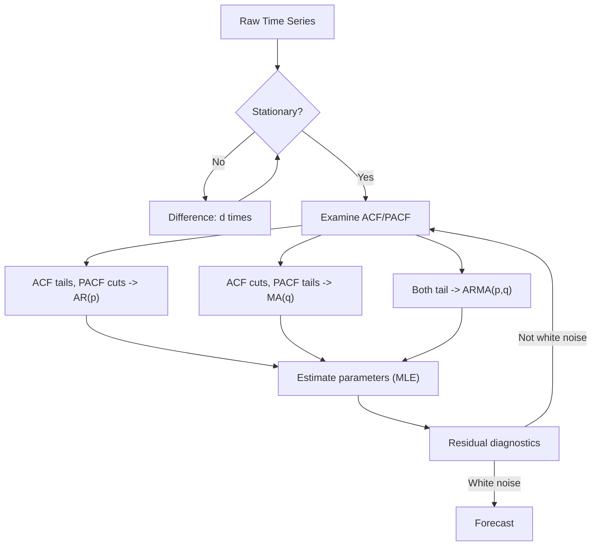
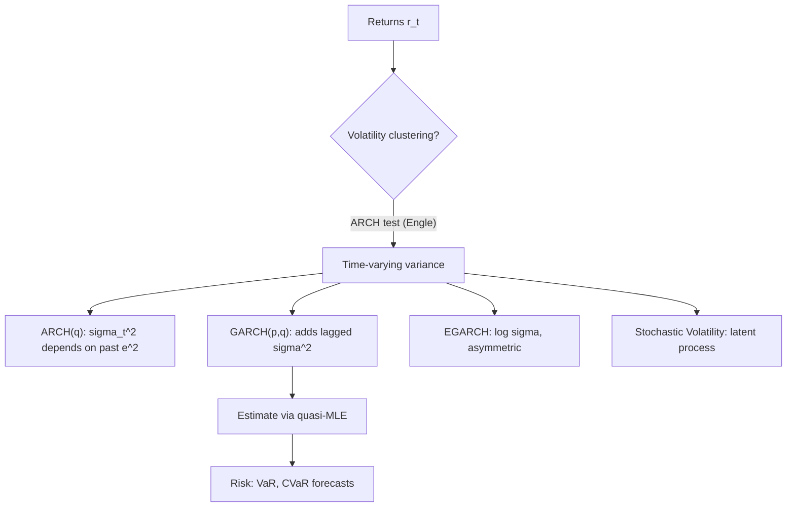

# Time Series Analysis

> Statistical modeling of temporally ordered observations: from ARIMA to state-space models.

Related: [[stochastic-processes]] | [[bayesian-statistics]] | [[causal-inference]] | [[harmonic-analysis]]

---

## Part I: Foundations (Weeks 1-3)

### 1.1 Stationarity

A time series $\{X_t\}$ is **strictly stationary** if the joint distribution of $(X_{t_1}, \ldots, X_{t_k})$ is identical to $(X_{t_1+h}, \ldots, X_{t_k+h})$ for all $h$.

**Weak (second-order) stationarity** requires only:

1. $E[X_t] = \mu$ (constant mean)
2. $\text{Var}(X_t) = \sigma^2 < \infty$ (constant variance)
3. $\text{Cov}(X_t, X_{t+h}) = \gamma(h)$ depends only on lag $h$

The **autocovariance function**:

$$\gamma(h) = \text{Cov}(X_t, X_{t+h}) = E[(X_t - \mu)(X_{t+h} - \mu)]$$

The **autocorrelation function** (ACF):

$$\rho(h) = \frac{\gamma(h)}{\gamma(0)}$$

Properties: $\gamma(0) \geq 0$, $|\gamma(h)| \leq \gamma(0)$, $\gamma(h) = \gamma(-h)$, and $\gamma$ must be positive semi-definite.

### 1.2 White Noise and Linear Processes

**White noise:** $\{W_t\} \sim WN(0, \sigma^2)$ with $\gamma(h) = \sigma^2 \mathbf{1}_{h=0}$.

A **linear process**:

$$X_t = \sum_{j=-\infty}^{\infty} \psi_j W_{t-j}, \quad \sum |\psi_j| < \infty$$

is stationary with $\gamma(h) = \sigma^2 \sum_j \psi_j \psi_{j+h}$.

**Wold's decomposition:** Every purely non-deterministic stationary process can be written as a causal linear process plus a deterministic component.

### 1.3 Backshift Operator

The **backshift** (lag) operator: $BX_t = X_{t-1}$, so $B^k X_t = X_{t-k}$.

The **difference operator**: $\nabla X_t = (1 - B)X_t = X_t - X_{t-1}$.

Polynomial expressions: $\phi(B) = 1 - \phi_1 B - \cdots - \phi_p B^p$.

---

## Part II: ARMA and ARIMA Models (Weeks 4-7)

### 2.1 Autoregressive Models AR($p$)

$$X_t = \phi_1 X_{t-1} + \phi_2 X_{t-2} + \cdots + \phi_p X_{t-p} + \epsilon_t$$

or $\phi(B)X_t = \epsilon_t$ where $\phi(B) = 1 - \phi_1 B - \cdots - \phi_p B^p$.

**Stationarity condition:** All roots of $\phi(z) = 0$ lie outside the unit circle.

For AR(1): $X_t = \phi X_{t-1} + \epsilon_t$, stationary iff $|\phi| < 1$, with $\gamma(h) = \sigma^2 \phi^{|h|}/(1-\phi^2)$.

The **partial autocorrelation function** (PACF) $\alpha(h)$ captures the direct linear dependence at lag $h$ after removing intermediate effects. For AR($p$), $\alpha(h) = 0$ for $h > p$ (cutoff at lag $p$).

### 2.2 Moving Average Models MA($q$)

$$X_t = \epsilon_t + \theta_1 \epsilon_{t-1} + \cdots + \theta_q \epsilon_{t-q} = \theta(B)\epsilon_t$$

Always stationary. **Invertibility** requires roots of $\theta(z) = 0$ outside the unit circle.

For MA($q$): $\gamma(h) = 0$ for $|h| > q$ (ACF cuts off at lag $q$).

### 2.3 ARMA($p, q$) Models

$$\phi(B)X_t = \theta(B)\epsilon_t$$

| Property | AR($p$) | MA($q$) | ARMA($p,q$) |
|---|---|---|---|
| ACF | Tails off | Cuts off at $q$ | Tails off |
| PACF | Cuts off at $p$ | Tails off | Tails off |

### 2.4 ARIMA($p, d, q$) and Differencing

Non-stationary series with a **unit root** are handled by differencing.

**ARIMA($p, d, q$):** $\phi(B)(1-B)^d X_t = \theta(B)\epsilon_t$

- $d = 1$: first difference removes linear trend
- $d = 2$: second difference removes quadratic trend
- Seasonal: SARIMA($p,d,q$)($P,D,Q$)$_s$ with seasonal period $s$

### 2.5 Model Identification and Estimation

**Box-Jenkins methodology:**

1. **Identify:** Plot ACF/PACF; use AIC/BIC for order selection
2. **Estimate:** Maximum likelihood or conditional least squares
3. **Diagnose:** Check residuals for white noise (Ljung-Box test: $Q = n(n+2)\sum_{k=1}^{h}\frac{\hat{\rho}_k^2}{n-k} \sim \chi^2_{h-p-q}$)

**Information criteria:**

$$\text{AIC} = -2\log L + 2k, \quad \text{BIC} = -2\log L + k\log n$$

---

## Part III: Spectral Analysis (Weeks 8-9)

### 3.1 Spectral Density

For a stationary process with absolutely summable autocovariances, the **spectral density** is:

$$S(\omega) = \sum_{h=-\infty}^{\infty} \gamma(h) e^{-i\omega h}, \quad \omega \in [-\pi, \pi]$$

The inverse relation:

$$\gamma(h) = \frac{1}{2\pi} \int_{-\pi}^{\pi} S(\omega) e^{i\omega h} \, d\omega$$

In particular, $\gamma(0) = \text{Var}(X_t) = \frac{1}{2\pi}\int_{-\pi}^{\pi} S(\omega)\,d\omega$.

Spectral densities of ARMA processes:

$$S(\omega) = \sigma^2 \frac{|\theta(e^{-i\omega})|^2}{|\phi(e^{-i\omega})|^2}$$

### 3.2 Periodogram

The **periodogram** estimates the spectral density:

$$I(\omega_j) = \frac{1}{n}\left|\sum_{t=1}^{n} X_t e^{-i\omega_j t}\right|^2$$

at Fourier frequencies $\omega_j = 2\pi j / n$.

The periodogram is an **inconsistent** estimator of $S(\omega)$ (variance does not decrease with $n$). Smoothing is required:

- **Daniell kernel** (moving average in frequency)
- **Bartlett/Welch** (averaged periodograms of sub-segments)
- **Multitaper** methods (Thomson, 1982)

---

## Part IV: Volatility and GARCH Models (Weeks 10-11)

### 4.1 Conditional Heteroscedasticity

Financial returns often exhibit **volatility clustering** (large changes follow large changes). The ARCH/GARCH family models time-varying conditional variance.

**ARCH($q$)** (Engle, 1982):

$$X_t = \sigma_t \epsilon_t, \quad \sigma_t^2 = \alpha_0 + \sum_{i=1}^{q} \alpha_i X_{t-i}^2$$

**GARCH($p, q$)** (Bollerslev, 1986):

$$\sigma_t^2 = \alpha_0 + \sum_{i=1}^{q} \alpha_i \epsilon_{t-i}^2 + \sum_{j=1}^{p} \beta_j \sigma_{t-j}^2$$

For GARCH(1,1): $\sigma_t^2 = \alpha_0 + \alpha_1 \epsilon_{t-1}^2 + \beta_1 \sigma_{t-1}^2$.

Stationarity requires $\alpha_1 + \beta_1 < 1$, and the unconditional variance is $\sigma^2 = \alpha_0 / (1 - \alpha_1 - \beta_1)$.

### 4.2 Extensions

- **EGARCH** (Nelson, 1991): models asymmetric effects (leverage), uses $\log \sigma_t^2$
- **GJR-GARCH**: $\sigma_t^2 = \alpha_0 + (\alpha_1 + \gamma_1 \mathbf{1}_{\epsilon_{t-1}<0})\epsilon_{t-1}^2 + \beta_1\sigma_{t-1}^2$
- **Stochastic volatility**: $\log \sigma_t^2$ follows a latent AR process

---

## Part V: State-Space Models and the Kalman Filter (Weeks 12-14)

### 5.1 State-Space Representation

**State equation:**

$$x_t = F x_{t-1} + B u_t + w_t, \quad w_t \sim \mathcal{N}(0, Q)$$

**Observation equation:**

$$y_t = H x_{t} + v_t, \quad v_t \sim \mathcal{N}(0, R)$$

Many models (ARIMA, structural time series, dynamic factor models) admit state-space form.

### 5.2 The Kalman Filter

**Prediction step:**

$$\hat{x}_{t|t-1} = F\hat{x}_{t-1|t-1} + Bu_t$$
$$P_{t|t-1} = FP_{t-1|t-1}F^T + Q$$

**Update step:**

$$K_t = P_{t|t-1}H^T(HP_{t|t-1}H^T + R)^{-1} \quad (\text{Kalman gain})$$
$$\hat{x}_{t|t} = \hat{x}_{t|t-1} + K_t(y_t - H\hat{x}_{t|t-1})$$
$$P_{t|t} = (I - K_tH)P_{t|t-1}$$

The Kalman filter is the **optimal linear filter** (minimizes mean squared error). For Gaussian systems, it gives the exact posterior $p(x_t \mid y_{1:t})$.

### 5.3 Smoothing and Parameter Estimation

**Kalman smoother** (Rauch-Tung-Striebel): computes $p(x_t \mid y_{1:T})$ for all $t$ using a backward pass.

Parameters $(F, H, Q, R)$ estimated via **maximum likelihood**, where the log-likelihood is computed from the innovation sequence:

$$\log L = -\frac{nT}{2}\log(2\pi) - \frac{1}{2}\sum_{t=1}^{T}\left[\log|S_t| + \nu_t^T S_t^{-1} \nu_t\right]$$

where $\nu_t = y_t - H\hat{x}_{t|t-1}$ and $S_t = HP_{t|t-1}H^T + R$.

### 5.4 Structural Breaks and Regime Switching

- **CUSUM/MOSUM** tests for parameter stability
- **Bai-Perron** (1998): multiple structural break detection
- **Markov-switching models** (Hamilton, 1989): regime-dependent parameters with transition probabilities

---

## Part VI: Forecasting (Week 15)

### 6.1 Forecast Evaluation

**Mean Squared Forecast Error:** $\text{MSFE} = E[(X_{T+h} - \hat{X}_{T+h|T})^2]$

**Forecast comparison metrics:**

| Metric | Formula |
|---|---|
| MAE | $\frac{1}{n}\sum |e_t|$ |
| RMSE | $\sqrt{\frac{1}{n}\sum e_t^2}$ |
| MAPE | $\frac{100}{n}\sum |e_t/X_t|$ |
| Theil's $U$ | RMSE relative to naive forecast |

**Diebold-Mariano test:** Compare predictive accuracy of two forecasts using $d_t = L(e_{1t}) - L(e_{2t})$ and testing $H_0: E[d_t] = 0$.

### 6.2 Forecast Combination

The optimal linear combination of forecasts $\hat{y}_1$ and $\hat{y}_2$:

$$\hat{y}_c = w\hat{y}_1 + (1-w)\hat{y}_2$$

often outperforms individual forecasts (Bates-Granger, 1969). Equal weights are a robust default.

---

## References

1. Hamilton, J. D. *Time Series Analysis*. Princeton University Press, 1994.
2. Brockwell, P. J. & Davis, R. A. *Introduction to Time Series and Forecasting*. 3rd ed., Springer, 2016.
3. Shumway, R. H. & Stoffer, D. S. *Time Series Analysis and Its Applications*. 4th ed., Springer, 2017.
4. Tsay, R. S. *Analysis of Financial Time Series*. 3rd ed., Wiley, 2010.
5. Durbin, J. & Koopman, S. J. *Time Series Analysis by State Space Methods*. 2nd ed., Oxford University Press, 2012.
6. Hyndman, R. J. & Athanasopoulos, G. *Forecasting: Principles and Practice*. 3rd ed., OTexts, 2021.
