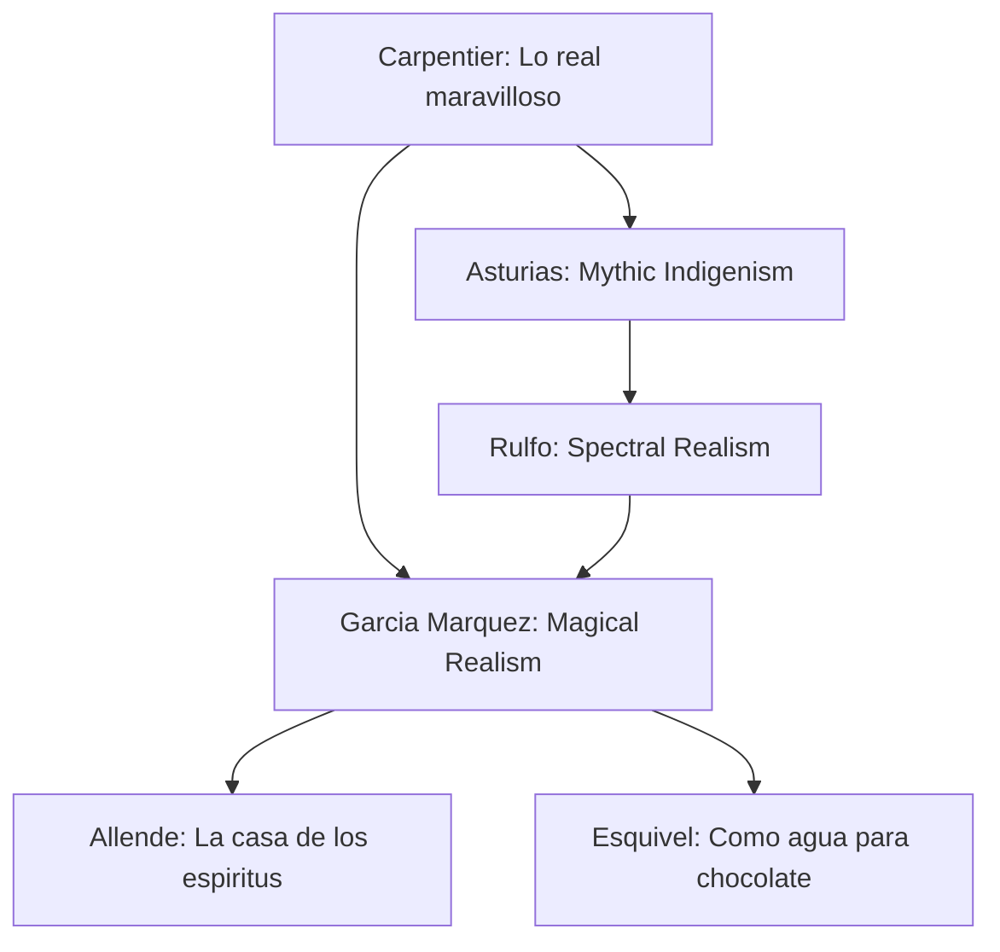
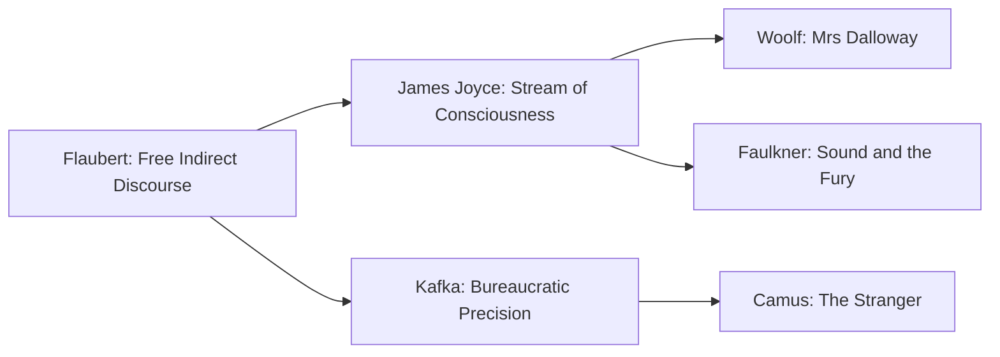
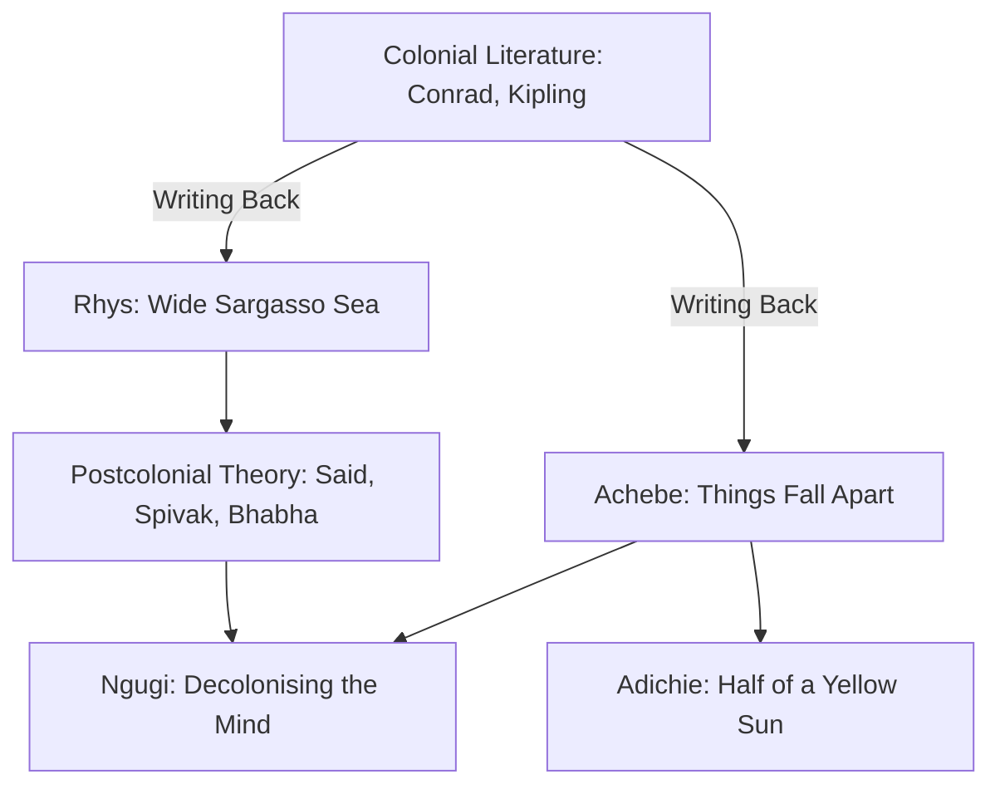

# World Literature

## Part I — The Latin American Boom

### Week 1: Magical Realism and Macondo

**Gabriel Garcia Marquez — *Cien anos de soledad* (1967)**

Magical realism dissolves the boundary between the extraordinary and the quotidian. In Macondo, rain of yellow flowers, levitating priests, and plagues of insomnia coexist with civil wars and banana company exploitation. The Buendia family's circular time — names repeating across generations — enacts Nietzsche's eternal return at the level of narrative structure.

Key concepts:
- **Lo real maravilloso** (Carpentier) vs. magical realism (coined by Uslar Pietri)
- Solitude as political metaphor: Latin America's isolation from modernity
- Cyclical vs. linear time; the manuscript of Melquiades as self-referential prophecy

### Week 2: Borges — Labyrinths of the Mind

**Jorge Luis Borges — *Ficciones* (1944)**

Borges invented literary postmodernism before the term existed. Key stories:
- "La biblioteca de Babel" — an infinite library containing every possible 410-page book; the universe as combinatorial text
- "El jardin de senderos que se bifurcan" — forking paths as metaphor for diverging timelines (anticipating many-worlds interpretation)
- "Tlon, Uqbar, Orbis Tertius" — a fictional world that overwrites reality
- "Pierre Menard, autor del Quijote" — identical text, different meaning; the reader constructs the work

### Week 3: Rulfo and Cortazar

**Juan Rulfo — *Pedro Paramo* (1955)**

Juan Preciado travels to Comala to find his father and discovers the town is populated entirely by the dead. The novel's fragmented voices — murmurs, whispers, overlapping monologues — obliterate the distinction between living narrator and dead speaker. Rulfo achieves in 120 pages what others need 500 for.

**Julio Cortazar — *Rayuela* (1963)**

The hopscotch novel: 155 chapters, two reading orders (linear 1-56, or hopscotch following a "Table of Instructions"). The expendable chapters (57-155) form a shadow novel. Cortazar's formal innovation: the reader as active co-creator of the text.

### Week 4: Octavio Paz — The Mexican Labyrinth

**Octavio Paz — *El laberinto de la soledad* (1950)**

Essay, not fiction, but foundational for understanding Mexican (and Latin American) identity. The mask (*mascara*), the *pachuco*, *la Malinche*, *la Chingada* — Paz dissects how colonial trauma produces a culture of dissimulation and solitude. Compare with Fanon's *Black Skin, White Masks* for parallel postcolonial psychology.

---

## Part II — The European Canon

### Week 5: Dostoevsky — The Underground

**Fyodor Dostoevsky — *Notes from Underground* (1864), *The Brothers Karamazov* (1880)**

- The Underground Man: consciousness as disease, spite against rational self-interest ("2+2=5")
- Bakhtin's concept of **polyphony**: each character in Dostoevsky carries an autonomous ideological voice; the author does not privilege one over another
- The Grand Inquisitor chapter: freedom vs. security, Christ's silence

### Week 6: Kafka and Joyce

**Franz Kafka — *Die Verwandlung* (1915)**

Gregor Samsa's metamorphosis into vermin is never explained — the narrative treats it as bureaucratic inconvenience. Alienation operates at every level: family, labor, body, language itself. Kafka's prose is precise, clerical, anti-lyrical.

**James Joyce — *Ulysses* (1922)**

Stream of consciousness as narrative method (Molly Bloom's unpunctuated monologue). Each episode corresponds to a Homeric parallel. Joyce's Dublin is both hyperlocal and universal — the encyclopedic novel as democratic form.

### Week 7: Proust and Cervantes

**Marcel Proust — *A la recherche du temps perdu* (1913-1927)**

Involuntary memory (the madeleine): sensory experience bypasses intellect to retrieve the past whole. Time is not clock-time but phenomenological duration. Seven volumes, ~1.2 million words — the novel as cathedral.

**Miguel de Cervantes — *Don Quixote* (1605/1615)**

The first modern novel. Part II is meta-fictional: characters have read Part I and perform for the reader. Don Quixote's madness asks whether fiction shapes reality or reality constrains fiction — a question the Boom writers inherited directly.

---

## Part III — American, Asian, and African Literatures

### Week 8: Faulkner, Morrison, Pynchon

**William Faulkner** — Southern Gothic, Yoknapatawpha County. Multiple timelines, unreliable narrators, the weight of history (*The Sound and the Fury*, *Absalom, Absalom!*). Direct influence on Garcia Marquez ("When I read Faulkner, I thought: this is what I want to do with my village").

**Toni Morrison — *Beloved* (1987)**

**Rememory**: the past is not remembered but re-experienced as spatial presence. 124 Bluestone Road is haunted by the ghost of Sethe's killed daughter. Slavery's trauma is not past — it inhabits the present. Morrison's prose is incantatory, liturgical.

**Thomas Pynchon — *Gravity's Rainbow* (1973)**

Paranoia as epistemology: every connection might be conspiracy or coincidence. Entropy (thermodynamic, informational) governs the novel's sprawl. Pynchon's maximalism is the inverse of Borges' compression — both arrive at the same vertigo.

### Week 9: Asian Traditions

- **Murasaki Shikibu — *The Tale of Genji* (~1008)**: arguably the world's first novel; psychological interiority in Heian court
- **Lu Xun — *A Madman's Diary* (1918)**: China's literary modernity; cannibalism as metaphor for Confucian society
- **Yukio Mishima — *The Temple of the Golden Pavilion* (1956)**: beauty and destruction, bushido aesthetics
- **Salman Rushdie — *Midnight's Children* (1981)**: postcolonial magical realism; India's independence allegorized through 1001 children born at midnight

### Week 10: African Literature and Decolonization

**Chinua Achebe — *Things Fall Apart* (1958)**

Achebe writes back to Conrad's *Heart of Darkness*. Okonkwo's tragedy is both personal (rigid masculinity) and collective (Igbo culture shattered by colonialism). The novel insists on the complexity of pre-colonial African society.

**Ngugi wa Thiong'o — *Decolonising the Mind* (1986)**

Ngugi's decision to write in Gikuyu rather than English: language is not neutral medium but carrier of cultural memory. The "language question" remains central to postcolonial literary studies.

---

## Part IV — Movements and Theory

### Week 11: Postcolonialism, Postmodernism, Magical Realism

| Movement | Key Features | Theorists/Authors |
|----------|-------------|-------------------|
| Magical Realism | Supernatural within realist frame, no explanation | Carpentier, Garcia Marquez, Rushdie |
| Postmodernism | Metafiction, pastiche, incredulity toward grand narratives | Pynchon, Borges, Barth, DeLillo |
| Postcolonialism | Writing back to empire, hybridity, subaltern voice | Achebe, Ngugi, Said, Spivak |

### Week 12: Comparative Frameworks

Pascale Casanova's *The World Republic of Letters* (2004): literature has a global economy with Paris as historical capital; peripheral literatures must fight for recognition. David Damrosch's *What Is World Literature?* (2003): world literature is writing that gains in translation, circulates beyond its origin.

---

## References

- Bloom, Harold. *The Western Canon*. Harcourt Brace, 1994.
- Casanova, Pascale. *The World Republic of Letters*. Harvard UP, 2004.
- Damrosch, David. *What Is World Literature?* Princeton UP, 2003.
- Bakhtin, Mikhail. *Problems of Dostoevsky's Poetics*. U of Minnesota P, 1984.
- Franco, Jean. *An Introduction to Spanish-American Literature*. Cambridge UP, 1969.
- Said, Edward. *Orientalism*. Pantheon, 1978.
- Martin, Gerald. *Gabriel Garcia Marquez: A Life*. Knopf, 2009.
